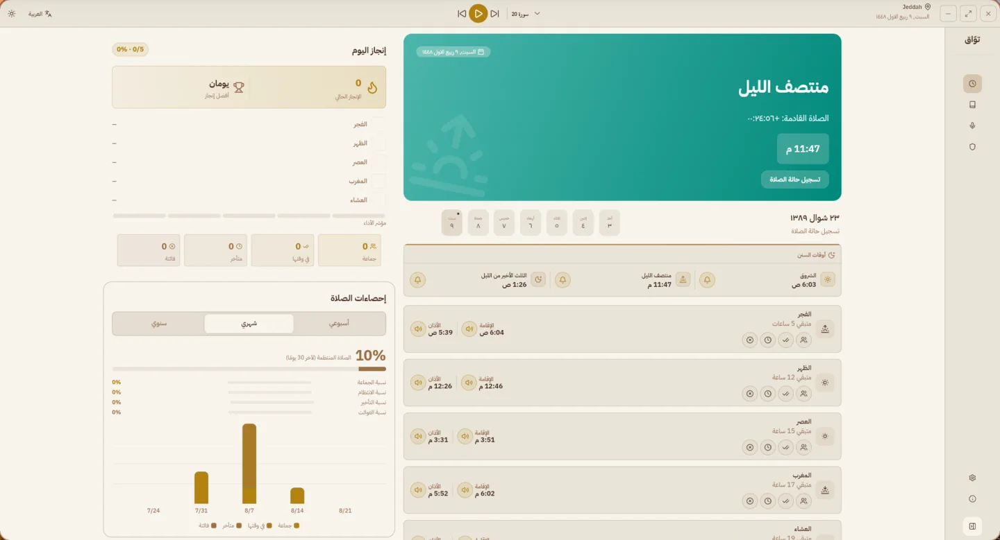
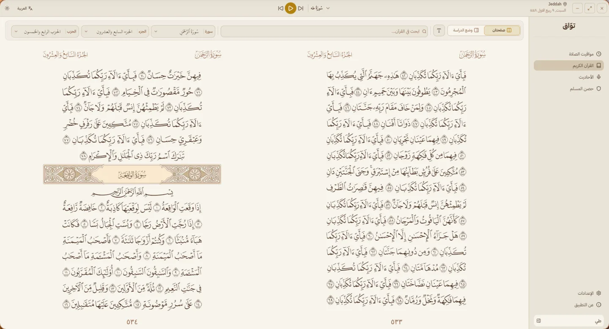
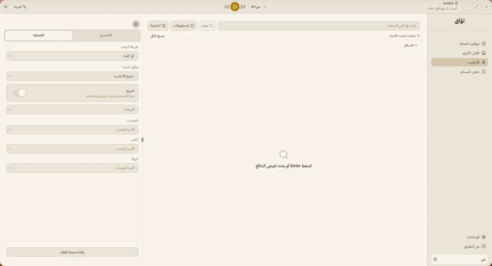
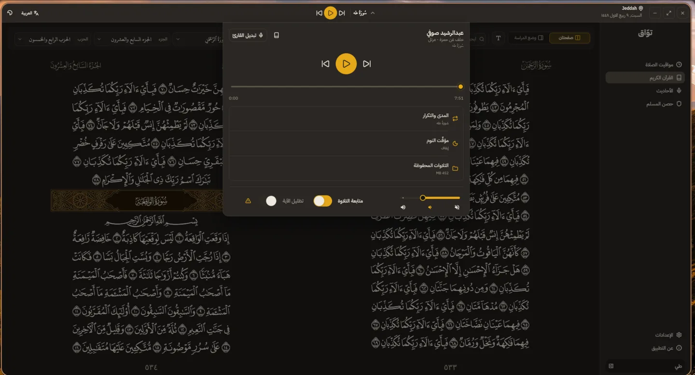
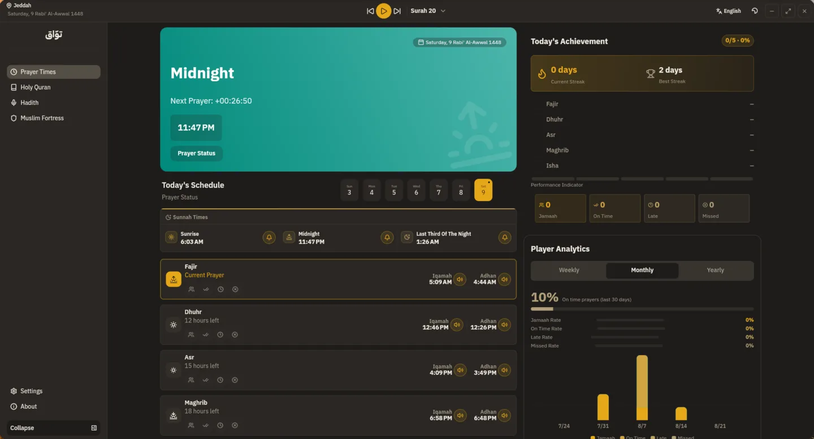
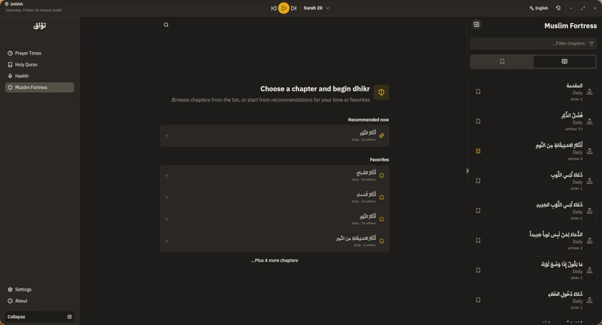
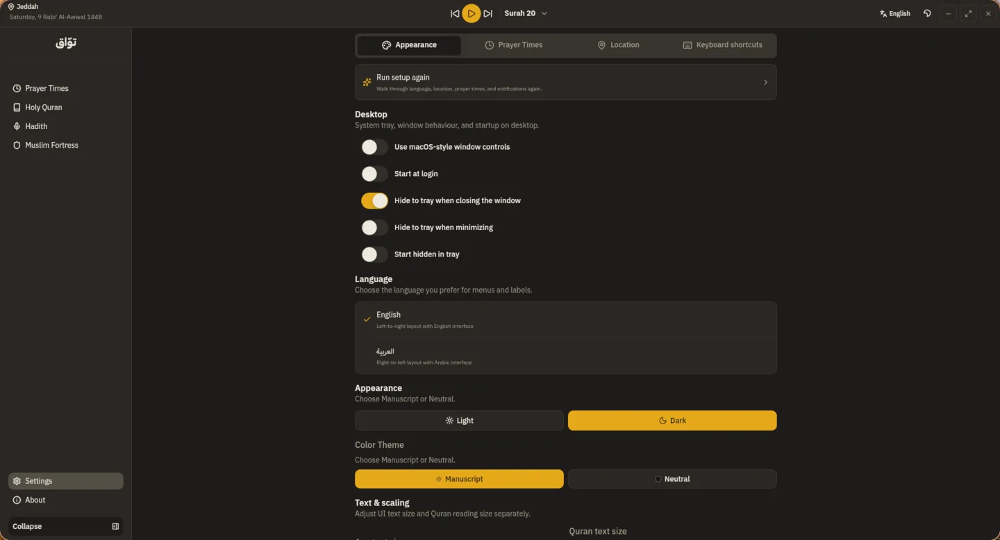

# تَوَّاق

<div dir="rtl">

تطبيق مكتبي إسلامي يجمع أوقات الصلاة، والمصحف، والبحث في الحديث، وأذكار حصن المسلم في مساحة هادئة وسهلة الاستخدام.

**تَوَّاق** — مِن تاقَ يَتوقُ؛ شِدّةُ الشوقِ والنُّزوعِ إلى الشيء.

> تَوَّاق في مرحلة تجريبية. قد تتغير بعض التفاصيل قبل الإصدار المستقر.

[English](README.en.md) · [التنزيلات التجريبية](https://github.com/MoathCodes/tawaq-app/releases) · [الإبلاغ عن مشكلة](https://github.com/MoathCodes/tawaq-app/issues)

## ما الذي يقدمه؟

- **الصلاة:** مواقيت حسب موقعك ومنهجية الحساب التي تختارها، مع التنبيهات، والإقامة، وسجل الإنجاز والتحليلات.
- **القرآن:** مصحف المدينة، والبحث، والترجمات، والتفاسير، والملاحظات، والتلاوات.
- **الحديث:** بحث وتصفية وتفاصيل للأحاديث من الدرر السنية، مع المفضلة وعمليات البحث الأخيرة على جهازك.
- **حصن المسلم:** الأذكار والأدعية مع الشروح والتخريج والبحث والقراءة المركزة.

## لقطات من التطبيق

<p align="center">
  
  
</p>
<p align="center">
  
  
</p>
<p align="center">
  
  
</p>
<p align="center">
  
</p>

## العمل دون اتصال

تَوَّاق مصمم ليكون مفيدًا دون اتصال. تعمل أوقات الصلاة وقراءة القرآن وحصن المسلم والبيانات المحفوظة على جهازك. يتصل بحث الحديث والتلاوات المتاحة عبر الإنترنت بجهات المحتوى عند استخدامك لهذه الميزات فقط.

## التنزيل والتثبيت

تتوفر النسخ التجريبية لأجهزة macOS وWindows ولينكس. حمّل الملف المناسب من [صفحة الإصدارات](https://github.com/MoathCodes/tawaq-app/releases).

| النظام | الملف المتاح |
| --- | --- |
| macOS | DMG وZIP للمثبّت، لمعالجات Apple Silicon وIntel |
| Windows | مثبّت EXE |
| لينكس | حزم DEB وRPM وArch، وZIP محمول لـ x64 |

بما أن الإصدارات التجريبية غير موقعة، قد يعرض نظام التشغيل تحذيرًا عند أول تشغيل. على macOS انقل التطبيق إلى Applications ثم افتحه عبر القائمة السياقية إذا ظهر التحذير. على Windows راجع تحذير SmartScreen قبل متابعة التثبيت.

في توزيعات لينكس الأخرى، فك ضغط ملف ZIP ثم شغّل `./install.sh`. يثبّت المثبّت تبعيات النظام المطلوبة عند الحاجة.

### التثبيت السريع

يمكن لمستخدمي macOS ولينكس تثبيت أحدث نسخة تجريبية بهذا الأمر:

```bash
curl -fsSL https://raw.githubusercontent.com/MoathCodes/tawaq-app/acbaf6ec7836a5248d90fb3ba86f1031fbdfab65/website/public/install.sh | bash
```

هذا المثبّت مثبّت إلى [نسخة منشورة من شفرة المستودع](https://github.com/MoathCodes/tawaq-app/blob/acbaf6ec7836a5248d90fb3ba86f1031fbdfab65/website/public/install.sh)، ويتحقق من SHA-256 الخاص بملف الإصدار قبل تشغيله. على macOS يثبّت تَوَّاق في `~/Applications` ويزيل علامة الحجر من نسخة تَوَّاق فقط، حتى لا تحتاج إلى خطوات Finder الإضافية. على لينكس يثبّته في `~/.local/opt/tawaq` ويطلب كلمة المرور مرة واحدة فقط إن أثبت فحص المكتبات أن التوزيعة تفتقد مكتبة مطلوبة.

تفضل تثبيتًا قابلًا للمراجعة؟ حمّل ZIP المناسب من صفحة الإصدارات، وفك ضغطه ثم شغّل `./install.sh`. يدعم المثبّت `--uninstall`، ويستبدل التثبيت السابق من دون حذف بياناتك.

## للمطورين

تحتاج إلى [FVM](https://fvm.app/documentation/getting-started/installation). بعد استنساخ المستودع، هيّئ الوحدات الفرعية ثم ثبّت نسخة Flutter المحددة وشغّل توليد الشفرة:

```bash
git clone https://github.com/MoathCodes/tawaq-app.git
cd tawaq-app
git submodule update --init -- packages/adhan_dart packages/dorar_hadith
fvm install
fvm exec bash tool/codegen.sh
```

للتشغيل والتحقق اليومي:

```bash
fvm flutter run
fvm flutter analyze
fvm flutter test
```

اقرأ [دليل المساهمة](CONTRIBUTING.md) و[دليل التعرّف على قاعدة الشفرة](docs/codebase-onboarding/README.md) قبل البدء.

راجع [قرار التوزيع](docs/adr/0001-user-local-installers.md) لتفاصيل نهج المثبّت وFlatpak.

## المساهمة

نرحب بالإصلاحات والتحسينات والتوثيق. اتبع [دليل المساهمة](CONTRIBUTING.md)، وافتح مشكلة قبل العمل الكبير حتى نتفق على النطاق.

## الشكر والمصادر

يبنى تَوَّاق على برمجيات ومحتوى من جهات عديدة. نشكر:

- [adhan_dart](https://github.com/prayer-timetable/adhan_dart) لحساب مواقيت الصلاة.
- [الدرر السنية](https://dorar.net/) و[dorar_hadith](https://github.com/MoathCodes/dorar_hadith) لبحث الحديث ومراجعه.
- [MP3Quran](https://www.mp3quran.net/) لبيانات القراء والتلاوات المتاحة عبر الإنترنت.
- [HisnElmoslem_App](https://github.com/muslimpack/HisnElmoslem_App) لمحتوى حصن المسلم المضمّن.
- [مجمع الملك فهد لطباعة المصحف الشريف](https://qurancomplex.gov.sa/) لخطوط QCF4 المستخدمة في عرض المصحف. هذه الخطوط ليست مشمولة برخصة MIT.
- [Athan-MP3](https://github.com/abodehq/Athan-MP3) للتسجيلات المضمّنة للأذان.
- IBM Plex Sans Arabic وعائلات Noto المستخدمة في الواجهة، وفق تراخيص SIL Open Font License المضمّنة معها.

تظل تراخيص وشروط المصادر والوسائط المضمّنة سارية على كل أصل منها.

## الترخيص

كود تَوَّاق ووثائقه مرخّصان بموجب [MIT](LICENSE). الأصول والبرمجيات التابعة لجهات أخرى، ومنها خطوط QCF4، تخضع لشروطها الخاصة.

</div>
