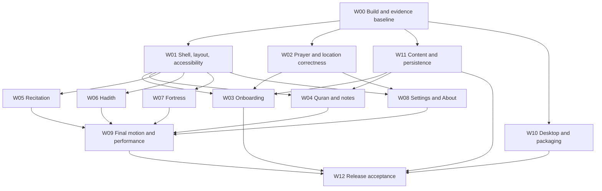

# Tawaq launch implementation specification

Tawaq must make its existing prayer, Quran, recitation, Hadith, and Fortress workflows trustworthy and complete before public launch. This specification defines repairs for all 31 UI audit findings, incorporates the nine migrated GitHub issues, and addresses the additional correctness, accessibility, performance, and distribution risks found in the backlog and current source.

**Status:** proposed implementation specification, ready for review. This document specifies work; it does not claim the work is implemented or the app is ready to ship.

**Baseline:** 4 October 2026; app commit `e9293e32b489c2d5811cdf682f7e872029fa2adf` plus the existing uncommitted work, principally Sage/theme and localization changes. Linear inventory: 80 issues, of which 60 are open and 20 are Done. No open GitHub PRs were returned during this review.

**Confirmed launch scope:** Linux, Windows, and macOS launch together, with Arabic and English and the current offline capabilities. All three platforms must pass their native acceptance and distribution gates before the coordinated public release. Windows/macOS readiness is part of the launch critical path. Mobile research does not delay this release.

**Primary records:** [Linear parent TAW-94](https://linear.app/tawaq/issue/TAW-94), [31-finding audit with evidence](../ui-audit/2026-10-03/REPORT.md), [GitHub-to-Linear mapping](../ui-audit/2026-10-03/LINEAR-MIGRATION.md), and the [machine-readable implementation coverage](tawaq-launch-coverage-2026-10-04.json). The original screenshots describe the audited build; they are not target designs. Implementation must add matching after evidence to the same issue.

## 1. What this release means

### 1.1 Required user outcomes

1. A new user can select a language and location, understand the calculation settings, review correct local prayer times, and enter the app without surprise audio or losing saved choices.
2. An existing user can correct location directly, cross midnight, travel, suspend/resume, and change calculation settings without disagreement between the schedule, next-prayer display, calendar, tray, and alerts.
3. A reader can navigate the Mushaf, select an ayah, study its sourced content, and write/reopen a reflection at the smallest supported desktop size without clipping, involuntary layout changes, or inaccessible controls.
4. A listener can choose a reciter and range, start playback promptly, use downloaded audio offline, cancel network work, and recover from interruptions without silently changing their selection.
5. A Hadith or Fortress user can understand search scope, inspect source information, reach details, and recover from empty or failed requests without raw exception messages or misleading labels.
6. A person can install, start, update, quit, and reopen the distributed application with their data intact. Desktop integrations must behave honestly when the host lacks a tray, location service, notification service, or autostart consumer.

### 1.2 Launch gates

| Gate | Requirement | Release decision |
| --- | --- | --- |
| G1: Trust | Consistent configured-zone prayer behavior, unchanged source religious text, reliable bundled-content updates, durable user writes | Any failure blocks launch |
| G2: Operability | Core flows work at 800×600 and larger, in Arabic/English, by pointer and keyboard; meaningful accessibility actions survive | Any inaccessible core task, crash, trapped state, or overflow hiding an action blocks launch |
| G3: Completion | All 31 audit findings have passing acceptance evidence or a specific evidence-backed “not reproduced/no defect” disposition for an investigation-only finding | A lower issue priority does not remove it from this requested scope |
| G4: Performance | Measured profile/release budgets, stable reading/navigation, responsive cancellation, bounded repeated-flow memory | Violations are investigated and fixed or receive a written product decision with measured impact; no silent waiver |
| G5: Distribution | Clean checks, tested Linux/Windows/macOS install/upgrade artifacts, working supported desktop integrations, accurate source/support information | The coordinated launch waits until all three platforms pass; a blocker on any platform blocks the launch |

A parent issue is a tracker, not evidence that every child passed. A green screenshot does not prove persistence, prayer correctness, keyboard activation, or frame timing. “Done” issues remain regression constraints; do not reopen them merely to organize this project.

### 1.3 Scope control

Deliver the existing feature set coherently. The interactive tour (TAW-19), additional theme collection (TAW-24), monthly prayer calendar (TAW-25), mobile research (TAW-26), and animated-icon research (TAW-27) stay outside the launch critical path. The current theme work and approved amber Turning ت icon are inputs to preserve, not invitations to restart branding.

TAW-18's broader player exploration is optional beyond the concrete player repairs in this specification. Its established drawer model and hierarchy are retained. TAW-22's already recorded Notes placement decision is incorporated because it resolves the empty study-panel structure cleanly.

## 2. Evidence and additional launch risks

### 2.1 Evidence classification

- **Reproduced:** runtime or controlled-test evidence exists in the linked issue/audit. Reproduce on the implementation baseline before changing the behavior.
- **Source confirmed:** the problematic current code path was inspected, but the affected native failure has not been replayed in this planning task.
- **Verification gate:** readiness is unproven; this is not a claim that the feature is broken.
- **Design requirement:** a proposed interaction or composition with measurable acceptance, rather than an alleged runtime crash.

UI-25 through UI-28 retain their audit limitations. UI-25 supplements an earlier reproduced Hadith failure but its broader error branches remain untested. UI-26, UI-27, and UI-28 require focused keyboard, reduced-motion, or persistence-state verification. They must not acquire fabricated failure videos.

### 2.2 Additional findings beyond the 31 UI entries

The `L-` identifiers below are local specification requirements, not newly created Linear issue IDs. Attach them to the indicated owner issue where the scope fits; otherwise file a focused issue before implementation. Do not create parallel tickets for the same failure.

| ID | Finding and current evidence | Work owner / exit proof |
| --- | --- | --- |
| L-01 | `MergedActionSemantics` excludes child semantics and supplies no activation callback. The September code-health audit reproduced loss of tap actions; the same source pattern remains. | W01: actual shell/settings/window actions can be invoked through semantics; component roles, labels, and disabled behavior agree |
| L-02 | Quran selector wrappers exclude editable/control semantics. Existing reproductions demonstrate loss of text editing actions; current `excludeChild: true` call sites remain. | W01/W04: inspect each real selector, preserve text entry, selection, expand, and activation actions |
| L-03 | `scheduleCurrentPrayer` watches a minute bucket but reads `prayerDayProvider`; a timeline change within the minute can leave current-prayer state stale. Prior controlled reproduction and current source agree. | W02: changing a prayer offset/location/method at a fixed clock instant immediately updates every affected projection |
| L-04 | Hadith adjacent selection increments an already chosen boundary when no result is selected; immediate search does not consume the pending filter debounce. Both were reproduced in the code-health audit and the relevant branches remain. | W06: first/last selection is correct; immediate query/reset makes one request and stale responses cannot replace current results |
| L-05 | Latest Quality run at the baseline failed app analysis and `mushaf_reader` analysis. Unique warning locations include Riverpod lifetime/dependency rules and a deprecated package lint. | W00: fresh-clone app/package checks pass with the real analyzer plugin active |
| L-06 | Desktop platform jobs can execute `shorebird release` or `shorebird patch` without depending on the `checks` job. GitHub publishing does depend on checks, but this does not protect the earlier distribution side effects. Source-confirmed workflow gap. | W10: no publish or patch command runs before required checks for the same revision pass |
| L-07 | Onboarding catches sibling preference-flush failures and can still mark completion. The completion state is also published before its own flush succeeds. Source-confirmed ordering/error-handling risk; disk-failure reproduction is still required. | W03/W11: injected required-write failure keeps setup recoverable, prevents successful completion/navigation, and never falsely arms alerts |
| L-08 | `tool/step8_shipgate_verify.sh` pipes checks through `tail`/`grep` without `pipefail`, repeats suites, and ends with a successful echo. It cannot serve as a reliable release verdict. | W00: retire it from release instructions or repair exit-status handling and verify a deliberately failing child command yields nonzero |
| L-09 | Automatic location depends on reverse-geocoding success after valid GPS; TAW-87 has a controlled reproduction. TAW-85 separately covers inaccurate Linux capability reporting. | W02/W10: commit a valid coordinates/timezone pair independently of its display name; test actual service availability and recovery |
| L-10 | Expired but schema-valid reciter metadata prevents offline restoration; auto-save can block opening audio and cancellation can wait for another network chunk. TAW-88 and TAW-90 have controlled reproductions. | W05: stale-valid offline restore, independent foreground playback, and request-level cancellation |
| L-11 | Bundled database identity uses only byte length. TAW-89 reproduced keeping old rows after an equal-size content update. | W11: content-based identity, safe replacement, and unchanged user-authored stores |
| L-12 | Native platform readiness, content attribution completeness, and release performance are not established by the UI screenshots. | W08/W09/W10/W12: explicit release evidence; classify each unavailable platform or untested state |

Sources: [code-health audit](../audits/code-health-2026-09-09/audit.md), [latest Quality failure](https://github.com/MoathCodes/tawaq-app/actions/runs/36742509615), current [`quality.yml`](../../.github/workflows/quality.yml), [`build-desktop.yml`](../../.github/workflows/build-desktop.yml), and [`onboarding_state_provider.dart`](../../lib/feature/onboarding/presentation/providers/onboarding_state_provider.dart).

The old analyzer-plugin startup finding is not copied forward unchanged: the current configuration now has one `riverpod_lint: 3.1.9` plugin entry, and CI is emitting its diagnostics. The current blocker is the failed checks and their underlying lifetime/dependency contracts. Similarly, the older Quran search path problem is tracked as Done in TAW-91; preserve its regression rather than planning its original fix again.

## 3. Design contract

### 3.1 Visual authority and hierarchy

Tawaq is an **Operate** interface around **Read** surfaces. Prayer status, search results, religious text, and playback state carry the hierarchy. Retain the existing typography, semantic color roles, manuscript/neutral identity, and approved icon work. Apply the same layout behavior to Sage if that in-progress theme is included in the release candidate. Missing `DESIGN.md` does not make this a greenfield app; the running native UI and audited screenshots establish the incumbent design.

Use existing spacing tokens: 4, 8, 12, 16, 24, 32, and 48 logical pixels. Default ordinary content gutters are 16 at compact size and 24 when room permits. A screen or pane owns its content gutters once. Native chrome remains edge-to-edge; placing page padding around a title bar is forbidden. Reading surfaces may be intentionally full bleed, with their own content controls and focus rings protected.

Use one clear primary action per task state. Related controls belong together: city/timezone/method in location setup, transport/seek/current recitation in the player, query/filter state/results in Hadith, and per-ayah notes beside the selected ayah. Replace decorative nested cards with headings, separators, or plain spacing where no independent group exists. Empty space should separate meaningful groups, not force a short form into the middle of an otherwise empty window.

### 3.2 Responsive rules

- **Minimum desktop contract:** 800×600 logical viewport. Also verify 1200×860 and 1440×900. Record native frame and content dimensions separately; scale factor must not be mistaken for logical size.
- **Layout uses available container dimensions**, after chrome/navigation/gutters, rather than only the window breakpoint. Two panes require both content minima plus divider and padding. Existing minimums (320 side panel, 400 Mushaf, 480 ordinary main pane) are starting constraints, not permission to squeeze below a readable minimum.
- **Height participates in layout selection.** At 800×600 or large text, prefer a single useful pane and an explicit switch to the other task. Do not stack two permanently visible panels that leave only a sliver for either.
- At large text, allow natural labels to wrap across words, increase rows, and scroll the task body. Never shrink text or give a toggle label a letter-wide column to meet a fixed height.
- Dialogs/drawers have bounded height, independently scrolling long content, reachable close/back controls, and stable action placement. Controls must not be hidden by the screen edge, sticky bars, or native window controls.
- Persist user-selected pane sizes in the existing owner. Clamp them safely on resize. Resize must not alter selected content, collapse intent, scroll position without necessity, or saved notes.

### 3.3 Accessibility, localization, and copy

Every actionable control must have a name, state, role, and working action. Prefer the semantics of the real button/text field. Add labels without erasing input behavior. A wrapper earns a place only when it owns a real interaction rule; remove redundant forwarding layers during L-01/L-02 repairs.

All core flows must work with Tab/Shift+Tab, activation keys, Escape where appropriate, and the documented shortcuts. Restore focus to the initiating control when a dialog closes. Pointer hover may reveal a convenience, but must not be the only route to deletion, help, or playback actions. A focused control remains visible when bodies scroll; use [W3C focus visibility guidance](https://www.w3.org/WAI/WCAG22/Understanding/focus-not-obscured-minimum.html) as an acceptance reference.

Use a project contrast floor of 4.5:1 for ordinary text and 3:1 for large text, following [W3C contrast guidance](https://www.w3.org/WAI/WCAG22/Understanding/contrast-minimum.html). Test token pairs and inspect rendered Arabic strokes. These checks do not by themselves establish comprehensive WCAG or native screen-reader conformance.

Arabic source text stays Arabic/RTL inside its content region; English surrounding controls and progress follow LTR. Use directional insets/alignment. Never reverse the whole feature merely because the religious text is Arabic. Dates, numerals, plural forms, labels, and shortcuts use localization resources. Religious terminology help must describe verified behavior and retain sourced terminology; it must not invent a translation or authenticity claim.

### 3.4 Motion

Keep stable content mounted through layout changes. Diagnose blank frames before adding transitions. Reuse the current duration tokens (fast 150 ms, normal 260 ms) for ordinary feedback; do not globally shorten unrelated motion to disguise delayed work. Page/reading transitions follow reading direction. Avoid repeated entrance animations on rebuild or selection.

Reduced-motion mode removes nonessential travel, scaling, and shimmer. Essential state changes become immediate or use a minimal fade that does not delay access. Capture normal-speed videos for flicker and calendar reset; slowed recordings may aid diagnosis but cannot establish perceived timing.

## 4. Ownership and compatibility contracts

| Fact or behavior | Existing owner | Required integration |
| --- | --- | --- |
| Live clock / prayer day / calendar keys | `app_clock_provider.dart`, `prayer_day.dart`, prayer domain rules | Schedule, hero, countdown, calendar, Fortress recommendations, tray, and alert scheduler derive from the same configured-zone timeline |
| Prayer settings and location bundle | `PrayerSettingsNotifier` | Apply coordinates/timezone atomically; guard async names; keep hydration and flush contracts |
| Setup route and desktop composition | `lib/app/` | Route focused recovery without changing first-run completion; compose alert readiness here instead of feature-to-app imports |
| Onboarding persisted completion | `OnboardingStateNotifier` / `SettingsStorage` | Required preferences durable before completion; distinguish loading, failure, explicit skip, and completed readiness |
| Logical recitation state | `RecitationSession` | Riverpod projects state; network/native audio/media-session integrations remain adapters |
| Catalog / saved audio / acquisition | Recitation repository and cache | One source of catalog validity/freshness and download ownership; exact saved identities and complete-file cache semantics |
| Hadith session and async results | Existing Hadith session/controller | Widgets express the session; use request generations and disposal checks; do not introduce a second search owner |
| Notes | Existing notes store/providers | Relocate access without changing note identity or schema; expose real save outcomes |
| Bundled source copies | `AssetDatabaseService`, separate Fortress installer | Content identity, safe replacement, and source-local connection lifetime; no changes to user data |
| UI tokens, semantics, layout primitives | `lib/theme/`, `lib/core/layout/`, shared controls | Representative consumers across Quran, Hadith, Fortress, Prayer, Settings, and shell tested before merging shared changes |

Keep [dependency boundaries](../../test/architecture/dependency_boundaries_test.dart) and [recitation ownership](../../test/architecture/recitation_session_boundary_test.dart) enforced. Fix old exceptions when their dependency is removed. Do not add an exception to make the planned architecture compile.

Persisted compatibility is a release contract: legacy settings, panel destinations, selected recitation IDs/ranges, bookmarks, reflections, and prayer history must decode. `persist(...).future` waits for hydration; kill-boundary writes must use the established durable flush path. Never use religious source replacement as a reason to recreate user-authored stores.

## 5. Implementation work packages

Each package below has a concrete behavior, owner, and proof. The package numbers are scheduling references, not a requirement for one giant PR per feature. Keep correctness and visual work reviewable, with a single editor responsible for a shared file during implementation.

### W00 — Establish a trustworthy build and verification baseline

**Covers:** L-05, L-08; the useful minimum of TAW-71. **Dependency:** none.

1. Create an isolated implementation checkout from the agreed revision. Record the exact disposition of the existing theme/localization work; do not reset it or silently treat it as committed baseline.
2. Reproduce the current Quality failure using the pinned FVM SDK and resolved package versions. Review keep-alive consumer lifetimes and scoped-provider dependencies at their owners. Make dependencies explicit, generate affected code, and keep bootstrap/disposal behavior tested. Blanket warning suppression or marking everything keep-alive is not a repair.
3. Remove/update the deprecated `mushaf_reader` lint in the package configuration. Run the package analyzer and tests, not only root checks.
4. Use a verification command whose exit code preserves every failing stage. Repair or retire the old step-8 shell harness; a printed success footer must never be treated as a pass.
5. Record stable route/control keys for the release flows in W12, debug/profile connection instructions, process ownership, and capture metadata. Keep debug hooks disabled in distributed builds.

**Acceptance:** clean-clone generation, app analysis/tests, and relevant package checks pass; an intentional failure makes the harness fail; no test stage is silently skipped after a preceding warning. Store a baseline report for each release candidate. No full test rerun is needed merely to edit this specification.

### W01 — Repair shell, responsive foundations, and accessible controls

**Covers:** TAW-69, TAW-82, UI-24; L-01/L-02. **Dependency:** W00 for a mergeable baseline.

Map shell, page, pane, and control padding ownership before changing any shared wrapper. Keep title bars full width and content gutters local to the content region. Navigation must expose destination names through an expanded labeled state; collapsed items retain readable tooltips on hover/focus and meaningful accessible names. The expand control itself must be clear and keyboard reachable.

Replace semantics layers that exclude working descendants. For explicit composite replacement nodes, connect the real activation callback and enabled state. Editable selectors retain editable roles and set-text actions. Check shell actions, window controls, theme controls, Quran selectors, and settings controls individually.

Keep layout primitives feature-neutral. They should choose/clamp geometry and preserve explicit collapse intent; they should not fetch feature providers or own content selection. Audit real-height fixtures because some existing player tests allow more height than the failing native window.

**Acceptance:** semantic activation changes the actual UI; editing a Quran selector works through its semantic action; disabled controls cannot activate; all routed pages have intentional directional edge spacing; no shared padding regression on full-bleed Mushaf or split panes. Capture compact/wide Arabic/English with default/XL text.

### W02 — Make prayer, location, and calendar behavior consistent

**Covers:** TAW-65, TAW-87, TAW-85, TAW-97, TAW-102, TAW-112, TAW-118; L-03/L-09. **Dependencies:** W00; coordinate shell presentation with W01.

**One local-time projection.** Make onboarding consume the same configured-day schedule representation or shared prayer-feature projection as the normal schedule. Do not add `+3 hours`, use the host timezone, or duplicate prayer formulas in onboarding. Convert the prayer instant through the configured timezone before formatting. Keep the date key and five obligatory-prayer ordering identical across consumers.

**Immediate invalidation.** Observe both relevant timeline identity/settings changes and the appropriate clock bucket. Countdown may update each second while schedule labels update less often; a changed location/method/offset must not wait for a clock bucket. Inventory schedule, current prayer, next prayer, sunnah labels, hero, Fortress recommendations, tray, and scheduler before changing a shared provider.

**Location transaction.** GPS/permission failure preserves the old valid bundle. Once coordinates and a valid timezone are available, commit them together without waiting for reverse geocoding. Show the established unknown-name representation while name enrichment runs. A response is accepted only for the still-current location request; a late city name must not replace a newer manual choice. Failed timezone resolution must not publish a half-updated pair.

**Calendar stability.** Keep the selected date and visible range independent of entrance animation. At configured-zone midnight, follow the new day only if the user was viewing today. Historical selection remains historical. A Today action restores live following. Exercise month/year boundaries, DST zones, zones on either side of UTC, and a host zone different from the prayer zone.

**Prayer layout.** Put current/next prayer context and the five-prayer schedule first; place analytics and history below or in a clearly labeled secondary view. At 800×600/default scale the five-prayer overview must be reachable without scrolling past analytics. With XL text, prefer ordinary body scrolling over compressed rows. Correct “Player Analytics” and pluralization in the ARB owners.

**Acceptance:** the recorded Madinah fixture (`24.4711530, 39.6111216`, `Asia/Riyadh`, Umm Al-Qura, 2026-10-03) shows the same five values before/after setup: 4:56 AM, 12:10 PM, 3:33 PM, 6:06 PM, 7:36 PM for the audited settings. This is a regression fixture for repository consistency, not external timetable certification. Add non-Riyadh, midnight, same-minute recalculation, delayed-geocoder, and historical-calendar tests using the shared clock. Repeat native calendar gestures at normal speed.

### W03 — Replace sparse onboarding with a short, coherent setup

**Covers:** TAW-106 through TAW-109, TAW-117, UI-08/09/10/11/29/31; L-07. **Dependencies:** W01/W02 and W11's durable completion contract.

**Proposed sequence: five named stages.** This is a composition decision for review; it preserves the current choices rather than introducing new product capabilities.

| Stage | Main task | Secondary/optional content |
| --- | --- | --- |
| 1. Welcome & language | Choose Arabic/English; understand what setup configures | “Set up later” remains visible; no standalone decorative welcome panel |
| 2. Prayer location | Search/select city, see timezone, review calculation method | “Use device location”; collapsible coordinates/map and method adjustments; no invented city/method recommendation |
| 3. Alerts | Configure Adhan and optional iqamah together | Existing voice previews; unavailable notification capability explained with recovery |
| 4. Appearance | Choose system/light/dark and existing palette | Optional; use current defaults and a local preview without duplicating theme ownership |
| 5. Review | Verify city, zone, method, alerts, and today's five times | Edit links return to the relevant stage; final action is “Start using Tawaq” |

Wide and compact use the same task order. Wide layout may add a useful schedule summary beside the active form; it must not invent a second card just to fill space. The principal task column is content-sized, roughly 560–720 logical pixels, with additional width only where the map or live schedule earns it. Align header, content, and actions. Avoid vertically centering a short strip across the whole window. On compact/XL layouts, use one scrolling task body and a reachable action footer.

```text
┌ Full-width native-safe title bar ────────────────────────────┐
│ Prayer location                         Step 2 of 5          │
│ Language · Location · Alerts · Appearance · Review          │
│                                                            │
│ City [ Search for a city…                         ]          │
│ Medina, Saudi Arabia                                       │
│ Timezone: Asia/Riyadh             [Change]                  │
│ Calculation method: Umm Al-Qura  [Review]                  │
│ [Use device location]  [Advanced location options ▾]        │
│                                                            │
│ [Back]                                     [Continue]      │
└────────────────────────────────────────────────────────────┘
```

Use a labeled step count as well as progress. Back/Continue remain in a predictable position; Back preserves choices. Required validation is adjacent to the relevant input, not a distant toast. Clear input/loading/empty/error states exist for city lookup and device location; an unavailable device source never blocks manual setup.

**Focused recovery:** “Set location” from Prayer opens the existing location settings destination with a return path to Prayer. It does not clear `onboarding.completed`. Explicit “Run setup again” remains a separate action. Skipping first-run setup completes onboarding durably but leaves prayer-dependent features visibly unconfigured until a valid location exists.

**Alerts:** compute readiness in app composition from hydrated settings, durable completion, a valid location/timeline, and an inactive setup route. Apply this to scheduling and dispatch so already queued events cannot interrupt setup. Voice preview is a deliberate user action using the existing audio lease, not a scheduled alert. On finish/resume, establish a fresh scheduler anchor; do not replay suppressed historical events or create a burst.

**Finish:** disable duplicate submission while required writes complete. A required write failure shows “Could not save setup” with retry, preserves the user's choices, and does not report success, navigate, or arm alerts. Required preferences flush before the completion record; publish completed readiness only after that record is durable. Cosmetic preference failure policy must be explicit rather than covered by a blanket catch.

**Acceptance:** zero horizontal title-bar inset in restored/maximized Linux states; native safe areas on macOS and correct Windows chrome/hit regions. Complete, skip, back/edit, restart mid-setup, finish-then-kill, failed-write/retry, location denial, and alert-boundary flows pass. Record a normal-speed full setup video and paired compact/wide screenshots. Review this scoped composition before spreading it into unrelated surfaces.

### W04 — Make Quran reading, study, and reflections work at every desktop size

**Covers:** TAW-98, TAW-104, TAW-105, TAW-81, TAW-10, TAW-22, TAW-116; UI-01/02/03/04/28. **Dependencies:** W01; W09 owns measured flicker work; W11 owns durable writes.

**Reading-first composition.** Keep a compact navigation toolbar: primary Surah/page context, search, Study, Notes, and secondary navigation under a clearly named control when the row cannot fit. Do not leave four full-width selector rows above a tiny Mushaf at 800×600. Preserve all existing Surah/Juz/Hizb/page navigation and shortcuts; progressive disclosure changes access, not capability.

Wide Study uses the existing resizable reading/study panes when both fit. Compact Study becomes one explicit companion view opened from the reading surface, with a clear return to reading. Use the existing compact surface where feasible; if a constrained full-height sheet is necessary, keep the same controller/selection and restore focus on close. Do not force the reader and a full study panel into two undersized vertical regions.

```text
Wide:    [Surah/page] [Search] [Study] [Notes]
         ┌ Mushaf reading area ─────┬ Current ayah companion ┐
         │                         │ Ayah reference/actions │
         │                         │ Tafsir / Translation   │
         │                         │ Reflection editor      │
         └─────────────────────────┴────────────────────────┘
Compact: [Surah/page] [Search] [More]
         ┌ Mushaf reading area ─────────────────────────────┐
         │ [Study selected ayah] or [Select an ayah]        │
         └─────────────────────────────────────────────────┘
         Opening Study presents the companion with [Back to reading].
```

**State rules:** collapsed stays collapsed across resize/rebuild, including wide-to-compact transitions. Preserve the preference without writing viewport-driven fallback as a new user preference. When no ayah is selected, show a compact instruction adjacent to the Study entry; do not reserve a full blank pane. When selected, keep the ayah action row stable so showing/hiding selection does not jump the reading viewport. Selection changes content without reconstructing the Mushaf controller.

**Notes:** follow TAW-22's recorded decision. Per-ayah editing stays in the companion. The all-notes browser moves to a labeled Quran header action, available with Study collapsed. Reuse `NotesBrowser` and `quranAllNotesProvider`; selecting an item navigates to its ayah and opens the editor. Closing without selection restores the original context. Decode a legacy reflections-tab destination compatibly into the current-ayah destination; do not migrate or delete note content.

**Save status:** first verify UI-28 against the actual store. Reflect pending/saving/saved/error from the real write lifecycle, not a timer that assumes success. “Saved” means the acknowledged durable operation succeeded. A failed write retains the draft and exposes retry. Define the flush boundary when leaving the ayah, closing the editor, and quitting; test those boundaries with delayed/failing storage. Do not add a redundant second notes store to display status.

**Keyboard:** clicking/focusing the Mushaf gives page navigation intent; focusing ayah controls gives selection intent; text fields keep text-editing keys. No double dispatch from nested shortcut scopes. The shortcut reference lists actual bound commands, including platform modifiers. Escape closes a transient surface and restores focus without losing the current page or draft.

**Acceptance:** no overflow or letter clipping at 800×600/default and XL text; the reader remains useful while Study is closed; selected ayah/page/zoom survive panel transitions and rapid resize. Cover selected/unselected, tafsir/translation loading and error, long Arabic content, notes empty/many, failed save/retry, and restored legacy destination. Existing Mushaf text/source integrity and search regressions remain green. Capture selection and collapse transitions on video.

### W05 — Finish the recitation workflow and offline reliability

**Covers:** TAW-95, TAW-96, TAW-100, TAW-70, TAW-7, TAW-88, TAW-90; bounded player layout from TAW-18. **Dependencies:** W01/W00; coordinate audio ownership with W03 alerts and W09 memory.

**Drawer composition:** retain the drawer presentation. Header shows Surah/range and reciter/riwayah. The first group contains seek position, duration, and transport. Secondary rows contain range/repeat, timer, reciter, offline files, and playback options. On wide layouts, secondary controls may sit beside the primary group; on compact layouts they stack in a scrollable region. Close and essential playback controls remain reachable.

Toggles use a row with a flexible phrase label and a fixed-size switch; never two competing expanding children that squeeze the label into letters. Volume has an accessible slider and coherent mute state. Put “Save while listening” in the offline-manager header/settings group, independent of the downloaded list length. Keep the completed file-management work in TAW-23 intact, including selection and safe deletion.

**No selection:** say “Choose reciter” or “Choose range” according to the missing value; do not say “Switch” when none exists. Play leads to the missing required choice or presents a clearly explained disabled state. No implicit default reciter or range. Restoring settings does not start playback.

**Duration:** represent unknown duration as unknown/loading, not `0:00` beside a nonzero saved position. When a trustworthy native or cached duration arrives, project it through the existing owner. A label fix must not seek, reset the saved position, or begin playback. Verify old selections after metadata hydration and paused cold startup.

**Timing availability:** use conventional continuous seeking when per-ayah timing is missing, failed, or unsupported. Remove the ayah lens, segmentation hints, ayah-specific focus preview, and semantics in that state. Switching reciter/Surah updates the mode without stale timing UI. Keep correct ayah timing unchanged when available.

**Catalog validity and freshness:** return a schema-valid last-known catalog immediately, even after the seven-day freshness interval. Refresh in the repository and retain usable data if the network fails. Match saved reciter/moshaf IDs exactly; no order-based substitution. Corrupt/incompatible metadata has an explicit recovery state. Local audio remains playable without a successful catalog refresh.

**Foreground playback and saving:** prefer complete local audio. Otherwise open the stream without waiting for automatic saving. The proposed initial policy permits a separately owned background download, so streaming plus saving may use two network transfers; keep that tradeoff explicit and retain the user's off switch. Optimize transfer sharing only after measurement, not through unsafe playback of incomplete cache files. Explicit saves join existing saves by cache key; define subscriber ownership so canceling one caller does not abort work another caller still owns.

Bind cancellation to the request while waiting for headers or body data, not just to the next chunk callback. Keep `.part` cleanup and atomic final rename. Stop, selection replacement, disposal, and prayer interruption invalidate stale work before it can open audio or overwrite progress. Never close a shared HTTP client to cancel one request.

**Acceptance:** test timed/untimed reciters, no selection, short/long range, first play, pause/restart, stale-valid catalog offline, corrupt catalog, local file absent, header/body stall, joined save cancellation, next-Surah/gapless continuation, seek/repeat, sleep timer, media keys, and Adhan interruption/resume. For controlled stalls, target cancellation acknowledgement within 250 ms without another network event; real device results must also be recorded. Audio-open calls must occur before optional save completion. Match native before/after first-play measurements by reciter, Surah, cache, and network condition.

### W06 — Repair Hadith state transitions and finish the existing layout

**Covers:** TAW-101, TAW-15, TAW-115; UI-19/20/25/26; L-04. **Dependencies:** W00/W01.

Preserve the current session controller and approved two-region design. On wide screens, main content is search/context/results; the side region contains Details and Filters. Initial empty details should collapse to a useful compact prompt using existing collapse ownership, or carry concise first-search guidance; it must not dominate an empty page. Do not introduce a new third pane or rewrite the information architecture. At compact size, search/results stay together, filters use a constrained surface, and selecting a result uses the existing narrow detail pattern.

Repair disposal/request ownership before styling errors away. The query in the original failure and the later successful `الصلاة` query are distinct evidence. A successful later search does not close the disposed-provider issue. Every await that reaches framework state must respect disposal and request generation; an older response cannot replace a newer query/mode.

An immediate query or filter reset consumes/cancels the pending debounce. No selection plus Next selects the first result; Previous selects the last. Existing selection moves one item and clamps at the boundary. Keep stable item identity across response replacement where the selected item still exists.

**Reachable states:** initial instruction, first-request loading, results, zero results, new-query failure, pagination pending/failure retaining the prior page according to the current session contract, detail loading/failure, bookmarks empty, and provider disposal/re-entry. Errors name the failed task and offer a retry or recovery action. Debugging instructions and exception types remain in logs rather than product copy. Preserve the user's query, filters, and selected result when the established operation permits it.

Filter help explains each option's actual search effect with a short example approved against the data/provider behavior. Source-backed grading and attribution from TAW-77 remain prominent. Do not invent interpretations of Hadith grades.

For UI-26, first determine whether the recent-query deletion command actually reaches the wrong scope. Make individual removal focusable without hover, and distinguish “Remove this search” from “Clear recent searches.” Clear-all is a separate explicit action. Provide undo where the existing storage permits a reliable restoration; otherwise use a confirmation appropriate to the actual scope. Never relabel a bulk delete as individual deletion.

**Acceptance:** controlled search/disposal/error tests, no-result navigation boundaries, debounce reset/submit races, pagination recovery, bookmarks mode, failed detail, and keyboard-only recent-query management pass. Preserve source/sharh rendering and completed share-card behavior. Capture wide/compact first search, selected result, filters active, long sharh, and meaningful error states in Arabic/English.

### W07 — Make Fortress browsing and reading coherent

**Covers:** TAW-99, TAW-103, TAW-113, relevant TAW-82 scope; UI-16/17/18. **Dependency:** W01.

Keep the completed browse hierarchy and preview accessibility from TAW-76/75. Wide layout can show catalog plus reading. At compact height/width, catalog is a real browsable destination with enough space to scan; selecting a chapter opens reading with a clear back-to-catalog action. Preserve category, favorite filter, search, selected chapter, and scroll context. Do not stack a large welcome/reading panel above a catalog sliver.

Distinguish two search jobs visibly: **Find a chapter** filters chapter names/catalog context; **Search all adhkar** searches the content corpus and shows results with chapter attribution. If retained on the same screen, label their scopes and give each a predictable clear/back path. They must not look like duplicate anonymous search fields.

UI chrome and progress follow interface locale. Arabic dhikr text uses its own RTL region. Favorite-filter empty copy depends on state: no saved favorites differs from no matches within existing favorites. A search with no matches must not imply bookmarks were deleted.

**Acceptance:** at 800×600 with XL text, catalog and reading controls remain reachable; no overflow in the original GitHub follow-up state. Favorites exist + unmatched query shows filtered-empty recovery; clearing query restores them. English progress/controls are LTR, Arabic controls RTL, Arabic content preserved in both. Test keyboard/focus transitions and screen-reader access to previews.

### W08 — Finish Settings, About, labels, and support access

**Covers:** TAW-110, TAW-111, TAW-114, TAW-14; Settings-specific TAW-20 coordinated with W09. **Dependencies:** W01, W02 for location entry, W11 for metadata consistency.

Appearance begins with mode, palette, and typography, using distinct labels: “Theme mode” controls System/Light/Dark; “Color palette” controls the palette. Group language/region, desktop behavior, and rerun-setup under the existing appropriate destinations instead of placing unrelated controls above appearance choices. Preserve deep links and decode prior tab destinations if a destination changes. Reuse the existing Settings destination model; do not proliferate overlapping routes.

About begins with a compact product/version row and real support destinations. The visible version comes from one package/build metadata source. Credits follow in readable groups: application contributors, religious/content sources, software/fonts, and licenses. Remove template names, domains, email addresses, and claims; verify values from project-owned records or omit the entry. Do not replace unknown facts with plausible text.

A link opens its actual destination. If copying is valuable, expose a separate labeled copy action with feedback. Handle launch failure with a usable fallback that clearly says it copies. Keep support/version available without a long decorative hero or duplicated cards. This includes the existing About dialog and page where both are reachable.

**Acceptance:** no shipped template strings or mismatched label/destination URLs; one runtime version source; keyboard-accessible open/copy actions with correct semantics; complete real attribution coverage for bundled/query sources and assets. Review Arabic/English copy, pluralization, disabled reasons, tooltips, and long labels. Regenerate ARB outputs together with inputs.

### W09 — Remove flicker and meet measured performance budgets

**Covers:** TAW-21, TAW-20, TAW-86, TAW-67, TAW-68; UI-27. **Dependencies:** baseline W00; coordinate changes with W04/W05/W08, then run a final integrated pass.

Start TAW-21 by profiling keys, controller lifetime, constraint changes, glyph/font readiness, and subtree recreation across page navigation and Study transitions. Keep current content visible while the new frame is prepared; bound any retained page cache. Do not solve flicker by keeping an unbounded set of Quran pages alive. A transition is added only after avoidable reconstruction is removed.

Start TAW-20 at Settings' Material `TabBar`/`TabBarView`, the identified swipe surface. Track the drag; settle within `context.theme.durations.normal`; publish route/checkpoint changes once after settling. Test tap, swipe, reversal, lazy destination initialization, deep link, and RTL. A global tab change requires evidence of another affected consumer.

Audit reduced-motion fan-out: entry, shell navigation, Study collapse, Quran transition, Settings tabs, onboarding, dialogs/drawers, and animated loading. Existing `AnimationEntry` already handles the preference; retain it while fixing the uncovered owners. Verify both semantic final state and motion behavior on the native build.

**Proposed performance budgets** below are release targets, not results already demonstrated. Record the reference device, refresh rate, build, cache/data state, and network fixture before testing. If the reference hardware changes, rebaseline instead of comparing incomparable runs.

| Measurement | Initial acceptance target | Method |
| --- | --- | --- |
| Input acknowledgement | Visible pressed/loading/selected feedback within 100 ms for local actions | Timestamp action to first relevant frame; slow network completion is separate |
| Warm local route/tab transition | Destination shell appears immediately; ordinary settle ≤260 ms; no blank interstitial frame | Profile timeline plus normal-speed recording over 20 repeated transitions |
| Interactive frame time | At 60 Hz, p95 UI and raster work each within 16.7 ms; report missed-frame proportion and p99 separately; no unexplained >100 ms app-caused frame | Profile mode on actual target hardware; repeat at actual refresh rates where advertised |
| First usable offline launch | Proposed ≤3 seconds on the named reference machine, measured over five fresh launches | Process start to responsive correct initial screen; distinguish fresh-install asset setup from warm installation |
| Network cancellation | Controlled headers/body stalls acknowledge ≤250 ms without another network event | Deterministic stream test, then native confirmation |
| Memory | Show a comparable reduction for TAW-67; after warm-up, 20 identical route cycles return within max(10%, 20 MiB) of the measured steady-state baseline, with no monotonic growth | External RSS/PSS/peak sampling; retain heap/native attribution and cache counts |

The September release investigation measured approximately 224 MiB RSS at initial Prayer and found platform/renderer costs plus opportunities in audio buffering and database opening. It did not establish a universal 400 MB idle condition or an optimized sub-200 result. Treat sub-200 MiB ordinary-use RSS as an optimization objective pending a new baseline, not a promised universal ceiling. Do not substitute PSS, hidden-window behavior, disk bundle size, or swap for an RSS improvement.

Test bounded audio buffering and connection/cache lifetimes only after identifying current retained allocations. A database manifest to avoid loading whole assets on warm open is considered after W11 establishes content correctness and profiling shows its value. Preserve database-handle owners in repositories; closing only the underlying service handle can leave stale references. No periodic allocator trimming or broad framework rewrite without affected-flow evidence.

Use [Flutter's profiling guidance](https://docs.flutter.dev/perf/ui-performance): evaluate performance in profile/release conditions, not debug frame timings. Frame/video/memory conclusions must identify exactly which flow was measured.

**Acceptance:** full route/state audit includes loading/empty/error states and a fresh-install as well as existing-data path; all reported defects link to owners; normal-speed videos show stable navigation/collapse/calendar; profile traces and external memory logs support every performance claim. TAW-68 closes only after its full profile acceptance is met, not after the existing screenshots are attached.

### W10 — Make desktop integrations and distribution honest and dependable

**Covers:** TAW-84/66, platform part of TAW-85, required TAW-11/28, verification of TAW-92/13; L-06/L-12. **Dependencies:** W00; validate against W02/W03/W05 behavior.

**Linux launch at login:** use TAW-84 as the implementation owner and reconcile TAW-66's overlapping acceptance rather than implementing two services. Respect `XDG_CONFIG_HOME`, a stable desktop identity, executable escaping, and installed paths. Upgrade/remove stale registrations idempotently. Verify registration and observed startup separately. A directly launched Hyprland session without an XDG autostart consumer must receive accurate capability messaging or a deliberately supported integration; a successful file write is not proof it will start at login. Do not silently edit a user's compositor configuration.

Test UWSM-managed Hyprland, direct Hyprland, and at least one full XDG desktop; include both GNOME and Plasma before claiming support for both. Enable → real login → one process → activation → disable → real login must work. A second launch activates the existing instance. Launch-to-tray falls back to a reachable window when no tray host is available. Quit stops scheduled work and releases audio/resources; close-to-tray behavior is visible and consistent.

**Location capability:** native Linux checks the actual service needed by the resolved implementation before claiming availability. Flatpak requires its own verified portal/permission path; do not assume installing inside a sandbox creates a working location service. Manual city/coordinate entry remains available on every supported session. Tests distinguish unavailable service, denied permission, permanent denial, timeout, successful coordinates, and failed name enrichment.

**Notifications and media:** verify OS notifications, Adhan/iqamah interaction, foreground/tray presentation, output-device changes, media keys, and interruption/resume through the same logical owners. Unsupported integrations expose a recoverable state. Record behavior across suspend/resume and clock changes; do not replay every missed alert after wake.

**Platform chrome:** macOS shows exactly one set of controls with valid native safe area, drag region, and fullscreen behavior (TAW-11). Windows uses appropriate native corner behavior and tested restored/maximized/high-DPI hit regions (TAW-28). Linux title-bar fixes must not add fake native padding on the other platforms.

**Windows/macOS lifecycle and integrations:** verify native login registration, close versus quit, tray/menu-bar availability, second-instance activation, notification and location permission outcomes, media commands, and suspend/resume on both systems. Test enable/disable across an actual sign-out/login or restart. Account for macOS application activation and platform keyboard modifiers, and for Windows display scaling and installer upgrade behavior. Missing native hardware or an untested permission path is an unresolved launch gate, not a reason to infer a pass from Linux. Preserve each host's conventions while keeping the same product/data contracts.

**Icons:** TAW-92's body records completed amber artwork integration despite its Backlog status. Verify the actual candidate's packaged icons and tray contrast at small sizes; reconcile the issue state using evidence. Do not rerun icon ideation or regenerate alternate artwork to satisfy the older TAW-13 description. Native Windows/macOS rendering remains a platform-specific verification requirement.

**Release pipeline:** split validation from side effects. Platform compilation may run in parallel, but Shorebird release/patch commands and GitHub publishing must wait for the required app/package checks at the same source revision. Single-platform builds support investigation and candidate testing; they cannot publish the first public launch. The launch workflow requires successful Linux, Windows, and macOS jobs, native acceptance sign-off, and the complete expected artifact set before publication. Handle skipped/failed jobs explicitly; missing output fails the gate. Existing checksums remain required.

Share the actual app/package validation commands between Quality and desktop release checks through one repository-owned script or reusable workflow. The current desktop `checks` job only performs root generation/analysis/tests; depending on that job alone does not establish that the local-package quality matrix passed. Test the workflow graph with successful checks, failed checks, one selected platform (launch publication blocked), all selected platforms, a missing artifact, failed native acceptance, and a patch-only run before enabling publication.

Stage the complete candidate artifact set before making the coordinated release public. Based on the current build matrix, this includes Linux x64, Windows x64, and macOS arm64/x64; freeze supported OS versions and architectures before the candidate build. Publish one versioned release only after every required artifact and native acceptance record is present. Publication across services is not assumed atomic: keep a release manifest/checklist, verify every download after publication, and define how a partial publication is withdrawn or completed before announcement. A Linux-ready build must not silently become a Linux-only public launch.

Pin/record release tooling, SDK, dependencies/submodule revisions, build identity, and generated outputs. Exercise a no-publish build path first. A failed candidate cannot be patched/published merely because one platform's compiler succeeded. Releasing or patching remains a separate authorized action after candidate review; writing this spec does not trigger it.

**Distribution policy:** the existing [installer ADR](../adr/0001-user-local-installers.md) selects user-local installers now and official Flatpak later, with portable Linux retained. For the Linux artifact in the coordinated launch, validate that current path rather than inventing a Flatpak manifest and declaring it ready. Flatpak is a gate if it is advertised in the launch. For macOS public release, explicitly settle whether the existing ad-hoc/quarantine-removal beta route remains the advertised policy or is replaced by signed/notarized distribution; no Linux test proves macOS trust/install behavior. Windows installer/signing behavior likewise needs its own clean-machine evidence.

**Acceptance:** fresh install, reinstall, upgrade from the latest published beta, correct executable/desktop identity, launch-at-login, second instance, tray absent/present, offline launch, network recovery, and uninstall/reinstall preserving user data by default. Test paths with spaces and nondefault XDG directories. Verify archive checksums, packaged dependencies, README/download links, support destinations, version display, and release notes against the actual artifact.

### W11 — Protect content updates, completion history, and durable writes

**Covers:** TAW-89, recorded migration decision in TAW-17, persistence portions of W03/W04; L-07/L-11. **Dependency:** W00.

**Bundled databases:** replace size-only identity with a digest of bundled content. Initially compute from the bytes already read, moving expensive work away from the UI isolate where measurement warrants. A generated manifest may follow only with a generator/checksum drift check. A legacy size marker requires one safe refresh. Identical content avoids replacement; equal-size different content updates.

Validate the staged source and write the final marker only after successful replacement. Preserve single-flight opens and disposal safety. A failed copy must not mark an incomplete file current. Coordinate connection lifetimes so no repository uses a replaced/closed handle. Test interruption during staging/commit and recovery on restart. Do not change source text while changing its installation mechanism.

Fortress's normal upstream-commit identity is distinct; retain it. Replace or explicitly guard its weak size fallback without discarding a usable installed corpus on malformed metadata. Test partial multi-database installation recovery as one coherent version; do not claim an atomic set if the implementation only atomically renames individual files.

**Prayer completion semantics:** TAW-17 records the decision that legacy `missed` means no completion record, never `late`. Follow that recorded product decision when the migration is executed: retain legacy wire decoding, never reuse enum indices, back up/safely stage the mutation, version it, make it idempotent, and mark completion only after durable success. Preserve every other legacy status and its meaning. Remove missed metrics and recompute analytics with the documented recorded-completions denominator. Do not silently perform this destructive migration during audit/spec work; its execution must satisfy the repository's explicit-approval requirement and established product authorization.

**Finish and reflection writes:** give UI state access to real persistence success/failure without duplicating domain ownership. W03's completion contract and W04's save status must share the actual flush boundaries. Test process kill only after the claimed durable boundary, then reopen independently. Save errors retain a retryable draft or original data; they must not be converted into successful toasts.

**Acceptance:** equal-size upgrade fixture; missing/legacy/corrupt markers; concurrent open/dispose; failed/stalled copy; read updated tafsir/translation rows; Fortress coherent recovery; note/settings/bookmark/history stores byte/record-equivalent where unaffected. For TAW-17, compare exact legacy/new rows and analytics across every enum value, rerun, interrupted migration, and recovery. No undocumented destructive operation or new schema owner.

### W12 — Integrate, prove, and prepare the launch candidate

**Covers:** every work package, TAW-94 reconciliation, final TAW-68 acceptance. **Dependency:** completed implementation and verification of the applicable packages.

The candidate must come from a reproducible commit, not a dirty developer binary. Resolve the existing Sage work's inclusion explicitly and capture all intended changes in the candidate. Preserve user data by testing isolated fresh and migrated copies. Record which shipped platform/build each claim applies to.

Run the matrix in section 7, review the issue coverage appendix, and produce a release dossier containing commit/submodules/toolchain, artifact checksums, automated checks, runtime scenarios, performance data, screenshots/videos, migration outcomes, and remaining limitations. Every audit issue must point to the fixing PR/commit and matching after evidence, or the specific runtime proof resolving an investigation-only concern.

For issues sharing one change, list each acceptance criterion separately. Do not close TAW-94 because the spec or implementation PR exists. Close it only when all child/existing-issue obligations are reconciled. Keep the GitHub originals as references unless separately instructed to close/reconcile them. Register every implementation PR worked on in T3 and follow its CI/review cycle under tawaq-delivery.

**Acceptance:** the final running-app UI/UX sign-off in section 12 passes, with no unexplained failures, no blocking defects, no untested advertised platform, and no unverified “fixed” labels. Present the candidate's readiness and any genuine product decisions for the final launch action.

## 6. Execution order and integration boundaries

### 6.1 Dependency graph



W09 starts baseline measurements in the first phase; its final pass follows the integrated UI. W10 can investigate host capabilities early but cannot finish runtime integration before the relevant prayer/setup/audio changes land. Do not serially delay every correctness fix behind visual foundations: independent owner-local fixes may start after W00.

### 6.2 Suggested delivery slices

| Phase | Reviewable outputs | Exit gate |
| --- | --- | --- |
| A. Baseline | CI/lint/harness repair; exact candidate baseline; replay of high-risk reproductions | Tests can be trusted and ownership contracts are recorded |
| B. Trust | Configured-zone projection and invalidation; atomic location/name enrichment; content identity; stale offline catalog; cancellation; durable completion behavior | G1 cases pass before redesigned presentation depends on them |
| C. Foundations | Semantics repairs; container/height-aware split rules; edge ownership; keyboard/focus contract | Shared consumers pass compact/wide and accessibility checks |
| D. Core UI | Setup composition, Quran/Notes, player, Hadith, Fortress, Settings/About as bounded changes | All 31 audit acceptance rows resolved with evidence |
| E. Platform and performance | Native Linux/Windows/macOS session/install checks; memory/flicker fixes; guarded release pipeline | All three platforms have G4/G5 evidence for the integrated candidate |
| F. Release candidate | Clean checks, full three-platform acceptance matrix, upgrade/kill-boundary tests, complete artifacts and dossier | All three platforms ready for one coordinated launch action |

Use small complete behavioral changes, not one branch containing every feature rewrite. Split a package when the proof or owner boundary is independently reviewable. Suggested first changes are CI reliability, semantics actions, prayer preview/invalidation, stale catalog recovery, content digest, and Hadith request/selection fixes.

### 6.3 Shared-file ownership

| Shared boundary | Integration rule |
| --- | --- |
| `lib/app/`, routes, desktop shell, main composition | One composition owner integrates setup, alert gating, navigation, and platform work |
| `lib/theme/`, `lib/core/layout/`, semantics helpers | Foundations owner approves consumer contracts before feature branches depend on them; preserve in-progress theme edits |
| Prayer settings/day/projection providers | Prayer owner integrates location, preview, calendar, hero, scheduler, and tray invalidation |
| Recitation provider/session/cache and `lib/core/audio/` | Audio owner reconciles streaming/save/cancel, restoration, UI state, and buffering changes |
| Settings storage, migrations, bundled database service | Persistence owner reviews every durable boundary and compatible decode change |
| ARBs/generated code, dependency lockfiles, package refs | One integration owner regenerates/reconciles outputs after merged inputs; no competing generated-file patches |
| Release workflows/installers | Distribution owner controls publication gates and artifact identity |

If parallel implementation is later used, isolate branches/worktrees and share contracts before editing overlapping owners. Do not assign multiple writers the same central file. This specification does not require additional agents or choose a model.

## 7. Verification matrix and release proof

### 7.1 Minimum native matrix

Run every core route at 800×600 and 1200×860 in Arabic and English, light and dark, default and XL text. This is a 16-configuration visual matrix per route; use representative stable states for the broad sweep, then exercise feature-specific edge states where layout risk is greatest. Add 1440×900 for reading-width/pane behavior and native maximized/high-DPI checks. Include every shipped palette in contrast/token checks and a native smoke pass; new or materially changed palettes get the full matrix.

| Dimension | Required cases |
| --- | --- |
| Data lifecycle | Fresh install, existing supported beta data, restored recitation/notes/history, corrupt optional metadata, forced write failure, durable finish then kill/reopen |
| Prayer clock | Before/after midnight; month/year boundary; DST forward/back in a relevant configured zone; host/configured zones differ; same-minute settings change; historical date remains selected; suspend/resume |
| Input/accessibility | Pointer, keyboard-only, visible focus, semantic activation/text entry, native screen reader on a supported desktop, reduced motion |
| Network | Offline cold launch, successful online search, failed name lookup, denied/unavailable location, slow headers, stalled body, disconnect/reconnect, stale catalog, failed detail/pagination |
| Content | Long Arabic ayah/tafsir/sharh, English translation, empty/many notes, no selection, untimed reciter, long download list, favorites with unmatched query |
| Desktop | Supported session types; tray present/absent; notification failure; startup registration; second launch; restored/maximized; high DPI; media commands; correct quit |
| Packaging | Clean install, upgrade, reinstall, uninstall preserving user data, missing runtime dependency, paths with spaces, nondefault XDG directories, expected artifacts/checksums |

The platform matrix is mandatory on all three launch platforms: Linux uses actual supported Wayland/X11/session combinations; Windows uses the supported OS/DPI configurations; macOS uses both claimed architectures and native window/install behavior. Record exact OS versions tested before publishing support claims. A Linux widget test is not macOS/Windows runtime evidence.

Run RC-01 through RC-16 on Linux, Windows, and macOS for the supported capabilities, using platform-specific startup/install/permission fixtures. Record a precise reason for any inapplicable subcase; the core prayer, reading, audio, search, persistence, and upgrade paths have no platform exemption. Use native screen-reader checks on each platform. Establish per-platform performance baselines and identify the memory metric used; Linux RSS/PSS evidence does not substitute for Windows/macOS measurements. TAW-68 retains its Linux audit scope, while W09/W12 carry the corresponding Windows/macOS release proof.

### 7.2 End-to-end release scenarios

| ID | Scenario | Pass condition |
| --- | --- | --- |
| RC-01 | Fresh launch → language → Madinah → method → alerts → appearance → review → finish | Preview equals main schedule; no unsolicited Adhan during setup; choices survive immediate kill/reopen |
| RC-02 | Skip setup → Quran → Prayer → Set location → return | Reading works without setup; focused recovery keeps completion state and returns to Prayer |
| RC-03 | GPS succeeds; geocoder fails; then a newer manual city is selected before the old lookup returns | Correct coordinate/zone pair applied; stale city result ignored; tray/alerts/schedule agree |
| RC-04 | Change offsets within one minute; cross local midnight with Today selected, then historical selection | Current prayer changes immediately; Today follows date; history stays stable; no duplicate catch-up alerts |
| RC-05 | Read Quran at 800×600 → select ayah → Study → resize → collapse → Notes → edit/reopen | No clipping/flicker/context loss; compact Study is explicit; save state is truthful |
| RC-06 | Keyboard-only Quran selection and search, then native accessibility activation | Correct scope; text editing works; actual actions fire once; focus remains visible |
| RC-07 | Restore saved recitation after eight offline days; play a complete downloaded file | Exact reciter/range restored, no catalog-network prerequisite, no automatic playback on restore |
| RC-08 | Uncached Play with auto-save → stall network → cancel/save/replace selection → Adhan interruption | Foreground opening not blocked by save; ownership/cancellation correct; no stale reopen or double audio |
| RC-09 | Hadith query → delayed filter → immediate reset → Next/Previous → failure → retry | One intended request per immediate action, correct boundary selection, stable recovery and source metadata |
| RC-10 | Fortress favorites → unmatched query → clear → select/read → switch locale | Honest empty copy, catalog usable at compact height, state retained, direction appropriate to content/chrome |
| RC-11 | Settings swipe/tap/reverse → mode/palette → About open/copy/support | No delayed blank panel; labels distinct; real metadata/links; focus restored |
| RC-12 | Upgrade content with same byte size; interrupt staged replacement; reopen | New rows installed when complete, interruption recoverable, user data unchanged |
| RC-13 | Legacy prayer-history migration fixture; interrupt/retry/reopen | Exact approved data semantics; no reused wire values or false completion totals |
| RC-14 | Install → enable autostart → actual login → second launch → disable → login | Exactly one reachable process; supported tray/window behavior; disable persists |
| RC-15 | Repeat full route/read/play flow in profile and release builds | Budgets met or explicit measured disposition; no unbounded cache/memory growth or uncaught runtime error |
| RC-16 | Final candidate → every reachable page, sheet, dialog, drawer, menu and popover → Impeccable audit/polish → confirmation | Complete surface inventory and runtime evidence; coherent UI/UX; no unresolved glitches, clipping, bad padding, inaccessible actions or untested surfaces; section 12 sign-off passes |

### 7.3 Automated verification ownership

Extend existing production-path tests before inventing parallel harnesses. Starting points include:

- Prayer/location: `test/feature/settings/location_bundle_test.dart`, `test/feature/prayer/prayer_day_computer_test.dart`, `schedule_selected_date_provider_test.dart`, `prayer_alert_scheduler_bootstrap_test.dart`, and the hero/schedule consumers. Add a same-minute recalculation regression and configured-zone onboarding parity test.
- Setup/persistence: `test/feature/onboarding/onboarding_finish_flush_order_test.dart`, `onboarding_needed_provider_test.dart`, and `test/feature/settings/settings_storage_gate_test.dart`; add injected failures and kill-boundary proof.
- Shared layout: `test/core/layout/split_pane_constraints_test.dart`, `split_gating_test.dart`, `player_dialog_shell_test.dart`, and `viewport_dialog_constraints_test.dart`; add actual 800×600 height and XL-label fixtures.
- Quran/audio: existing `quran_mushaf_viewport_test.dart`, `ayah_selection_actions_test.dart`, `recitation_drawer_test.dart`, `selected_recitation_explicit_test.dart`, `recitation_initialization_test.dart`, `download_progress_test.dart`, `segmented_seek_bar_test.dart`, note store/flush tests, session/lease/media tests, and the changed package tests.
- Hadith/Fortress: existing controller, split-layout, detail, recent-search store, preview semantics, and source-rendering tests. Bring the code-health failure cases into reachable production regressions.
- Content: `test/core/database/asset_database_service_test.dart`, tafsir/translation repository/provider tests, and exact history migration fixtures.
- Accessibility: assertions must perform activation/text editing, not just find a label. Native screen-reader verification complements widget semantics tests.

Use deterministic fake clocks and controlled streams for logic/races, native runtime evidence for layout/desktop/audio, and profile measurements for timing/memory. Golden tests alone cannot certify those other properties.

At the appropriate integration gates run:

```bash
fvm exec bash tool/codegen.sh
fvm flutter analyze --no-fatal-infos
fvm flutter test
```

For root-only generator inputs, use `fvm dart run build_runner build`; for ARB changes, `fvm flutter gen-l10n`. Include tracked generated outputs. Run each changed local package's analyzer/tests from its directory with FVM; root analysis excludes `packages/**`. The candidate must also pass the CI package matrix. Do not use a tool script that masks exit failures as release evidence.

### 7.4 Evidence record

Every issue closure carries: issue/finding IDs, before/after commit, dirty state, package revisions, SDK, OS/session, build mode, locale, palette/mode, viewport/content size, text scale, isolated data fixture, deterministic date/zone where relevant, exact actions, expected/actual result, automated check result, media filenames, and limitations.

Screenshots cover composition; videos cover motion/flow; logs/traces cover runtime/performance; reopened data proves persistence. Inspect all images and decode clips before claiming they demonstrate a fix. Store safe fixtures rather than private user notes, history, or location data. Capture matching states so the reviewer can compare rather than infer.

### 7.5 Candidate checklist

- [ ] Every UI-01…UI-31 row below resolves to a tested implementation or a justified investigation result.
- [ ] Every G1/G2 failure is fixed; no source-only concern is silently presented as reproduced or dismissed without its focused check.
- [ ] Applicable W00…W12 acceptance and RC-01…RC-16 scenarios pass with named evidence.
- [ ] Exact candidate commit passes generation, app/package analysis, tests, and architecture contracts.
- [ ] Linux, Windows, and macOS artifacts all install, upgrade, launch, and preserve data; checksums and version identifiers match. A failure on any platform blocks the coordinated launch.
- [ ] Release/patch publication is gated on the same candidate's checks; failed or incomplete artifact sets cannot publish.
- [ ] Content sources, real support links, privacy-relevant network behavior, and known limitations are accurately documented.
- [ ] Profile/release measurements support performance claims; all outstanding exceptions have explicit impact and a product decision.
- [ ] Issue/PR mapping and evidence are reconciled, including prior completed work used as a regression constraint.

## 8. Decisions and limits for review

The implementation is fully decomposed without requiring all product choices to be silently invented. The remaining choices are narrow:

| Decision | Proposed default | Impact if changed |
| --- | --- | --- |
| Launch platforms — confirmed | Linux, Windows, and macOS together | All three native acceptance and distribution gates are mandatory; no partial first launch |
| Onboarding composition | Five named stages; optional advanced settings; task-focused layout | Review the W03 wireframe before expanding UI edits; correctness fixes proceed independently |
| Compact Quran Study | Explicit companion surface, preserving reader state | A different presentation must still satisfy actual-height readability, collapse, focus, and keyboard requirements |
| Auto-save bandwidth | Independent foreground stream and background save initially | A shared-transfer solution needs its own measured benefits and cancellation/cache ownership proof |
| Linux distribution | Existing portable/user-local installer for first candidate, official Flatpak when verified | Advertising Flatpak adds portal/service/install gates before launch |
| Theme candidate | Preserve existing identity; include Sage only when its current work is intentionally integrated and verified | A new visual identity is separate design work, not part of fixing layout correctness |
| Release performance | Proposed budgets in W09 on a named reference machine | Adjust a budget only with measured evidence and documented user impact; do not relabel debug results |

The spec was prepared from the current source, 80 Linear records, GitHub issue/release/CI state, and existing runtime evidence. It does not constitute a new native audit, a clean full-suite run, a license certification, or a platform release certification. The last listed published releases were prereleases (`v1.0.0-beta.8` and `v1.0.0-beta.4`); candidate upgrade testing must use the actually supported release path at execution time.

Historical planning documents are evidence, not automatic authority. The older code-health plan remains an unfinished interview; this specification adopts its reproduced defects while using current ownership instructions. The older generic improvement checklist contains stale naming/tooling suggestions and must not override AGENTS.md, the pinned SDK, tracked generated outputs, or this release scope.

The coverage tables that follow are the implementation checklist. Linear issue status is a snapshot from review time and may change; check the live issue before starting work.

## 9. Complete audit traceability

Each row is required by G3. Evidence confidence remains that of the original report; the exit checks specify what implementation must prove.

| Finding | Issue | Work | Exit check |
| --- | --- | --- | --- |
| UI-01: Quran study overflows and shrinks the reader at 800×600 | [TAW-98](https://linear.app/tawaq/issue/TAW-98/quran-compact-layout-shrinks-the-reader-and-overflows-study-tabs-at) | W04 | RC-05: Readable compact reader/study with no overflow. |
| UI-02: A collapsed study panel reappears in the stacked layout | [TAW-104](https://linear.app/tawaq/issue/TAW-104/keep-the-quran-study-panel-collapsed-in-the-stacked-layout) | W04 | RC-05: Explicit collapse intent survives stacked/compact fallback. |
| UI-03: Selecting an ayah resizes and repositions the reading page | [TAW-81](https://linear.app/tawaq/issue/TAW-81/polish-quran-study-labels-and-selected-ayah-actions) | W04 | RC-05: Ayah actions do not move the reading viewport. |
| UI-04: An empty study panel claims space before an ayah is selected | [TAW-105](https://linear.app/tawaq/issue/TAW-105/make-the-unselected-quran-study-state-compact-and-actionable) | W04 | RC-05: Unselected Study uses a compact useful instruction. |
| UI-05: Recitation preference labels wrap one character per line | [TAW-95](https://linear.app/tawaq/issue/TAW-95/recitation-player-wraps-toggle-labels-into-vertical-letters-and) | W05 | RC-08: Toggle labels use words, never vertical letter columns. |
| UI-06: The recitation drawer overflows the supported minimum window | [TAW-95](https://linear.app/tawaq/issue/TAW-95/recitation-player-wraps-toggle-labels-into-vertical-letters-and) | W05 | RC-08: All player actions reachable at actual 800×600 height. |
| UI-07: An unconfigured player does not explain how to start | [TAW-70](https://linear.app/tawaq/issue/TAW-70/require-explicit-reciter-and-range-selection-when-no-selection-exists) | W05 | RC-07/08: Missing reciter/range has an explicit first action. |
| UI-08: Missing-location recovery restarts the entire onboarding flow | [TAW-106](https://linear.app/tawaq/issue/TAW-106/open-location-setup-directly-from-the-missing-location-recovery) | W03 | RC-02: Location recovery preserves onboarding completion. |
| UI-09: An Adhan modal interrupts incomplete onboarding | [TAW-107](https://linear.app/tawaq/issue/TAW-107/keep-adhan-alerts-from-interrupting-incomplete-onboarding) | W03 | RC-01/04: No unsolicited alert during incomplete/active setup. |
| UI-10: Onboarding does not explain the length or shape of setup | [TAW-108](https://linear.app/tawaq/issue/TAW-108/make-onboarding-compact-and-explain-its-setup-stages) | W03 | RC-01: Named stages, understandable progress and return/edit flow. |
| UI-11: Location setup exposes too many coordinate-level decisions at once | [TAW-109](https://linear.app/tawaq/issue/TAW-109/prioritize-city-selection-in-prayer-location-setup) | W02/W03 | RC-01/03: City-first setup; advanced inputs optional and zone explicit. |
| UI-12: Appearance settings bury appearance below unrelated controls | [TAW-110](https://linear.app/tawaq/issue/TAW-110/put-appearance-controls-first-in-the-appearance-tab) | W08 | RC-11: Appearance controls lead their own destination. |
| UI-13: Light/dark controls use color-palette copy | [TAW-111](https://linear.app/tawaq/issue/TAW-111/distinguish-theme-mode-from-color-palette-in-settings-copy) | W08 | RC-11: Mode and palette labels describe distinct choices. |
| UI-14: The five-prayer schedule is pushed below secondary content | [TAW-112](https://linear.app/tawaq/issue/TAW-112/keep-the-five-prayer-schedule-easy-to-scan-in-the-initial-view) | W02 | RC-04: Five-prayer overview precedes analytics. |
| UI-15: Prayer statistics are labelled “Player Analytics” in English | [TAW-102](https://linear.app/tawaq/issue/TAW-102/english-prayer-dashboard-says-player-analytics-and-1-days) | W02 | RC-04: Prayer analytics title and plural forms are correct. |
| UI-16: Fortress chapter browsing has almost no list height at 800×600 | [TAW-99](https://linear.app/tawaq/issue/TAW-99/hisn-al-muslim-chapter-list-is-clipped-to-a-sliver-at-the-minimum) | W07 | RC-10: Catalog remains useful at compact size and XL text. |
| UI-17: English Fortress interface chrome inherits RTL direction | [TAW-113](https://linear.app/tawaq/issue/TAW-113/use-locale-direction-for-english-fortress-controls-and-progress) | W07 | RC-10: English chrome/progress LTR; Arabic source remains RTL. |
| UI-18: Fortress presents two search scopes without a clear relationship | [TAW-82](https://linear.app/tawaq/issue/TAW-82/polish-global-shell-affordances-and-informational-badges) | W07 | RC-10: Chapter filtering and corpus search have clear scopes. |
| UI-19: Hadith reserves an empty detail pane before there is a selection | [TAW-15](https://linear.app/tawaq/issue/TAW-15/modernize-the-hadith-screen-to-match-the-current-app-design-system) | W06 | RC-09: Initial details region does not dominate an empty screen. |
| UI-20: Hadith filter help repeats specialist terms instead of explaining them | [TAW-15](https://linear.app/tawaq/issue/TAW-15/modernize-the-hadith-screen-to-match-the-current-app-design-system) | W06 | RC-09: Filter help explains actual provider behavior accurately. |
| UI-21: About exposes placeholder support and credit data | [TAW-14](https://linear.app/tawaq/issue/TAW-14/refresh-about-content-and-document-all-datacontent-sources) | W08 | RC-11: Verified credits/links/version; no template content. |
| UI-22: About link arrows copy instead of opening the destination | [TAW-14](https://linear.app/tawaq/issue/TAW-14/refresh-about-content-and-document-all-datacontent-sources) | W08 | RC-11: Open and Copy are separate truthful actions. |
| UI-23: About spends most of its initial height on repeated brand information | [TAW-114](https://linear.app/tawaq/issue/TAW-114/make-about-version-and-support-easier-to-find) | W08 | RC-11: Support/version reachable without oversized repeated hero. |
| UI-24: The collapsed sidebar requires sighted users to recognize icons | [TAW-82](https://linear.app/tawaq/issue/TAW-82/polish-global-shell-affordances-and-informational-badges) | W01 | RC-06/11: Navigation has discoverable names and accessible actions. |
| UI-25: Follow-up: Hadith errors have technical copy and no local retry | [TAW-101](https://linear.app/tawaq/issue/TAW-101/hadith-search-fails-with-a-disposed-provider-error-and-exposes) | W06 | RC-09: Reachable failures have localized recovery; original disposal bug repaired. **Focused runtime verification required.** |
| UI-26: Follow-up: Recent-query removal depends on hover and announces “Clear all” | [TAW-115](https://linear.app/tawaq/issue/TAW-115/verify-and-repair-keyboard-access-and-scope-of-recent-query-deletion) | W06 | RC-09: Verify actual delete scope; keyboard can reach individual removal. **Focused runtime verification required.** |
| UI-27: Follow-up: Reduced motion is not applied consistently | [TAW-86](https://linear.app/tawaq/issue/TAW-86/rethink-and-reimplement-app-animations-so-they-enhance-the-experience) | W09 | RC-05/11/15: Reduced-motion preference honored by all audited owners. **Focused runtime verification required.** |
| UI-28: Follow-up: Reflection saving has no visible status | [TAW-116](https://linear.app/tawaq/issue/TAW-116/verify-and-expose-reflection-autosave-status-and-recovery) | W04/W11 | RC-05: Verify store lifecycle; save acknowledgement and retry are truthful. **Focused runtime verification required.** |
| UI-29: Onboarding title bar stops short of both window edges | [TAW-117](https://linear.app/tawaq/issue/TAW-117/stretch-the-onboarding-title-bar-across-the-native-window) | W03 | RC-01: Native-safe title bar spans the window width. |
| UI-30: Final onboarding schedule displays UTC instead of the configured timezone | [TAW-118](https://linear.app/tawaq/issue/TAW-118/display-configured-zone-prayer-times-in-the-onboarding-preview) | W02/W03 | RC-01/04: Configured-zone preview exactly matches main schedule. |
| UI-31: Onboarding's sparse two-column composition wastes its viewport | [TAW-108](https://linear.app/tawaq/issue/TAW-108/make-onboarding-compact-and-explain-its-setup-stages) | W03 | RC-01: Task-focused setup composition replaces excessive empty space. |

### Migrated GitHub scope

These nine issues also remain in scope even where a problem is absent from the 31-item report. The originals are reference records, not a second implementation queue.

| GitHub | Linear | Work |
| --- | --- | --- |
| [#26](https://github.com/MoathCodes/tawaq-app/issues/26) | [TAW-95](https://linear.app/tawaq/issue/TAW-95/recitation-player-wraps-toggle-labels-into-vertical-letters-and) | W05 |
| [#27](https://github.com/MoathCodes/tawaq-app/issues/27) | [TAW-96](https://linear.app/tawaq/issue/TAW-96/save-while-listening-is-hidden-below-the-entire-downloaded-recitation) | W05 |
| [#28](https://github.com/MoathCodes/tawaq-app/issues/28) | [TAW-97](https://linear.app/tawaq/issue/TAW-97/prayer-calendar-jumps-and-resets-its-visible-dates-after-the-entrance) | W02/W09 |
| [#29](https://github.com/MoathCodes/tawaq-app/issues/29) | [TAW-98](https://linear.app/tawaq/issue/TAW-98/quran-compact-layout-shrinks-the-reader-and-overflows-study-tabs-at) | W04 |
| [#30](https://github.com/MoathCodes/tawaq-app/issues/30) | [TAW-99](https://linear.app/tawaq/issue/TAW-99/hisn-al-muslim-chapter-list-is-clipped-to-a-sliver-at-the-minimum) | W07 |
| [#31](https://github.com/MoathCodes/tawaq-app/issues/31) | [TAW-100](https://linear.app/tawaq/issue/TAW-100/restored-paused-recitation-shows-a-000-total-beside-a-nonzero-saved) | W05 |
| [#33](https://github.com/MoathCodes/tawaq-app/issues/33) | [TAW-101](https://linear.app/tawaq/issue/TAW-101/hadith-search-fails-with-a-disposed-provider-error-and-exposes) | W06 |
| [#34](https://github.com/MoathCodes/tawaq-app/issues/34) | [TAW-102](https://linear.app/tawaq/issue/TAW-102/english-prayer-dashboard-says-player-analytics-and-1-days) | W02 |
| [#35](https://github.com/MoathCodes/tawaq-app/issues/35) | [TAW-103](https://linear.app/tawaq/issue/TAW-103/fortress-filter-says-no-favorites-even-when-bookmarked-chapters-exist) | W07 |

## 10. Full open-backlog disposition

All 60 open Linear records were reviewed for scope. A low Linear priority does not override this spec’s required audit coverage. “Verify first” prevents duplicating implementation already present under a stale status.

| Issue | Problem / scope | Snapshot status | Disposition |
| --- | --- | --- | --- |
| [TAW-7](https://linear.app/tawaq/issue/TAW-7/hide-ayah-lens-when-recitation-has-no-ayah-timing-data) | Hide ayah lens when recitation has no ayah timing data | Todo | W05 / required |
| [TAW-10](https://linear.app/tawaq/issue/TAW-10/complete-desktop-shortcuts-and-fix-quran-keyboard-focusnavigation) | Complete desktop shortcuts and fix Quran keyboard focus/navigation | Todo | W04 / required |
| [TAW-11](https://linear.app/tawaq/issue/TAW-11/remove-duplicate-macos-window-controls-and-use-native-safe-title-bar) | Remove duplicate macOS window controls and use native-safe title-bar spacing | Todo | W10 / required: macOS launch |
| [TAW-13](https://linear.app/tawaq/issue/TAW-13/replace-app-and-system-tray-icons-with-a-coherent-production-icon-set) | Replace app and system-tray icons with a coherent production icon set | Backlog | W10 / verify TAW-92 implementation before new work |
| [TAW-14](https://linear.app/tawaq/issue/TAW-14/refresh-about-content-and-document-all-datacontent-sources) | Refresh About content and document all data/content sources | Todo | W08 / required |
| [TAW-15](https://linear.app/tawaq/issue/TAW-15/modernize-the-hadith-screen-to-match-the-current-app-design-system) | Modernize the Hadith screen to match the current app design system | Backlog | W06 / required |
| [TAW-17](https://linear.app/tawaq/issue/TAW-17/remove-the-missed-prayer-completion-status-safely) | Remove the Missed prayer completion status safely | Todo | W11 / required with recorded migration decision |
| [TAW-18](https://linear.app/tawaq/issue/TAW-18/explore-and-implement-a-recitation-dialog-redesign) | Explore and implement a recitation dialog redesign | Backlog | W05 / bounded layout included; broader exploration deferred |
| [TAW-19](https://linear.app/tawaq/issue/TAW-19/add-an-interactive-ui-tour-to-onboarding) | Add an interactive UI tour to onboarding | Backlog | After launch / interactive tour |
| [TAW-20](https://linear.app/tawaq/issue/TAW-20/speed-up-tab-swipe-transitions-and-next-section-reveal) | Speed up tab swipe transitions and next-section reveal | Todo | W09 / required |
| [TAW-21](https://linear.app/tawaq/issue/TAW-21/animate-mushaf-transitions-to-eliminate-navigation-and-panel-collapse) | Animate Mushaf transitions to eliminate navigation and panel-collapse flicker | Todo | W09 / required |
| [TAW-22](https://linear.app/tawaq/issue/TAW-22/find-a-better-home-for-my-notes-in-the-quran-experience) | Find a better home for “My Notes” in the Quran experience | Backlog | W04 / required |
| [TAW-24](https://linear.app/tawaq/issue/TAW-24/add-more-customizable-app-themes) | Add more customizable app themes | Backlog | After launch / more palettes beyond current theme work |
| [TAW-25](https://linear.app/tawaq/issue/TAW-25/add-monthly-prayer-times-calendar-with-past-and-future-navigation) | Add monthly prayer times calendar with past and future navigation | Backlog | After launch / new monthly calendar feature |
| [TAW-26](https://linear.app/tawaq/issue/TAW-26/research-whether-a-tawaq-mobile-app-is-worth-building) | Research whether a Tawaq mobile app is worth building | Backlog | After launch / mobile product research |
| [TAW-27](https://linear.app/tawaq/issue/TAW-27/research-morphnext-for-animated-icon-morphing-and-ux) | Research MorphNext for animated icon morphing and UX | Backlog | After launch / icon-morphing research |
| [TAW-28](https://linear.app/tawaq/issue/TAW-28/improve-windows-window-corner-radius-and-edge-spacing) | Improve Windows window corner radius and edge spacing | Todo | W10 / required: Windows launch |
| [TAW-65](https://linear.app/tawaq/issue/TAW-65/keep-the-prayer-line-calendar-current-and-selected-across-midnight) | Keep the Prayer line calendar current and selected across midnight | Backlog | W02 / required |
| [TAW-66](https://linear.app/tawaq/issue/TAW-66/make-linux-launch-at-login-work-across-hyprland-and-other-window) | Make Linux launch-at-login work across Hyprland and other window managers | Backlog | W10 / reconcile overlap into TAW-84 |
| [TAW-67](https://linear.app/tawaq/issue/TAW-67/reduce-release-build-ram-usage-from-roughly-400-mb) | Reduce release-build RAM usage from roughly 400 MB | Backlog | W09 / required |
| [TAW-68](https://linear.app/tawaq/issue/TAW-68/high-priority-run-a-full-read-only-linux-ui-and-profile-audit) | High priority: run a full read-only Linux UI and profile audit | Backlog | W09 / required |
| [TAW-69](https://linear.app/tawaq/issue/TAW-69/restore-consistent-leading-and-trailing-padding-across-app-pages) | Restore consistent leading and trailing padding across app pages | Backlog | W01 / required |
| [TAW-70](https://linear.app/tawaq/issue/TAW-70/require-explicit-reciter-and-range-selection-when-no-selection-exists) | Require explicit reciter and range selection when no selection exists | Backlog | W05 / required |
| [TAW-71](https://linear.app/tawaq/issue/TAW-71/add-a-compact-flutter-runtime-debugging-contract-for-mcp-workflows) | Add a compact Flutter runtime debugging contract for MCP workflows | Backlog | W00 / minimal verification support |
| [TAW-72](https://linear.app/tawaq/issue/TAW-72/preview-adhan-and-iqamah-voices-before-applying-a-selection) | Preview Adhan and iqamah voices before applying a selection | Backlog | W03/W05 / verify existing preview implementation first |
| [TAW-81](https://linear.app/tawaq/issue/TAW-81/polish-quran-study-labels-and-selected-ayah-actions) | Polish Quran study labels and selected-ayah actions | Backlog | W04 / required |
| [TAW-82](https://linear.app/tawaq/issue/TAW-82/polish-global-shell-affordances-and-informational-badges) | Polish global shell affordances and informational badges | Backlog | W01 / required |
| [TAW-84](https://linear.app/tawaq/issue/TAW-84/make-linux-launch-at-login-work-across-uwsm-and-direct-hyprland) | Make Linux launch at login work across UWSM and direct Hyprland sessions | Backlog | W10 / required |
| [TAW-85](https://linear.app/tawaq/issue/TAW-85/make-automatic-location-reliable-on-linux-and-flatpak) | Make automatic location reliable on Linux and Flatpak | Backlog | W02/W10 / required |
| [TAW-86](https://linear.app/tawaq/issue/TAW-86/rethink-and-reimplement-app-animations-so-they-enhance-the-experience) | Rethink and reimplement app animations so they enhance the experience, not become it | Backlog | W09 / required |
| [TAW-87](https://linear.app/tawaq/issue/TAW-87/let-gps-update-prayer-times-without-a-city-name-lookup) | Let GPS update prayer times without a city-name lookup | Backlog | W02 / required |
| [TAW-88](https://linear.app/tawaq/issue/TAW-88/keep-downloaded-recitations-usable-after-reciter-catalog-expiry) | Keep downloaded recitations usable after reciter catalog expiry | Backlog | W05 / required |
| [TAW-89](https://linear.app/tawaq/issue/TAW-89/detect-bundled-tafsir-and-translation-database-updates-by-content) | Detect bundled tafsir and translation database updates by content | Backlog | W11 / required with recorded migration decision |
| [TAW-90](https://linear.app/tawaq/issue/TAW-90/start-recitation-before-automatic-saving-finishes-and-make) | Start recitation before automatic saving finishes and make cancellation responsive | Backlog | W05 / required |
| [TAW-92](https://linear.app/tawaq/issue/TAW-92/use-amber-turning-t-across-tawaq-app-and-tray-icons) | Use amber Turning ت across Tawaq app and tray icons | Backlog | W10 / verify existing artwork; reconcile TAW-13 |
| [TAW-94](https://linear.app/tawaq/issue/TAW-94/resolve-desktop-ui-findings-from-the-linux-audits) | Resolve desktop UI findings from the Linux audits | Backlog | W12 / tracker reconciliation |
| [TAW-95](https://linear.app/tawaq/issue/TAW-95/recitation-player-wraps-toggle-labels-into-vertical-letters-and) | Recitation player wraps toggle labels into vertical letters and overflows its panel | Todo | W05 / required |
| [TAW-96](https://linear.app/tawaq/issue/TAW-96/save-while-listening-is-hidden-below-the-entire-downloaded-recitation) | Save while listening is hidden below the entire downloaded recitation list | Todo | W05 / required |
| [TAW-97](https://linear.app/tawaq/issue/TAW-97/prayer-calendar-jumps-and-resets-its-visible-dates-after-the-entrance) | Prayer calendar jumps and resets its visible dates after the entrance animation | Todo | W02 / required |
| [TAW-98](https://linear.app/tawaq/issue/TAW-98/quran-compact-layout-shrinks-the-reader-and-overflows-study-tabs-at) | Quran compact layout shrinks the reader and overflows study tabs at 800×600 | Todo | W04 / required |
| [TAW-99](https://linear.app/tawaq/issue/TAW-99/hisn-al-muslim-chapter-list-is-clipped-to-a-sliver-at-the-minimum) | Hisn al-Muslim chapter list is clipped to a sliver at the minimum desktop size | Todo | W07 / required |
| [TAW-100](https://linear.app/tawaq/issue/TAW-100/restored-paused-recitation-shows-a-000-total-beside-a-nonzero-saved) | Restored paused recitation shows a 0:00 total beside a nonzero saved position | Todo | W05 / required |
| [TAW-101](https://linear.app/tawaq/issue/TAW-101/hadith-search-fails-with-a-disposed-provider-error-and-exposes) | Hadith search fails with a disposed-provider error and exposes debugging instructions | Todo | W06 / required |
| [TAW-102](https://linear.app/tawaq/issue/TAW-102/english-prayer-dashboard-says-player-analytics-and-1-days) | English prayer dashboard says Player Analytics and 1 days | Todo | W02 / required |
| [TAW-103](https://linear.app/tawaq/issue/TAW-103/fortress-filter-says-no-favorites-even-when-bookmarked-chapters-exist) | Fortress filter says no favorites even when bookmarked chapters exist | Todo | W07 / required |
| [TAW-104](https://linear.app/tawaq/issue/TAW-104/keep-the-quran-study-panel-collapsed-in-the-stacked-layout) | Keep the Quran study panel collapsed in the stacked layout | Todo | W04 / required |
| [TAW-105](https://linear.app/tawaq/issue/TAW-105/make-the-unselected-quran-study-state-compact-and-actionable) | Make the unselected Quran study state compact and actionable | Backlog | W04 / required |
| [TAW-106](https://linear.app/tawaq/issue/TAW-106/open-location-setup-directly-from-the-missing-location-recovery) | Open location setup directly from the missing-location recovery | Todo | W03 / required |
| [TAW-107](https://linear.app/tawaq/issue/TAW-107/keep-adhan-alerts-from-interrupting-incomplete-onboarding) | Keep Adhan alerts from interrupting incomplete onboarding | Todo | W03 / required |
| [TAW-108](https://linear.app/tawaq/issue/TAW-108/make-onboarding-compact-and-explain-its-setup-stages) | Make onboarding compact and explain its setup stages | Backlog | W03 / required |
| [TAW-109](https://linear.app/tawaq/issue/TAW-109/prioritize-city-selection-in-prayer-location-setup) | Prioritize city selection in prayer location setup | Backlog | W03 / required |
| [TAW-110](https://linear.app/tawaq/issue/TAW-110/put-appearance-controls-first-in-the-appearance-tab) | Put appearance controls first in the Appearance tab | Backlog | W08 / required |
| [TAW-111](https://linear.app/tawaq/issue/TAW-111/distinguish-theme-mode-from-color-palette-in-settings-copy) | Distinguish theme mode from color palette in settings copy | Todo | W08 / required |
| [TAW-112](https://linear.app/tawaq/issue/TAW-112/keep-the-five-prayer-schedule-easy-to-scan-in-the-initial-view) | Keep the five-prayer schedule easy to scan in the initial view | Backlog | W02 / required |
| [TAW-113](https://linear.app/tawaq/issue/TAW-113/use-locale-direction-for-english-fortress-controls-and-progress) | Use locale direction for English Fortress controls and progress | Todo | W07 / required |
| [TAW-114](https://linear.app/tawaq/issue/TAW-114/make-about-version-and-support-easier-to-find) | Make About version and support easier to find | Backlog | W08 / required |
| [TAW-115](https://linear.app/tawaq/issue/TAW-115/verify-and-repair-keyboard-access-and-scope-of-recent-query-deletion) | Verify and repair keyboard access and scope of recent-query deletion | Backlog | W06 / verify and finish |
| [TAW-116](https://linear.app/tawaq/issue/TAW-116/verify-and-expose-reflection-autosave-status-and-recovery) | Verify and expose reflection autosave status and recovery | Backlog | W04/W11 / verify and finish |
| [TAW-117](https://linear.app/tawaq/issue/TAW-117/stretch-the-onboarding-title-bar-across-the-native-window) | Stretch the onboarding title bar across the native window | Todo | W03 / required |
| [TAW-118](https://linear.app/tawaq/issue/TAW-118/display-configured-zone-prayer-times-in-the-onboarding-preview) | Display configured-zone prayer times in the onboarding preview | Todo | W02 / required |

### Completed work to preserve

The 20 Done records below are regression constraints, not automatically reopened scope. Where a new issue overlaps, test the old acceptance and close only the new defect.

| Issue | Existing behavior to preserve |
| --- | --- |
| [TAW-6](https://linear.app/tawaq/issue/TAW-6/add-configurable-hadith-and-sharh-share-cards) | Add configurable Hadith and sharh share cards |
| [TAW-8](https://linear.app/tawaq/issue/TAW-8/add-configurable-muslim-fortress-share-cards) | Add configurable Muslim Fortress share cards |
| [TAW-9](https://linear.app/tawaq/issue/TAW-9/rewrite-readme-as-launch-ready-arabic-first-documentation) | Rewrite README as launch-ready Arabic-first documentation |
| [TAW-12](https://linear.app/tawaq/issue/TAW-12/use-jumuah-label-only-for-fridays-in-historical-prayer-calendar) | Use Jumuah label only for Fridays in historical prayer calendar |
| [TAW-16](https://linear.app/tawaq/issue/TAW-16/show-the-localized-surah-name-in-the-recitation-dialog) | Show the localized surah name in the recitation dialog |
| [TAW-23](https://linear.app/tawaq/issue/TAW-23/redesign-downloaded-recitations-manager-for-safe-desktop-file) | Redesign downloaded recitations manager for safe desktop file management |
| [TAW-62](https://linear.app/tawaq/issue/TAW-62/restore-recitation-range-and-surah-labels-only-after-mushaf-metadata) | Restore recitation range and surah labels only after Mushaf metadata is ready |
| [TAW-63](https://linear.app/tawaq/issue/TAW-63/show-recitation-initialization-feedback-on-the-first-play-action) | Show recitation initialization feedback on the first play action |
| [TAW-64](https://linear.app/tawaq/issue/TAW-64/deepen-quran-recitation-into-a-single-ordered-session-module) | Deepen Quran recitation into a single ordered session module |
| [TAW-73](https://linear.app/tawaq/issue/TAW-73/redesign-prayer-hero-status-model-and-accessible-color-treatment) | Redesign prayer hero status model and accessible color treatment |
| [TAW-74](https://linear.app/tawaq/issue/TAW-74/repair-manuscript-light-theme-contrast-and-semantic-color-roles) | Repair Manuscript light theme contrast and semantic color roles |
| [TAW-75](https://linear.app/tawaq/issue/TAW-75/expose-muslim-fortress-preview-content-to-assistive-technologies) | Expose Muslim Fortress preview content to assistive technologies |
| [TAW-76](https://linear.app/tawaq/issue/TAW-76/redesign-muslim-fortress-browse-hierarchy-and-dhikr-previews) | Redesign Muslim Fortress browse hierarchy and dhikr previews |
| [TAW-77](https://linear.app/tawaq/issue/TAW-77/make-hadith-grading-source-backed-and-prominent) | Make Hadith grading source-backed and prominent |
| [TAW-78](https://linear.app/tawaq/issue/TAW-78/refine-quran-study-panel-typography-directionality-and-control) | Refine Quran study panel typography, directionality, and control hierarchy |
| [TAW-79](https://linear.app/tawaq/issue/TAW-79/give-prayer-analytics-a-meaningful-empty-state) | Give prayer analytics a meaningful empty state |
| [TAW-80](https://linear.app/tawaq/issue/TAW-80/improve-hadith-split-view-comparison-hierarchy) | Improve Hadith split-view comparison hierarchy |
| [TAW-83](https://linear.app/tawaq/issue/TAW-83/continue-from-here-downloads-all-remaining-surahs-instead-of-playing) | Continue from here downloads all remaining surahs instead of playing one-by-one (untimed reciter) |
| [TAW-91](https://linear.app/tawaq/issue/TAW-91/restore-quran-and-mushaf-backed-search-results-on-desktop) | Restore Quran and mushaf-backed search results on desktop |
| [TAW-93](https://linear.app/tawaq/issue/TAW-93/remove-bootstrap-semantics-debugger-to-prevent-linux-accessibility) | Remove bootstrap semantics debugger to prevent Linux accessibility update assertions |

## 11. Implementation handoff

Start with W00, then the owner-local G1 fixes and W01 accessibility/layout foundations. Review the W03/W04 structural wireframes at the first UI checkpoint; the spec proposes behavior and composition, not final pixel approval. Continue feature slices only when their prerequisite contracts and focused tests agree.

For each implementation issue, lead with the user-visible failure and expected result, list its mapped acceptance rows, identify the existing owner and affected consumers, attach before/after evidence, and report actual checks and limitations. Changes to the plan must update the relevant coverage rows and release gate, not merely add a note to a parent issue.

## 12. Final running-app UI and UX sign-off

**Required final step (RC-16):** after implementation and functional checks, run the final candidate and use the `$impeccable` skill's audit and polish workflows to review the entire experience. Preserve Tawaq's established desktop design and sourced content; apply the skill to Linux, Windows, and macOS within this specification's platform scope.

1. Inventory every reachable page and sheet, including onboarding stages, detail panes, dialogs, drawers, menus, and popovers. Derive the inventory and reachable states from the actual routes and opening controls. Every surface must have a review row; visiting only the six main routes is insufficient.
2. Open each surface in the running native candidate and complete its real interaction path. Apply section 7's viewport, locale, theme, text-scale, input, and state matrix. Check spacing and padding ownership, alignment, hierarchy, text wrapping, clipping, scroll and action reachability, native chrome, focus, semantics, dismiss/return behavior, loading and recovery feedback, and normal/reduced motion. Inspect transitions for flicker, jumps, blank frames, stale state, and other visible glitches.
3. Use Impeccable to assess both visual craft and task usability against the design contract in section 3. Record each confirmed defect's surface/state, user impact, owner, severity, and evidence. Fix confirmed findings at their owning layer, preserving data and behavior, then run relevant regression checks.
4. Perform one batched inspection and one confirmation round after the fix batch. Retain screenshots for layout and normal-speed videos for interaction or motion. Record the exact candidate revision, build, OS, native viewport, locale, theme, text scale, exercised state, result, and evidence per surface. Any subsequent change affecting a reviewed surface invalidates its sign-off until that path is checked again.
5. Include the surface inventory and final Impeccable report in the release dossier. RC-16 passes only when every reachable surface has evidence of review and all confirmed UI/UX defects are resolved or supported by a specific, reviewed intentional-design decision. Untested surfaces/platforms, inaccessible actions, unexplained glitches, and bad spacing remain unresolved release gates. Source inspection, widget tests, or synthetic previews alone cannot establish this final runtime pass.
