# Tawaq UI and UX issue audit — 3 October 2026

Onboarding displays UTC prayer times instead of the configured local times: a Madinah reproduction shows all five prayers three hours earlier than the same day's Prayer screen. Tawaq's supported compact desktop window can also make Quran study content, recitation controls, and Fortress chapter browsing unusable. This report records these problems, confusing flows, layout waste, and unfinished content with native evidence and proposed acceptance criteria; no fixes have been implemented.

The backlog contains **27 runtime-backed findings** and **four source-supported follow-ups**. Runtime-backed includes both reproducible defects and explicitly identified design judgments. A photograph of a design concern does not prove that every user will find it confusing.

## Scope and baseline

| Item | Audited baseline |
| --- | --- |
| Checkout | Current working tree on `main`, HEAD `e9293e32b489c2d5811cdf682f7e872029fa2adf` |
| Important qualification | Existing uncommitted theme, localization, main, and test work was present. This is an audit of that working tree, not a clean release or committed-only build. |
| Runtime | Native Linux app launched from `lib/main.dart`; no visual harness substituted for the app |
| SDK and dependencies | FVM Flutter 3.47.5 / Dart 3.13.4; resolved Forui 0.27.3 |
| State | Fresh, isolated configuration, data, cache, and documents directories; personal app data was not used |
| Main window sizes | 1200×860 and the supported minimum 800×600; additional 1366×768 and 1896×1030 captures |
| Locales | English and Arabic, including RTL flows |
| Themes and scaling | Manuscript light/dark; Sage dark; default app scale, with targeted Arabic XL checks |
| Time-sensitive context | Host timezone Asia/Riyadh. A live Adhan interruption occurred during onboarding. Prayer calculation accuracy was not the subject of this audit. |
| Delivery | Local Markdown and media only. No issue, PR, message, or public upload was created. |

The requested `$tawaq-delivery` flow supplied native Linux reproduction, isolated state, evidence handling, and final verification. `$impeccable` supplied the critique and native audit principles. Its critique workflow called for two independent assessments: one design review and one technical/source review. Their findings were reconciled against fresh runtime evidence by the primary assessor.

Questions were skipped because the user requested documentation, not a redesign decision. Recommendations below are directions for future fixes, not approved visual specifications.

## Reading the issues

- **P1:** a core task loses readable content or reachable controls in a supported configuration.
- **P2:** a substantial interaction, discovery, recovery, or trust problem.
- **P3:** a smaller clarity or hierarchy problem that should accompany related work.
- **Reproduced:** the behavior was observed in the native app, with source corroboration where useful.
- **Design critique:** the visible arrangement is verified; the usability impact is an expert judgment, not a user-study result.
- **Follow-up:** source supports the concern, but the relevant failure or accessibility state was not exercised. Context screenshots are not presented as proof of that state.

These are proposed priorities, not a claim that every finding has the same cost or certainty. Each issue has its own reproduction, actual and expected behavior, relevant owner/consumers, and acceptance criteria so it can be filed independently.

## Prioritized issue index

| ID | Priority | Finding | Evidence status |
| --- | --- | --- | --- |
| [UI-01](#ui-01) | P1 | Compact Quran study overflows and leaves a tiny reader | Reproduced |
| [UI-02](#ui-02) | P2 | Study panel collapse is ignored in stacked mode | Reproduced + source |
| [UI-03](#ui-03) | P2 | Ayah actions resize the page during selection | Reproduced, video |
| [UI-04](#ui-04) | P2 | Disabled study controls dominate first entry | Design critique |
| [UI-05](#ui-05) | P1 | Player preference labels collapse vertically | Reproduced |
| [UI-06](#ui-06) | P1 | Player controls extend below the window | Reproduced |
| [UI-07](#ui-07) | P2 | Empty player lacks a clear first action | Design critique |
| [UI-08](#ui-08) | P2 | Location recovery starts again at Welcome | Reproduced |
| [UI-09](#ui-09) | P2 | Live alert blocks setup before alert configuration | Reproduced |
| [UI-10](#ui-10) | P3 | Eight-step setup lacks an overview | Design critique |
| [UI-11](#ui-11) | P2 | Location screen overwhelms the basic city task | Design critique |
| [UI-12](#ui-12) | P2 | Appearance tab starts with setup and desktop behavior | Design critique |
| [UI-13](#ui-13) | P3 | Theme mode and palette descriptions are indistinct | Reproduced copy mismatch |
| [UI-14](#ui-14) | P2 | Prayer schedule loses priority to other content | Design critique |
| [UI-15](#ui-15) | P3 | Prayer card uses an audio-sounding label | Reproduced |
| [UI-16](#ui-16) | P1 | Compact Fortress clips the useful chapter area | Reproduced |
| [UI-17](#ui-17) | P2 | English punctuation and progress read in the wrong order | Reproduced + source |
| [UI-18](#ui-18) | P2 | Chapter filter and content search compete | Design critique |
| [UI-19](#ui-19) | P2 | Wide Hadith opens with a large unused detail pane | Design critique |
| [UI-20](#ui-20) | P3 | Filter copy assumes specialist knowledge | Design critique |
| [UI-21](#ui-21) | P2 | About ships visible mock destinations and credits | Reproduced + source |
| [UI-22](#ui-22) | P2 | External-link affordance performs clipboard copy | Reproduced |
| [UI-23](#ui-23) | P3 | About hides useful support rows below its hero | Design critique |
| [UI-24](#ui-24) | P2 | Persistent navigation loses visible names | Design critique + source |
| [UI-29](#ui-29) | P2 | Onboarding title bar stops short of both window edges | Reproduced + user evidence |
| [UI-30](#ui-30) | P1 | Final onboarding schedule displays UTC instead of configured timezone | Reproduced, before/after comparison |
| [UI-31](#ui-31) | P2 | Onboarding's sparse two-column composition wastes its viewport | Design critique + owner feedback |
| [UI-25](#ui-25) | P2 | Hadith error recovery needs runtime verification | Source-supported follow-up |
| [UI-26](#ui-26) | P2 | Recent-query removal scope and keyboard access | Source-supported follow-up |
| [UI-27](#ui-27) | P2 | Shared motion policy has gaps | Source-supported follow-up |
| [UI-28](#ui-28) | P3 | Reflection persistence has no visible feedback | Source-supported follow-up |

## Quran reading and study

<a id="ui-01"></a>

### UI-01 — Quran study overflows and shrinks the reader at 800×600

**Priority:** P1 · **Status:** reproduced · **Configuration:** English and Arabic; Manuscript; default scale.

**Reproduction:** Open Quran, select Study Mode, leave the panel expanded, and resize the native window to 800×600. Wait for the layout to settle.

**Actual:** Navigation occupies several rows at the top. The stacked study region consumes much of the remaining height but cannot fit its own header and tabs. The screenshot shows a bottom overflow of 145 pixels in the English state; the Arabic capture shows 45 pixels. The Mushaf becomes approximately 150 pixels wide in the English capture, making the primary reading surface much less useful. Overflow extent varies with the exact state; it is not a fixed invariant.

**Expected and impact:** Reading and the active study task should remain usable at the app's minimum window size. A short window should not force both into regions too small to perform either task. This blocks a core task without requiring unusually large text.

**Principle and direction:** Impeccable adaptation and hierarchy: respond to available height as well as width, simplify navigation, and reveal study content through a useful compact arrangement. Preserve the reader's explicit text sizing and sourced Quran content.

**Owner and fan-out:** [StudyModeLayout](../../../lib/feature/quran/presentation/widgets/study_mode_layout.dart), [StudyPanel](../../../lib/feature/quran/presentation/widgets/study/study_panel.dart), and [QuranHeaderWidget](../../../lib/feature/quran/presentation/widgets/quran_header_widget.dart). The stacked branch caps the study panel at 45% of the remaining height without ensuring its fixed content fits. Review selected/empty study states, both directions, and app text scaling together.

**Acceptance:** At 800×600, both locales have no layout overflow, a useful reading surface, and reachable study controls. Regression coverage should use the real shell/header and a finite short viewport, not only an isolated tall panel.

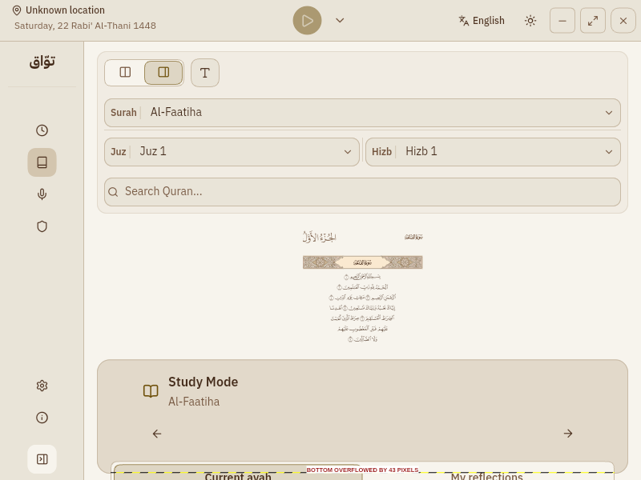

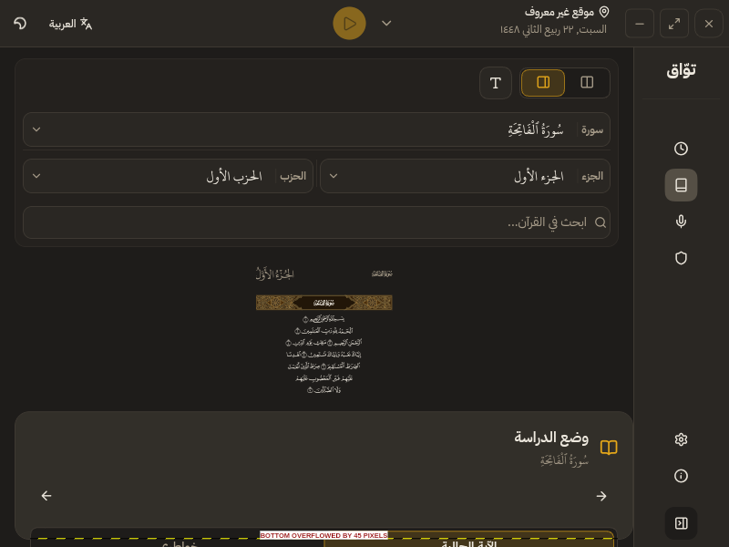

[Video: compact study remains clipped after settling, 8 seconds](evidence/quran-compact-study.mp4). This is persistence-of-layout evidence, not a frame-rate or flicker measurement.

<a id="ui-02"></a>

### UI-02 — A collapsed study panel reappears in the stacked layout

**Priority:** P2 · **Status:** reproduced and source-confirmed.

**Reproduction:** In a wide Arabic Study Mode window, collapse the study panel using its control. Resize to 800×600, then return to a wide window.

**Actual:** The narrow layout renders the study panel again. Returning wide restores the collapsed presentation. The stacked branch always builds the panel; it does not apply the watched `sidePanelCollapsed` preference. The wide collapsed and narrow expanded captures document the mismatch.

**Expected and impact:** A deliberate collapse should remain meaningful when the layout changes, or the compact design should offer an explicit replacement with an obvious close action. Resizing should not unexpectedly reclaim the reading space a user just recovered.

**Principle and direction:** User control and consistency. Give collapse one coherent meaning across layouts instead of allowing the wide and stacked branches to interpret the same preference differently.

**Owner and fan-out:** [StudyModeLayout](../../../lib/feature/quran/presentation/widgets/study_mode_layout.dart), including `ResponsiveHorizontalSplitGate` and the Quran screen settings provider. Consider persisted collapse, automatic collapse, reopening, and RTL placement. There is no evidence that the stored preference itself is lost.

**Acceptance:** Collapse/resize/expand works predictably in both directions, including restart with a collapsed preference. Compact users can recover reader space without first widening the window.

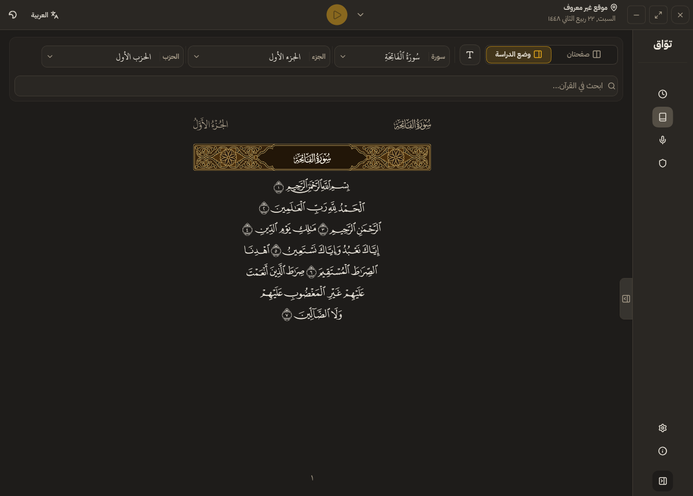

The compact state is shown in [UI-01's Arabic screenshot](evidence/quran-study-ar-800x600.png).

<a id="ui-03"></a>

### UI-03 — Selecting an ayah resizes and repositions the reading page

**Priority:** P2 · **Status:** reproduced; motion recorded · **Configuration:** Arabic, Manuscript dark, 1200×860.

**Reproduction:** Open the first Quran page in Study Mode. Select an ayah, clear the selection, and select it again while watching the reading surface.

**Actual:** Adding the selection action strip changes the height available to the Mushaf. The page scales and line positions move when the strip appears or disappears. The reader therefore moves in response to a selection gesture intended to act on the text.

**Expected and impact:** Selecting a verse should preserve reading position and page geometry as far as possible. Repeated movement makes it harder to retain the line the user was reading and weakens the sense that controls are attached to a stable document.

**Principle and direction:** Motion should explain state without disrupting the task. Reserve a stable action region or use another arrangement that preserves the existing guarantee that actions never cover a Quran line or page metadata.

**Owner and fan-out:** [QuranMushafPane](../../../lib/feature/quran/presentation/widgets/quran_mushaf_pane.dart) places the expanding Mushaf and selection actions in one column. This is intentional occlusion prevention, not evidence of corrupted text. Review both Study Mode and double-page reading before changing the shared arrangement.

**Acceptance:** Repeated selection and clearing preserve line/page geometry at representative sizes. Actions remain reachable and never obscure religious text. Check reduced motion separately.

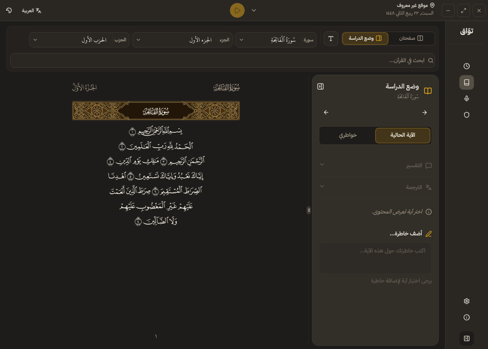

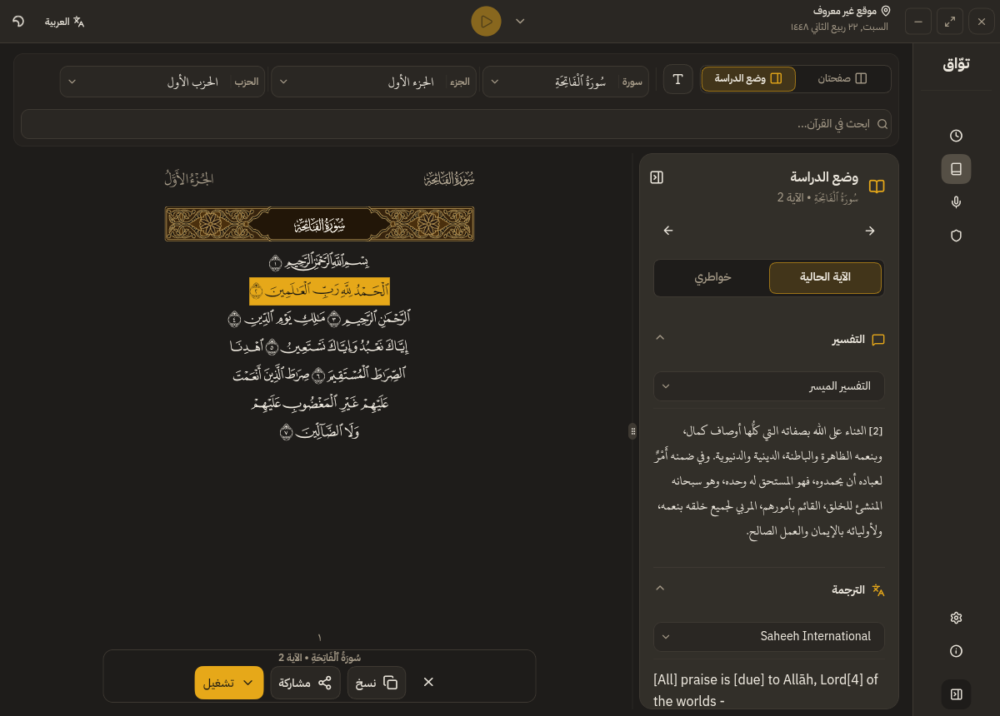

[Video: repeated verse selection and clearing, approximately 17.5 seconds](evidence/quran-verse-selection.mp4). The recorded defect is reflow. A flashing or flickering defect was not confirmed.

<a id="ui-04"></a>

### UI-04 — An empty study panel claims space before an ayah is selected

**Priority:** P2 · **Status:** design critique · **Configuration:** wide English light and Arabic dark.

**Reproduction:** Open Study Mode with no selected ayah.

**Actual:** A substantial side panel presents tabs, source selectors, disabled Tafsir/Translation sections, a reflection area, and a low-emphasis instruction to select an ayah. Most of the panel cannot yet help the user, while it takes width from the Quran page.

**Expected and impact:** The empty state should explain the next action clearly and earn the space it occupies. Source selection can remain available where useful, but inactive controls should not have more visual weight than the instruction that unlocks them.

**Principle and direction:** Progressive disclosure, minimalism, and clear hierarchy. Start with a compact explanation, or reveal the full study surface when selection makes it useful. This is an interaction recommendation, not a proposal to remove Tafsir, translation, or reflections.

**Owner and fan-out:** [StudyPanel](../../../lib/feature/quran/presentation/widgets/study/study_panel.dart) and [NotesSection](../../../lib/feature/quran/presentation/widgets/study/notes_section.dart). Preserve legitimate source-loading, error, empty-content, and selected-ayah states when changing disclosure.

**Acceptance:** First entry communicates how to select an ayah without a wall of disabled controls. Selection, clearing, and switching study tabs have a deliberate hierarchy in both locales.

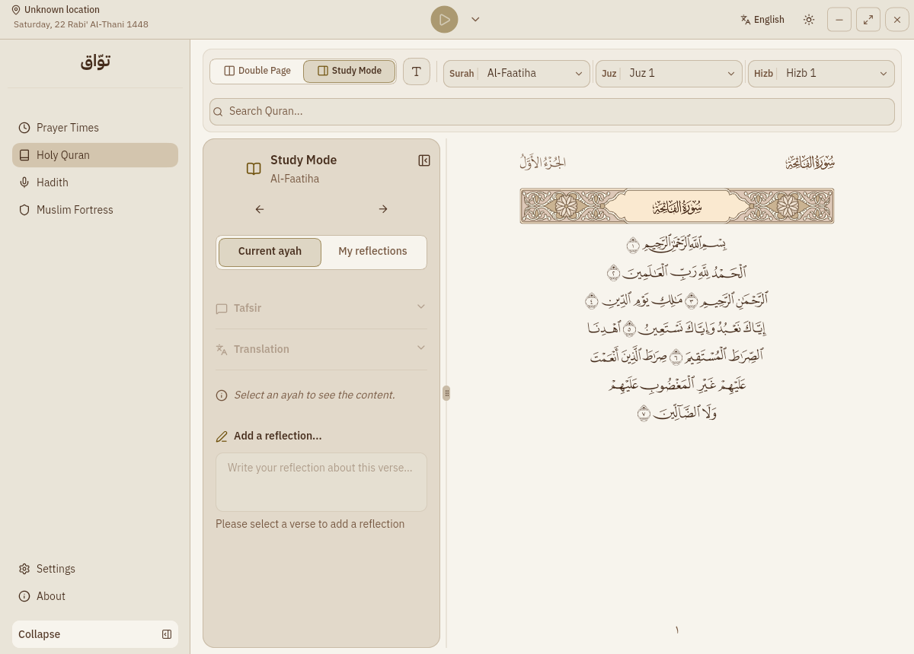


## Recitation controls and dialogs

<a id="ui-05"></a>

### UI-05 — Recitation preference labels wrap one character per line

**Priority:** P1 · **Status:** reproduced · **Configuration:** English, default scale, 1200×860.

**Reproduction:** Open the recitation drawer from the shell's player chevron and inspect its lower preference controls.

**Actual:** “Auto-scroll” and “Highlight ayah” are squeezed into extremely narrow text columns. Their letters run vertically, even though the drawer itself has substantial width. The switches are visible but their labels are difficult to read.

**Expected and impact:** Preference labels should remain readable and visually attached to the correct switch. This makes basic playback behavior unnecessarily difficult to understand before any playback begins.

**Principle and direction:** Typography, grouping, and robust adaptation. Give each preference a bounded, useful label area or stack the controls when their combined intrinsic sizes do not fit.

**Owner and fan-out:** `_PreferencesSection` in [recitation_drawer_controls.dart](../../../lib/feature/quran/presentation/widgets/player/recitation_drawer_controls.dart), particularly its row sizing and nested highlight row. Resolved Forui 0.27.3 layout behavior was inspected; this is not a speculative package-version assumption. The shell exposes this drawer on every feature route.

**Acceptance:** Both labels read normally in English and Arabic at supported window sizes and app scales, with no character-column wrapping. Test the real grouped row rather than each switch alone.

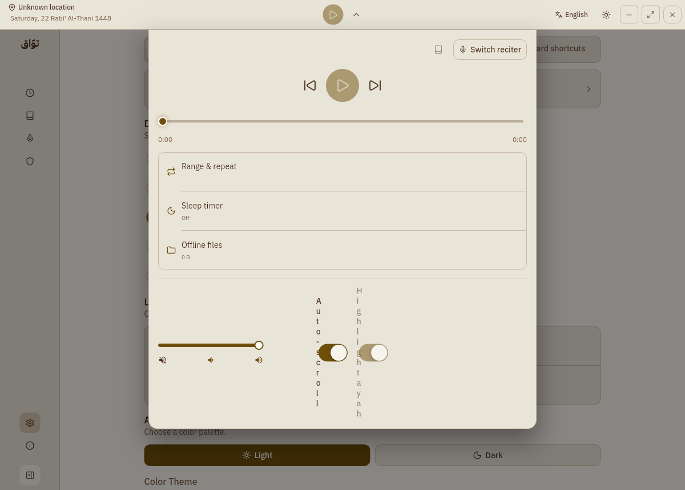

<a id="ui-06"></a>

### UI-06 — The recitation drawer overflows the supported minimum window

**Priority:** P1 · **Status:** reproduced · **Configuration:** English, default scale, 800×600.

**Reproduction:** Open the recitation drawer and resize the native window to 800×600.

**Actual:** The drawer reports a bottom overflow of 177 pixels. Its lower controls extend below the available area rather than becoming scrollable or adopting a useful short-window arrangement. The drawer can choose its wide content branch because its own width remains around 680 pixels, even though the window is too short for that branch.

**Expected and impact:** Every player control should remain reachable at the supported minimum size. Width alone cannot determine whether a content-heavy floating drawer fits.

**Principle and direction:** Adaptation and recovery. Bound the drawer by actual available height, then make the necessary content reachable. Fixing vertical label wrapping may reduce height, but the drawer still needs a sound height constraint.

**Owner and fan-out:** [RecitationDrawer](../../../lib/feature/quran/presentation/widgets/player/recitation_drawer.dart) uses a non-scrollable column; shell title-bar space further reduces the viewport. Existing [drawer tests](../../../test/feature/quran/recitation_drawer_test.dart) include a narrow but very tall case, which does not prove 800×600 compatibility. Shared shell overlays and all feature routes are affected.

**Acceptance:** No overflow at 800×600; controls remain reachable with keyboard and pointer at default and larger text. Verify empty, initialized, loading, and active player content. Nested dialogs should retain their independent height behavior.

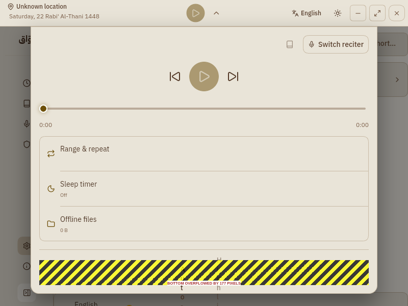

The [reciter dialog](evidence/reciter-800x600.png) is a useful positive contrast: its list fits and scrolls in a bounded dialog. The striped content behind it belongs to the drawer, not the dialog.

<a id="ui-07"></a>

### UI-07 — An unconfigured player does not explain how to start

**Priority:** P2 · **Status:** design critique of a reproduced empty state.

**Reproduction:** On fresh isolated state, open the shell player before choosing a reciter or starting a track.

**Actual:** The player presents a disabled play button, a 0:00/0:00 timeline, no useful track or reciter identity, and a “Switch reciter” action. “Switch” implies an existing choice even though this state has no configured reciter. Advanced range, timer, and offline controls have more structure than the first-use instruction.

**Expected and impact:** The empty state should explain what is missing and present a clear next action. Users should not have to infer the setup requirement from a disabled transport button.

**Principle and direction:** Visibility of state, precise verbs, and progressive disclosure. Use state-specific wording and a useful initial action. The range dialog already demonstrates clearer “Select reciter” guidance.

**Owner and fan-out:** [RecitationDrawer](../../../lib/feature/quran/presentation/widgets/player/recitation_drawer.dart), its controls, and recitation metadata. Reconcile first-use labels across shell transport, drawer, reciter picker, and range dialog without duplicating logical playback state.

**Acceptance:** No-reciter and no-track states explain themselves; configuring a reciter leads naturally to a playable choice. Initialized and restored sessions continue to identify the current selection correctly.

Context: [empty player](evidence/player-labels-wide.png) and [range dialog with clearer selection guidance](evidence/range-repeat-wide.png).

## Onboarding and location recovery

<a id="ui-08"></a>

### UI-08 — Missing-location recovery restarts the entire onboarding flow

**Priority:** P2 · **Status:** reproduced and source-confirmed.

**Reproduction:** Reach Prayer with no configured location. Activate the location recovery/setup button.

**Actual:** The user returns to Welcome, rather than a focused location step. The button resets onboarding completion and starts the multi-step flow again. The missing prerequisite is a location, but the recovery asks the user to traverse unrelated setup choices.

**Expected and impact:** Recovery should take the user to the missing prerequisite and back to Prayer once it is valid. A short correction should not require redoing the entire introductory journey or create uncertainty about settings already chosen.

**Principle and direction:** Clear recovery and user control. Couple the location prompt to the location editor or a resumable focused setup path, with its return destination preserved.

**Owner and fan-out:** [PrayerLocationSetupAlert](../../../lib/feature/prayer/presentation/widgets/prayer_location_setup_alert.dart) calls onboarding `reset()` and routes to onboarding. [OnboardingScreen](../../../lib/app/onboarding/onboarding_screen.dart) controls the steps. Any future change must respect persisted completion and established finish/flush ordering; this audit made no persistence changes.

**Acceptance:** Missing-location recovery opens the relevant step directly, preserves other settings, and returns to the originating flow. Explicit “Run setup again” remains a separate deliberate action.

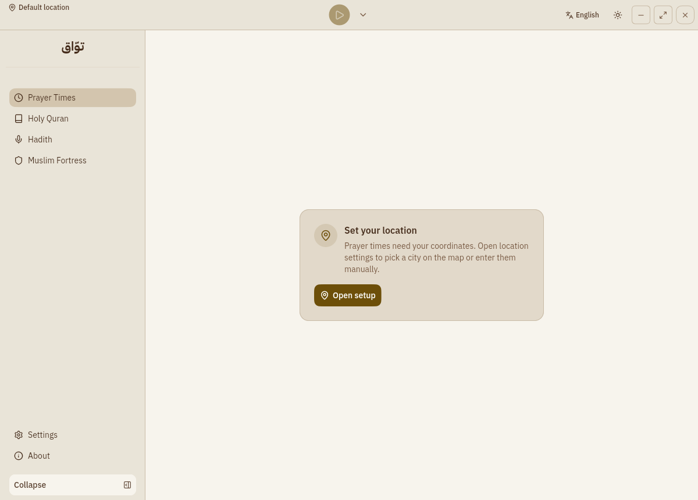

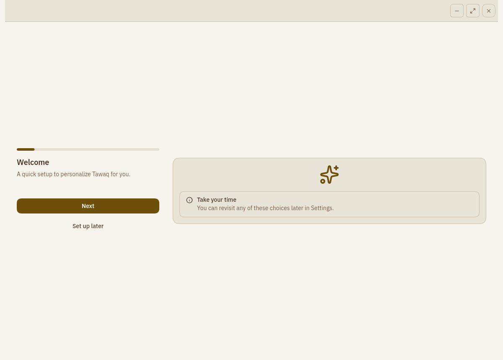

<a id="ui-09"></a>

### UI-09 — An Adhan modal interrupts incomplete onboarding

**Priority:** P2 · **Status:** live interruption reproduced once.

**Reproduction observed:** During fresh onboarding, configure coordinates and continue to the calculation-method screen. A live prayer alert becomes due while setup is still incomplete.

**Actual:** An Adhan modal for Maghrib appeared over the setup screen before the later notification/alert choices had been completed. It blocked the current Back/Next interaction. Audio also started during the session and was stopped immediately; the attached screenshot proves the visual interruption, not audio behavior.

**Expected and impact:** Setup should provide a coherent opportunity to configure alert behavior before time-triggered UI interrupts it. A modal arriving while prayer/location preferences are still being chosen can make the user doubt whether setup is complete.

**Principle and direction:** Respect the current task and prevent surprising interruption. Define when alerts become eligible during onboarding and apply that policy at the alert owner, rather than hiding one modal locally.

**Owner and fan-out:** [main.dart](../../../lib/main.dart) wraps routed content in [AdhanAlertHost](../../../lib/app/desktop/alerts/adhan_alert_host.dart). Trace the shared coordinator, sound behavior, completion state, and desktop alert consumers before implementing a guard. The observed interruption does not establish a prayer-time calculation bug.

**Acceptance:** A clock-controlled test covers a due alert during incomplete setup and at completion. The intended behavior for rerunning setup is explicit. Visual and audio eligibility agree, without suppressing legitimate alerts after configuration.

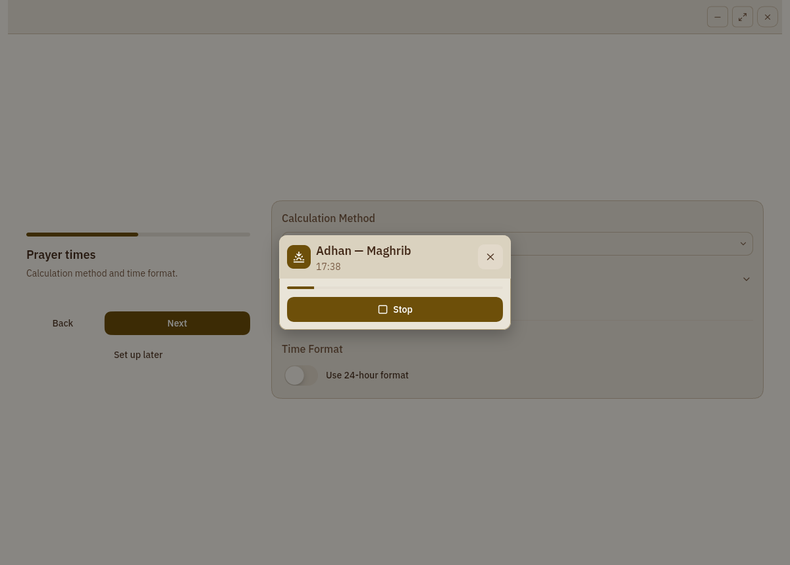

<a id="ui-10"></a>

### UI-10 — Onboarding does not explain the length or shape of setup

**Priority:** P3 · **Status:** design critique.

**Reproduction:** Start fresh setup and proceed through Welcome, language, location, prayer calculation, iqamah, notifications, appearance, and completion.

**Actual:** The welcome screen uses a large quiet surface for a small amount of introduction. Subsequent screens show progress but do not clearly preview the eight-step journey or explain which choices are essential and which can be revisited. Several technical choices arrive one after another.

**Expected and impact:** Users should understand the commitment and purpose of setup before starting. A calm visual style should still communicate what will happen and how to recover or adjust decisions later.

**Principle and direction:** Orient the user and reduce cognitive load. Add a concise overview or clearer step identity, and consider coupling closely related prayer configuration tasks where that improves comprehension. Do not remove necessary accuracy choices just to shorten the flow.

**Owner and fan-out:** [OnboardingScreen](../../../lib/app/onboarding/onboarding_screen.dart) and [OnboardingScaffold](../../../lib/app/onboarding/onboarding_scaffold.dart). Review welcome, progress, back navigation, required validation, and completion together.

**Acceptance:** Setup communicates its main stages, current stage, and revisitable choices in both locales. Users can move back without losing valid choices, and required location/calculation choices remain clear.

Context: [Welcome](evidence/onboarding-welcome.png), [calculation method](evidence/onboarding-method.png), [iqamah](evidence/onboarding-iqamah.png), [notifications](evidence/onboarding-notifications.png), and [appearance](evidence/onboarding-appearance.png).

<a id="ui-11"></a>

### UI-11 — Location setup exposes too many coordinate-level decisions at once

**Priority:** P2 · **Status:** design critique; map loading was observed, not a permanent map failure.

**Reproduction:** Open the onboarding location step or Settings → Location with fresh/manual location state.

**Actual:** City search, device location, timezone, map, latitude, and longitude are all part of the initial decision surface. The map can initially be blank while loading. Coordinate-level inputs have substantial visual weight even though the common task is choosing the user's city.

**Expected and impact:** The primary path should make location selection obvious, show the resulting timezone, and let users inspect or refine details when needed. New users should not need to understand coordinate editing to complete an accurate setup.

**Principle and direction:** Progressive disclosure, explanatory state, and task-based grouping. Prioritize city/device-location selection, then expose the resolved result and manual controls deliberately. Preserve manual accuracy and timezone control.

**Owner and fan-out:** Prayer location settings and the shared location controls used in onboarding and Settings. Review loading, lookup failure, device-location failure, manual entry, and valid coordinates together; do not invent a fallback location.

**Acceptance:** A basic city choice has a clear success state and usable recovery. Advanced coordinates remain accessible. Loading is identified without implying the map is permanently broken.

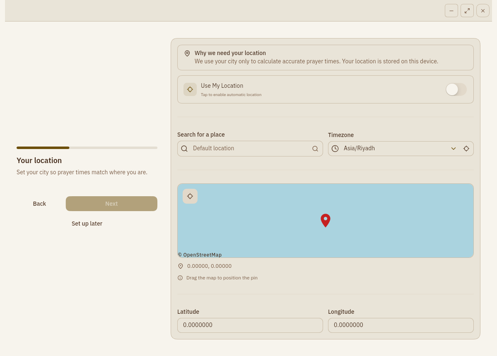

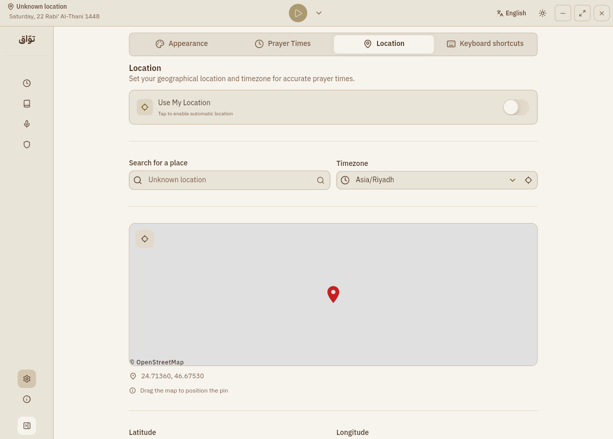

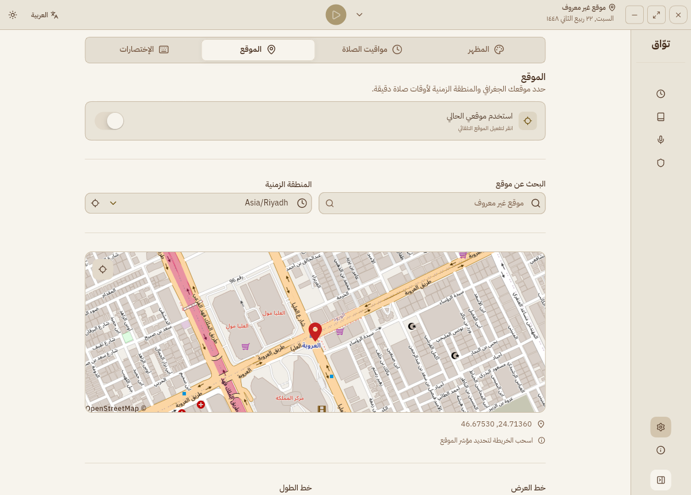

## Settings and prayer hierarchy

<a id="ui-12"></a>

### UI-12 — Appearance settings bury appearance below unrelated controls

**Priority:** P2 · **Status:** design critique.

**Reproduction:** Open Settings → Appearance at 1200×860, starting at the top; repeat at 800×600.

**Actual:** The tab begins with “Run setup again,” then desktop startup/tray/window switches and language. Theme mode and the actual color theme are farther down; the color theme is below the initial fold in the wide capture. A user following the tab name must pass several unrelated groups first.

**Expected and impact:** The tab label should predict its first content. Frequently used appearance controls should be grouped and easy to reach; general setup and desktop behavior should have a coherent place of their own.

**Principle and direction:** Information architecture, meaningful grouping, and efficient access. Reorder or regroup based on task rather than treating Appearance as a container for every general setting.

**Owner and fan-out:** [SettingsAppearanceTab](../../../lib/feature/settings/presentation/widgets/tabs/settings_appearance_tab.dart), the settings tab composition, and onboarding rerun tile. Review keyboard navigation, locale switching, and selected-tab restoration if the grouping changes. Existing Sage theme work is part of this audit baseline, not attributed as the cause of the older grouping.

**Acceptance:** Appearance controls are immediately discoverable in the Appearance destination. Desktop and setup actions remain easy to locate with accurate destination labels. Compact and XL layouts keep all groups reachable.

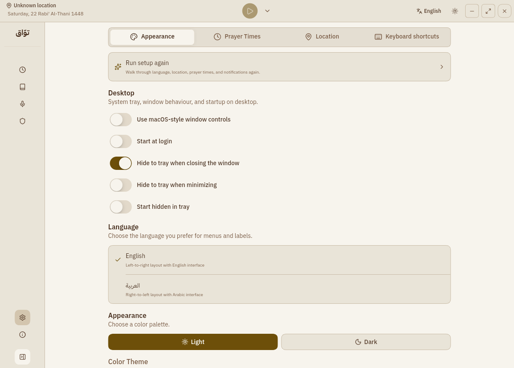

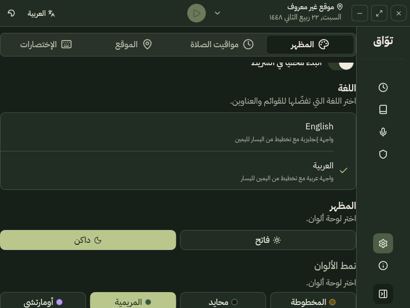

<a id="ui-13"></a>

### UI-13 — Light/dark controls use color-palette copy

**Priority:** P3 · **Status:** visible copy mismatch.

**Reproduction:** Open Appearance and inspect the explanatory text for Light/Dark and Color Theme.

**Actual:** “Choose a color palette” describes the Light/Dark choice and is repeated under Color Theme. The Arabic dark-mode capture shows the corresponding duplicate explanation. Two different dimensions of appearance are described as the same choice.

**Expected and impact:** Theme mode and color palette should have distinct, short explanations. Ambiguous helper text makes an otherwise simple settings group require interpretation.

**Principle and direction:** Precise labels and concise useful copy. Describe what each control changes, including any system mode only if the actual control supports it.

**Owner and fan-out:** [SettingsAppearanceTab](../../../lib/feature/settings/presentation/widgets/tabs/settings_appearance_tab.dart), [AppThemeSelector](../../../lib/feature/settings/presentation/widgets/theme/app_theme_selector.dart), and ARB inputs. A future copy change should update both locales and regenerate tracked localization outputs instead of editing generated Dart directly.

**Acceptance:** Mode and palette have distinct accurate descriptions in English and Arabic, with no redundant paragraph. Onboarding appearance uses compatible terminology.

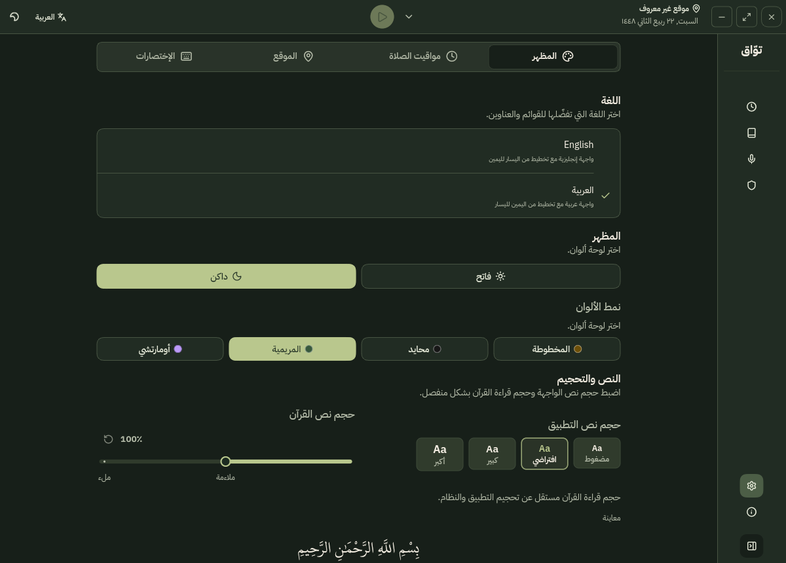

<a id="ui-14"></a>

### UI-14 — The five-prayer schedule is pushed below secondary content

**Priority:** P2 · **Status:** design critique · **Configuration:** English, 1200×860.

**Reproduction:** Open Prayer after location is valid and inspect the initial viewport.

**Actual:** A large current-prayer hero, week navigation, and an expanded Sunnah Times group precede the daily prayer rows. The first obligatory prayer row appears near the bottom of the visible area; seeing the complete five-prayer schedule requires scrolling. The analytics column consumes considerable space even with fresh, sparse history.

**Expected and impact:** The daily schedule should be quick to scan. Related secondary times and tracking history are useful, but their default presentation should not obstruct the primary time-checking task.

**Principle and direction:** Hierarchy and task frequency. Couple current-prayer context with a compact, visible daily schedule, then use deliberate disclosure for additional times and analytics. This concerns presentation priority, not religious classification or calculation rules.

**Owner and fan-out:** [PrayerScreen](../../../lib/feature/prayer/presentation/screens/prayer_screen.dart), [PrayerScheduleList](../../../lib/feature/prayer/presentation/widgets/schedule_row/prayer_schedule_list.dart), and analysis cards. Any redesign must preserve selected-day behavior, tracking actions, and the shared live clock.

**Acceptance:** The initial desktop view makes the full daily prayer schedule easy to find and scan. Secondary times remain accessible, and zero-history analytics have an intentional compact empty state.

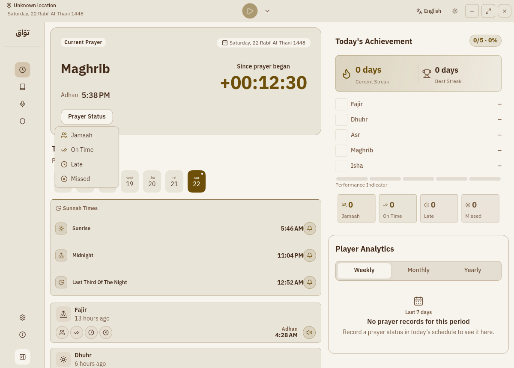

<a id="ui-15"></a>

### UI-15 — Prayer statistics are labelled “Player Analytics” in English

**Priority:** P3 · **Status:** reproduced and source-confirmed.

**Reproduction:** Open Prayer in English and inspect the trend/statistics card.

**Actual:** The heading says “Player Analytics.” The app also has a Quran audio player, so the label suggests a different feature. The card actually contains prayer tracking statistics; the Arabic wording follows that intent more closely.

**Expected and impact:** The heading should identify prayer statistics consistently across locales. A wrong feature noun makes the card harder to understand and undermines confidence in otherwise meaningful data.

**Principle and direction:** Match labels to the user's task and domain. Correct the localization input and consider whether the generated identifier should also reflect the owning concept.

**Owner and fan-out:** [TrendAnalysisCard](../../../lib/feature/prayer/presentation/widgets/analysis/trend_analysis_card.dart) reads `l10n.playerAnalytics`; [app_en.arb](../../../lib/l10n/app_en.arb) contains the English string. Trace other references before renaming an identifier. No localized or generated files were changed in this audit.

**Acceptance:** English and Arabic identify the same prayer analytics concept; localization generation and relevant widget assertions agree.

Evidence: the lower-right card in [the Prayer capture](evidence/prayer-status-wide.png).

## Fortress browsing and reading

<a id="ui-16"></a>

### UI-16 — Fortress chapter browsing has almost no list height at 800×600

**Priority:** P1 · **Status:** reproduced · **Configuration:** English default scale and Arabic Sage XL.

**Reproduction:** Open Fortress at 800×600 with no selected chapter. Inspect the catalog, then select a chapter. Repeat with Arabic and XL app text.

**Actual:** The stacked layout gives the catalog a fixed portion of the available height. Its heading, chapter filter, and tabs use most of that portion, leaving only a thin clipped strip for the chapter list. A separate main-pane search and welcome/detail region consume the rest. The screenshot after selection still shows the cramped catalog; Arabic XL makes the constraint more evident.

**Expected and impact:** Browsing chapters is the entry task and needs enough space to see and choose items. A technically scrollable sliver does not provide a finished browsing experience.

**Principle and direction:** Useful adaptation and progressive disclosure. In a short window, prioritize either browsing or reading at a time, or provide a compact catalog with a meaningful visible list. Preserve direct access back to browsing.

**Owner and fan-out:** [MuslimFortressScreen](../../../lib/feature/muslim_fortress/presentation/screens/muslim_fortress_screen.dart) stacks catalog/main panes with flex 2/3; [FortressBrowseSidebar](../../../lib/feature/muslim_fortress/presentation/widgets/browse/fortress_browse_sidebar.dart) has fixed chrome above its expanding list. Review chapter tabs, filtering, favorites, selected detail, and focus reading.

**Acceptance:** Several chapter rows are visibly usable at 800×600, including Arabic XL. Browsing-to-reading and returning preserve context, with no clipping or layout overflow.

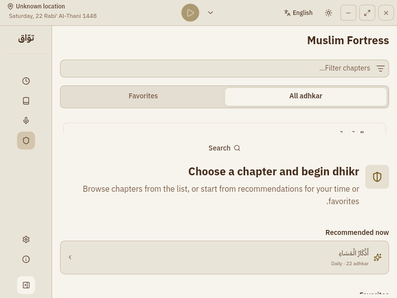

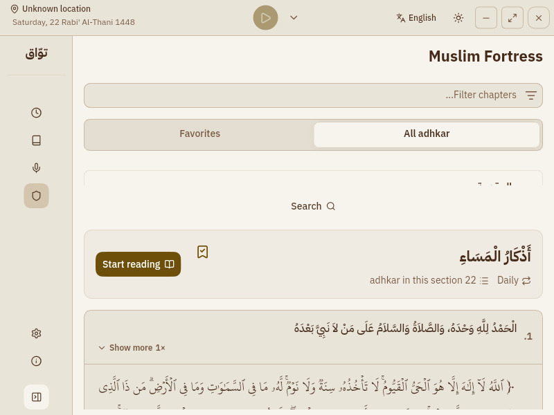

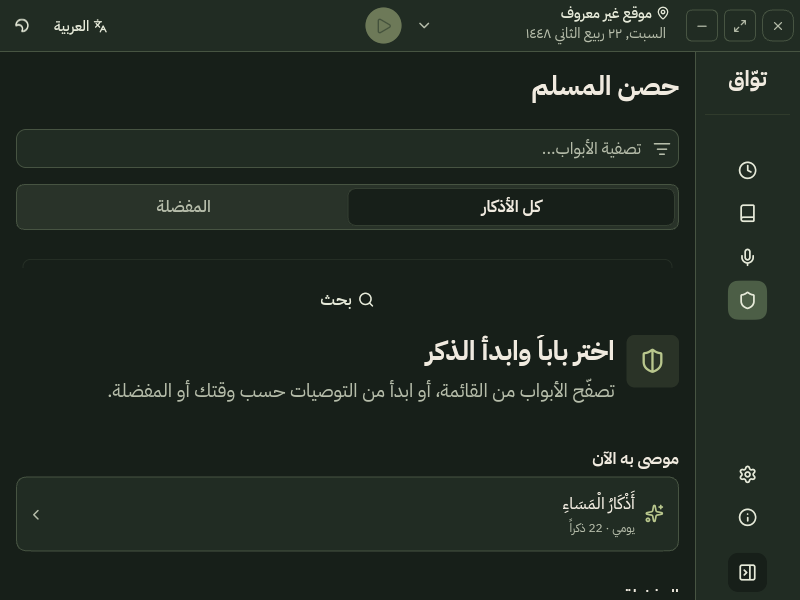

<a id="ui-17"></a>

### UI-17 — English Fortress interface chrome inherits RTL direction

**Priority:** P2 · **Status:** reproduced and source-confirmed.

**Reproduction:** Choose English, open Fortress's welcome/browse state, and enter focus reading on the first item of a 22-item chapter.

**Actual:** English welcome punctuation and ellipsis placement are affected by RTL layout. In reading, the progress display visually reads “22 / 1” while the user is on the first of 22 items. The screen applies RTL direction to broad regions rather than limiting it to Arabic content.

**Expected and impact:** English interface text and progress should follow the English locale, while Arabic religious content retains its correct direction. Reversed progress can make the user misread their location in a chapter.

**Principle and direction:** Locale-aware typography and real-world comprehension. Separate content direction from interface direction; do not normalize or rewrite sourced religious text to repair layout.

**Owner and fan-out:** The browse and reading branches in [MuslimFortressScreen](../../../lib/feature/muslim_fortress/presentation/screens/muslim_fortress_screen.dart) wrap broad content in `Directionality.rtl`. Review progress, punctuation, search fields, nav buttons, and mixed-script labels in both layouts.

**Acceptance:** English progress reads unambiguously as current/total, and English punctuation follows LTR order. Arabic content and Arabic locale navigation remain correct, including mixed-script source references.

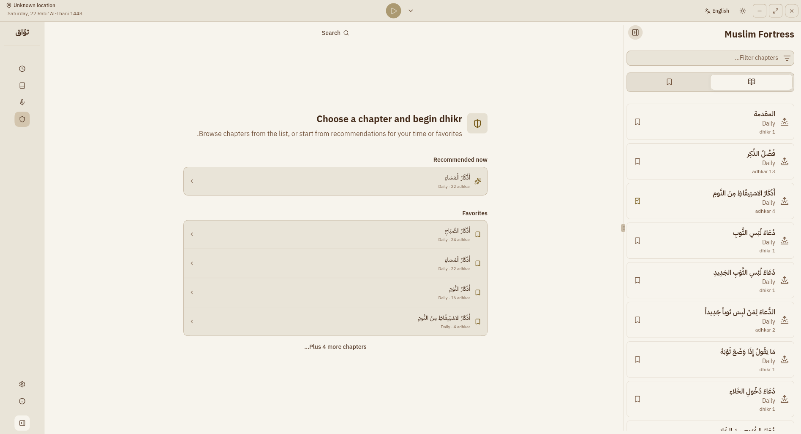

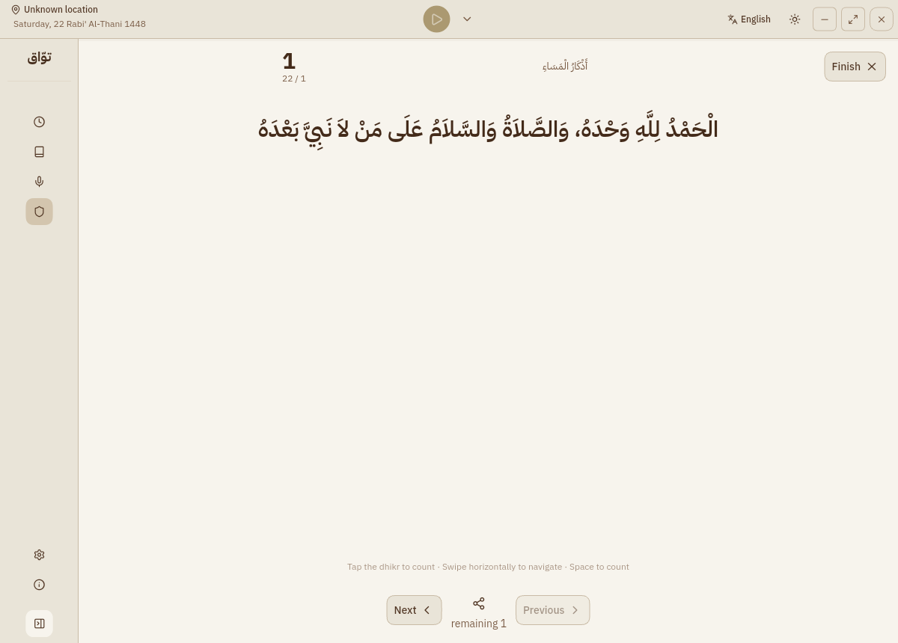

<a id="ui-18"></a>

### UI-18 — Fortress presents two search scopes without a clear relationship

**Priority:** P2 · **Status:** design critique.

**Reproduction:** Open Fortress browsing and compare “Filter chapters” in the catalog with the separate “Search” field in the main pane.

**Actual:** Two nearby search surfaces operate in different parts of the screen. The first is scoped to chapter filtering; the other has a generic label. Their relationship and expected result destination are not equally clear. In the stacked layout, both also consume scarce height before useful content.

**Expected and impact:** Users should know whether they are finding a chapter or searching remembrance content, and where results will appear. Similar-looking inputs should not require trial and error to understand their scope.

**Principle and direction:** Clarify scope and group related tasks. Use distinct task labels or a coordinated search entry with an explicit scope, while preserving the actual query owners and result semantics.

**Owner and fan-out:** [MuslimFortressScreen](../../../lib/feature/muslim_fortress/presentation/screens/muslim_fortress_screen.dart) main pane and [FortressBrowseSidebar](../../../lib/feature/muslim_fortress/presentation/widgets/browse/fortress_browse_sidebar.dart). This is a discovery critique, not a claim that both queries share duplicated business logic.

**Acceptance:** Users can distinguish chapter filtering from content search without entering a query. Scope, clear action, empty result, and return-to-reading behavior are explicit in both locales and layouts.

Evidence: [wide browse](evidence/fortress-welcome-wide.png) and [compact browse](evidence/fortress-welcome-800x600.png).

## Hadith search

<a id="ui-19"></a>

### UI-19 — Hadith reserves an empty detail pane before there is a selection

**Priority:** P2 · **Status:** design critique.

**Reproduction:** Open Hadith in a wide window before searching or selecting a result. Compare the compact layout.

**Actual:** The split view reserves a substantial blank detail region with a generic instruction. With no result selected, that region contributes little while the search form and empty results already explain the initial task. Compact mode presents a more focused starting surface.

**Expected and impact:** The detail pane should earn its space when there is content to inspect, or serve an informative initial purpose. An unused pane creates visual complexity without helping the first search.

**Principle and direction:** Minimalism and progressive disclosure. Consider revealing detail on selection or making the initial pane meaningfully support the task; preserve efficient result-to-detail browsing after selection.

**Owner and fan-out:** [HadithScreen](../../../lib/feature/hadith/presentation/screens/hadith_screen.dart) split composition and its detail pane. Existing split-layout tests verify the gate, not whether an empty pane is useful. Review initial, loading, selected, cleared, bookmarked, and restored selection states.

**Acceptance:** Wide first entry has a deliberate purpose for every major region. Selection reveals useful detail without losing query/results context, and compact detail navigation remains coherent.

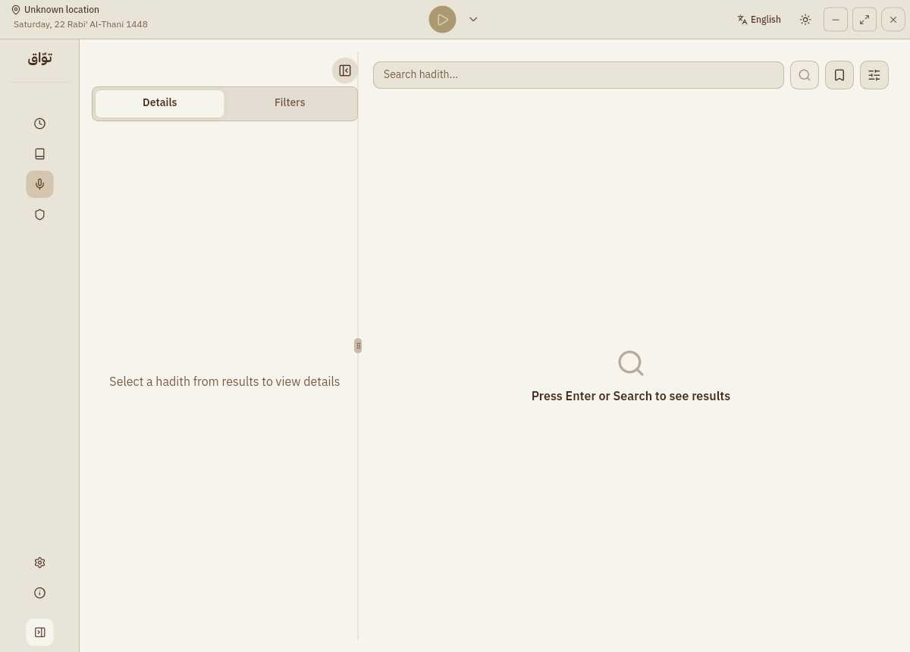

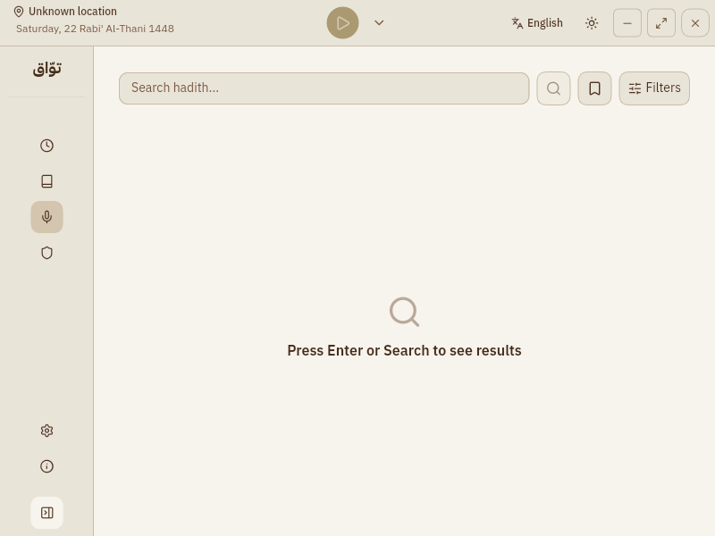

<a id="ui-20"></a>

### UI-20 — Hadith filter help repeats specialist terms instead of explaining them

**Priority:** P3 · **Status:** design critique.

**Reproduction:** Open Hadith filters in English and inspect the Takhrij option and associated metadata-oriented controls.

**Actual:** The help text for Takhrij says to return hadiths that include takhrij in their metadata. It repeats the specialist term and introduces implementation language rather than helping a non-specialist decide when to use the filter. The result screen contains further specialist vocabulary.

**Expected and impact:** A filter should explain what narrowing it performs in language appropriate to the audience. Users unfamiliar with the term should be able to learn its verified meaning without guessing.

**Principle and direction:** Clear labels and help at the point of need. Retain authoritative terminology, but supply a sourced explanation or contextual help. This report does not invent a religious definition, translation, or replacement.

**Owner and fan-out:** Hadith filter form, localized ARB copy, and result metadata presentation. Verify explanations against the repository's data/API contracts and an appropriate authority before writing them. Preserve source attribution and scholarly categories.

**Acceptance:** Both locales explain the filter's practical effect accurately. Explanations are accessible without opening an unrelated screen, and result terminology is consistent with the filter.

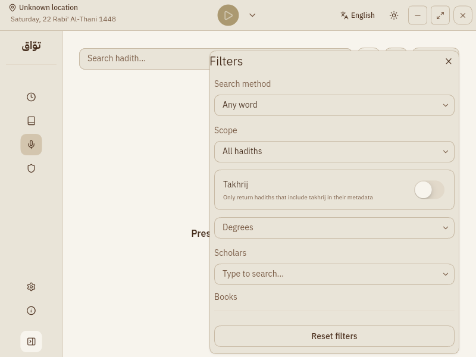

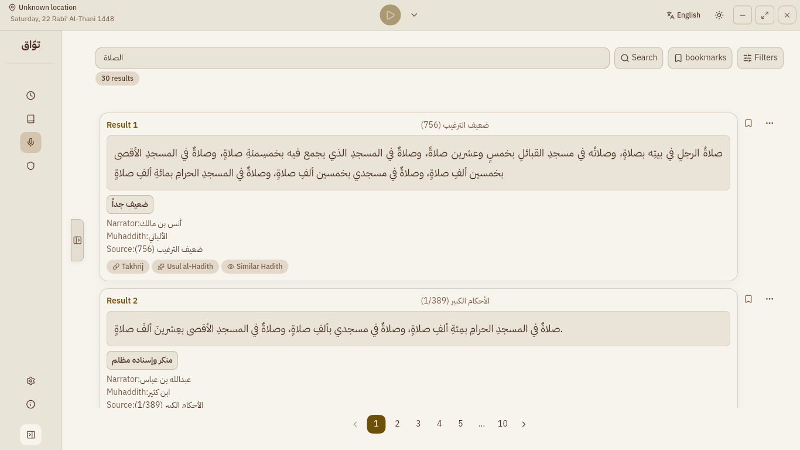

## About and shared navigation

<a id="ui-21"></a>

### UI-21 — About exposes placeholder support and credit data

**Priority:** P2 · **Status:** reproduced and source-confirmed.

**Reproduction:** Open About, inspect Links, and scroll to credits.

**Actual:** The interface shows `hello@example.com` and “Your Name.” The Website row displays `tawaq.app`, but its configured URL is `https://example.com`. Source code and issue-report URLs use `github.com/example/tawaq`. The owner explicitly identifies this content as placeholder/mock data, but it is composed into the real app.

**Expected and impact:** Support, source, and credit information should identify real destinations or be omitted until it is available. A displayed address must match its action. Placeholder destinations damage trust precisely where a user seeks support or provenance.

**Principle and direction:** Trustworthy content and finished reachable states. Replace only with verified project information; do not guess contact details, authorship, release claims, or URLs.

**Owner and fan-out:** [about_info.dart](../../../lib/feature/about/data/about_info.dart) supplies the content to the shared About view, used in dialog/screen presentations. This audit did not open external destinations or send contact messages.

**Acceptance:** Every displayed destination and credit is verified, matches its action, and is appropriate in both locales. Missing information has an intentional presentation rather than mock strings.

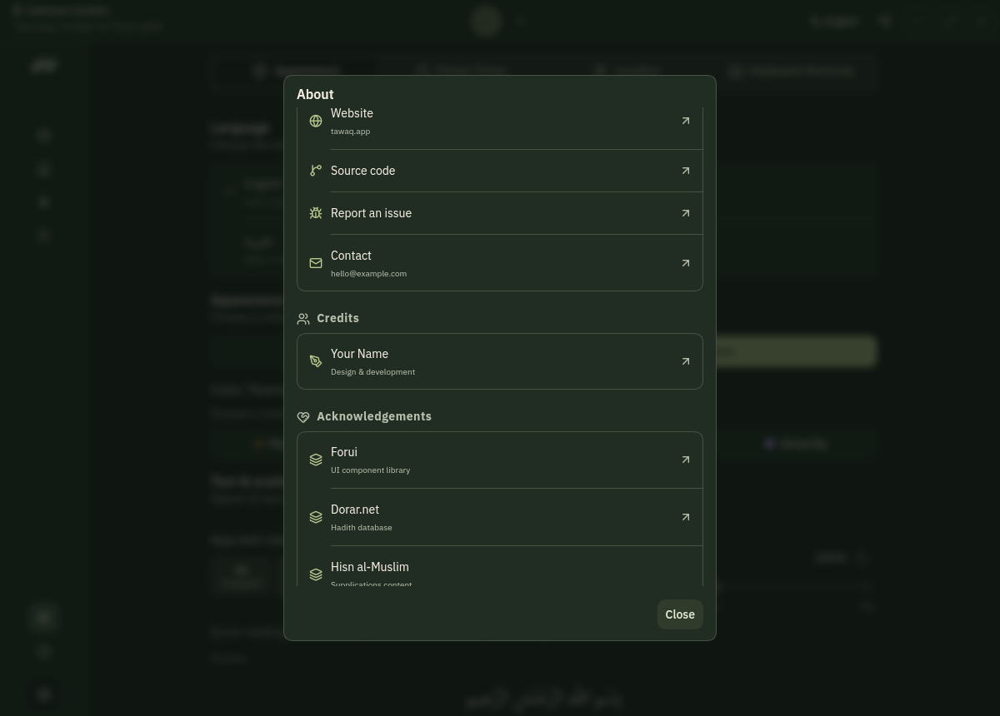

The mismatched Website description appears in [the initial About view](evidence/about-top.png).

<a id="ui-22"></a>

### UI-22 — About link arrows copy instead of opening the destination

**Priority:** P2 · **Status:** reproduced and source-confirmed.

**Reproduction:** Activate the Website row in About.

**Actual:** A “Link copied to clipboard” toast appears. Rows use an external-navigation arrow, but `_openAboutLink` only calls `Clipboard.setData`; it does not open the resource. Users must understand the unexpected toast and paste elsewhere.

**Expected and impact:** The affordance and label should predict the actual action. Navigation and copying are both useful, but they should have distinct, explicit controls.

**Principle and direction:** Consistent signifiers and precise action labels. Either make the row perform clearly indicated navigation or identify it as a copy action; provide a separate copy affordance if useful.

**Owner and fan-out:** [AboutView](../../../lib/feature/about/presentation/widgets/about_view.dart), its link/credit/acknowledgement rows, and About strings. Fixing placeholder destinations alone will not fix this behavior. Review keyboard activation and feedback in dialog and screen variants.

**Acceptance:** Every resource action behaves as advertised. Copy feedback is localized and corresponds to an explicitly identified copy action; navigation has a clear result or failure response.

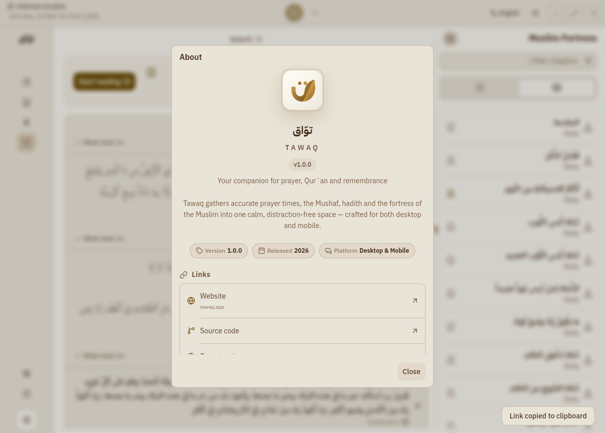

<a id="ui-23"></a>

### UI-23 — About spends most of its initial height on repeated brand information

**Priority:** P3 · **Status:** design critique; the dialog scrolls successfully.

**Reproduction:** Open About at 1200×860 without scrolling.

**Actual:** Logo, Arabic title, Latin name, version badge, tagline, description, and a facts strip occupy most of the initial dialog. Version is repeated in the badge and facts. Only the start of the Links section is visible; issue reporting and contact require further scrolling.

**Expected and impact:** About can express the brand while making version, provenance, and support easy to find. The repeated promotional structure delays the practical tasks that commonly bring users to this destination.

**Principle and direction:** Distill redundant content and establish a task hierarchy. Use a more compact identity/version group and make support/provenance prominent. This is an editorial design judgment, not proof that the screen's implementation is chronologically outdated.

**Owner and fan-out:** [AboutView](../../../lib/feature/about/presentation/widgets/about_view.dart) shared hero and sections, plus [about_info.dart](../../../lib/feature/about/data/about_info.dart). Keep version/platform content verified rather than inferring it from mock copy.

**Acceptance:** Useful support destinations are discoverable in the initial view at representative sizes. Version appears once in a clear place. Scrolling and keyboard access remain intact with Arabic and larger text.

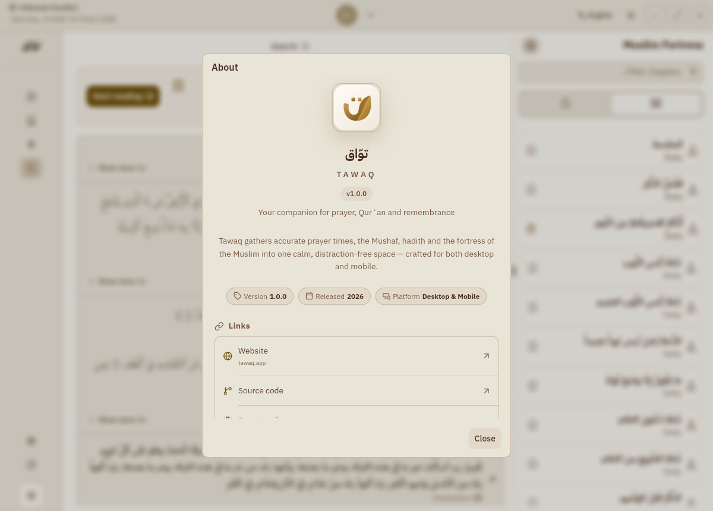

<a id="ui-24"></a>

### UI-24 — The collapsed sidebar requires sighted users to recognize icons

**Priority:** P2 · **Status:** design critique with source corroboration.

**Reproduction:** Use the collapsed shell sidebar, particularly at 800×600, and identify feature destinations without expanding it.

**Actual:** Persistent feature destinations appear as clock/book/microphone/shield icons with no visible names. The sidebar source supplies semantic labels but no naming tooltips on these route buttons. A sighted newcomer must recognize or remember the icon meanings, expand the sidebar, or try destinations.

**Expected and impact:** Compact navigation should preserve discoverability for both experienced and new users. Semantic naming is useful, but it does not by itself provide a visible explanation on hover/focus.

**Principle and direction:** Recognition over recall, clear wayfinding, and input-mode parity. Add useful localized visible hints or another compact naming strategy while retaining existing semantics and selected-state styling.

**Owner and fan-out:** [ShellSidebar](../../../lib/app/shell/shell_sidebar.dart) and shared route definitions. All major features use the same shell. This report does not claim that these icons are unnamed to screen readers: `MergedActionSemantics` supplies localized names. A live screen-reader walkthrough was not performed.

**Acceptance:** Collapsed destinations can be identified by sighted pointer and keyboard users without trial navigation. English/Arabic labels, focus, selected state, and existing semantics agree.

Context: the left icon rail in [compact Hadith](evidence/hadith-empty-compact.png) and right icon rail in [Arabic Quran](evidence/quran-study-ar-800x600.png).

## Additional onboarding findings raised during review

The owner supplied two screenshots while the audit was in progress: an inset title bar and an implausible schedule preview despite a correct location/timezone. Both were investigated separately and reproduced in the isolated native app. The owner also explicitly described onboarding as visually poor and wasteful. UI-31 records that design concern more fully; UI-10 remains the distinct orientation/step-overview issue.

<a id="ui-29"></a>

### UI-29 — Onboarding title bar stops short of both window edges

**Priority:** P2 · **Status:** reproduced and source-confirmed · **Configuration:** 1200×860; Manuscript light in the supplied screenshot, Sage dark in the fresh reproduction.

**Reproduction:** Start or rerun onboarding and inspect the native top bar against the outer window edges.

**Actual:** The title-bar surface and bottom border begin 12 pixels inside the left edge and stop 12 pixels before the right edge. The controls occupy the inset strip. In the completed app, the shell's bar spans the width, so entering setup also changes the window-frame treatment unexpectedly.

**Expected and impact:** A desktop title bar should occupy the full window width, with deliberate internal control padding rather than a padded outer surface. The exposed strips make the frame look detached and unfinished on every onboarding step.

**Principle and direction:** Consistent shell composition, alignment, and intentional spacing. Separate title-bar framing from content gutters. Do not stretch the setup card or remove useful inner padding merely to repair the bar.

**Owner and fan-out:** [OnboardingScaffold](../../../lib/app/onboarding/onboarding_scaffold.dart) puts the top bar inside the `FScaffold` body. The resolved scaffold's default body padding is applied to the entire column. Its 52-pixel bar has its own six-pixel control padding, which is a separate concern. All eight onboarding steps inherit the inset; drag region and window controls must stay functional.

**Acceptance:** The bar surface and border reach both window edges in both locales, themes, supported sizes, and window-control styles. Body gutters remain intentional. Dragging and native controls work after the framing change.

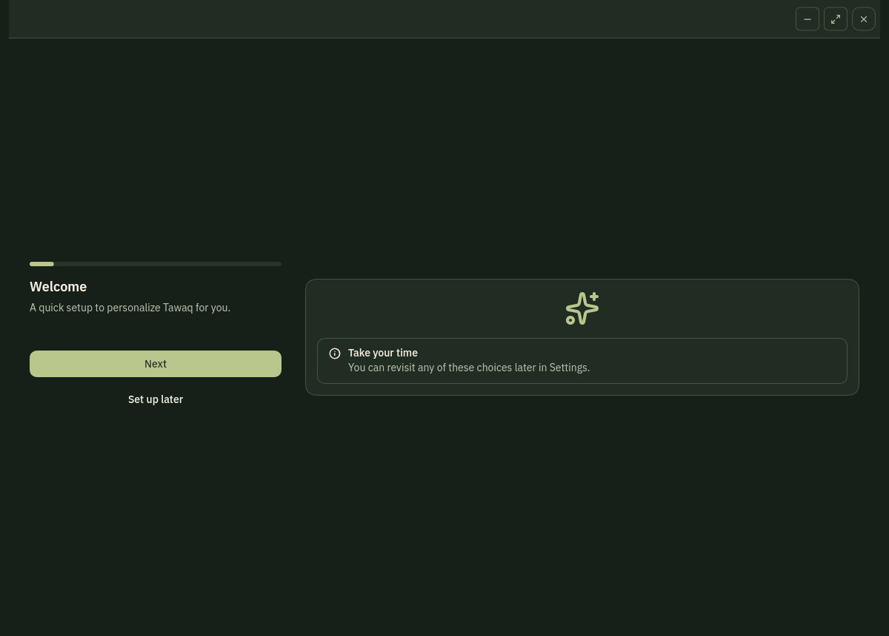

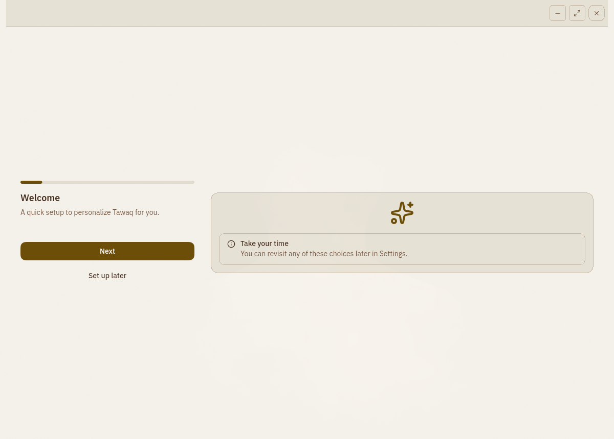

The owner-supplied screenshot's exact revision/state was not established. The fresh screenshot independently reproduces the visible defect on the recorded audit baseline.

<a id="ui-30"></a>

### UI-30 — Final onboarding schedule displays UTC instead of the configured timezone

**Priority:** P1 · **Status:** reproduced with all five before/after values; source cause confirmed.

**Reproduction:** Rerun onboarding, search for “Madinah,” select the returned Medina result, retain `Asia/Riyadh`, and choose Umm Al-Qura University. Continue to “Ready to go,” capture the schedule, then activate “Get started” without changing prayer settings. Inspect the same day's complete Prayer schedule.

**Recorded inputs:** The app's city lookup selected latitude `24.4711530`, longitude `39.6111216`. Timezone: `Asia/Riyadh` (UTC+03:00 for this reproduction). Date: 2026-10-03. Method: Umm Al-Qura. Time display: English 12-hour. No manual prayer offsets were introduced during the audit. Window: 1200×860; Sage dark; default app scale. This comparison establishes consistency against the repository's configured calculation, not an independently certified Madinah timetable.

**Actual:** Every preview value is three hours earlier than the value displayed after finishing. Completion does not require correcting coordinates or timezone. The location screenshot explicitly shows Medina coordinates and `Asia/Riyadh` before the wrong preview.

| Prayer | Onboarding preview | Prayer screen after finishing | Difference |
| --- | --- | --- | --- |
| Fajr | 1:56 AM | 4:56 AM | +3 hours |
| Dhuhr | 9:10 AM | 12:10 PM | +3 hours |
| Asr | 12:33 PM | 3:33 PM | +3 hours |
| Maghrib | 3:06 PM | 6:06 PM | +3 hours |
| Isha | 4:36 PM | 7:36 PM | +3 hours |

**Expected and impact:** The final review must display the same configured local prayer times as the main app for the same inputs and calendar day. This is a trust-critical display error, not a cosmetic number-formatting issue. It makes correct location setup look wrong and invites users to change accurate settings to compensate.

**Confirmed cause:** [OnboardingFinishStep](../../../lib/app/onboarding/onboarding_screen.dart) passes `bundle.today.timeForPrayer(prayer)` directly to the formatter. The checked-out [adhan implementation](../../../packages/adhan_dart/lib/src/prayer_times.dart) returns raw prayer timestamps; its [TimeComponents](../../../packages/adhan_dart/lib/src/time_components.dart) constructs UTC dates. The resolved `intl` formatter reads the supplied timestamp's hour/minute fields without converting timezone. In contrast, [PrayerScheduleProvider](../../../lib/feature/prayer/presentation/provider/prayer_schedule/prayer_schedule_provider.dart) calls `getTimesForPrayer(prayer, settings.location)`, whose [shared extension](../../../lib/core/utils/prayer_extensions.dart) converts with `TZDateTime.from`. The issue is the preview's missing display conversion; the evidence does not point to wrong selected coordinates. An independent FVM Dart computation using the exact recorded coordinates reproduced all ten displayed values; [the comparison record](evidence/prayer-preview-comparison.json) includes raw UTC instants. Source/computation inspection places the configured local midnight at 21:00 UTC for this zone, but a live midnight rollover was not exercised.

**Principle and direction:** Correctness and a single trustworthy display contract. Format the configured-zone representation consistently, preferably through the existing schedule/display owner where appropriate. Do not compensate by shifting stored times, changing coordinates, or hardcoding a three-hour adjustment.

**Owner and fan-out:** Onboarding preview, shared prayer day bundle, schedule row formatting, time-format/locale provider, and timezone conversion helpers. Today/yesterday bundles intentionally retain raw instants alongside localized timeline values. Preserve that model and the existing computation, adjustments, hydration, and onboarding finish-flush order.

**Acceptance:** Preview and main schedule match for all five prayers with identical inputs. Cover Arabic/English and 12/24-hour formatting, timezone changes, a configured zone different from the host zone, and relevant local day boundaries using the shared clock override. Offsets and calculation-method changes must appear identically in both views. Never assume every location is UTC+03:00.

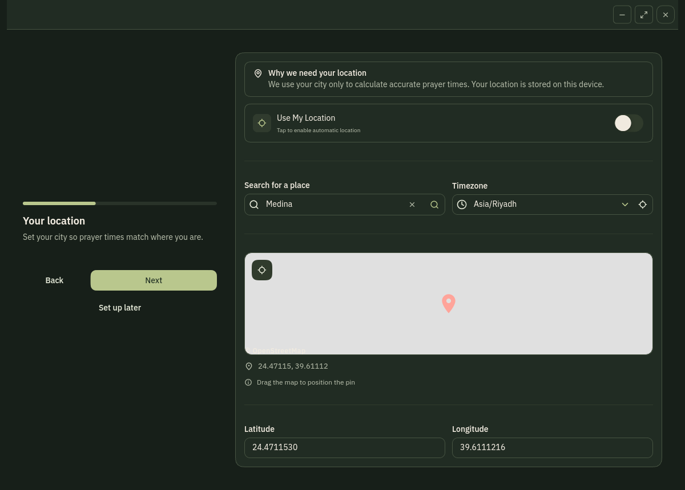

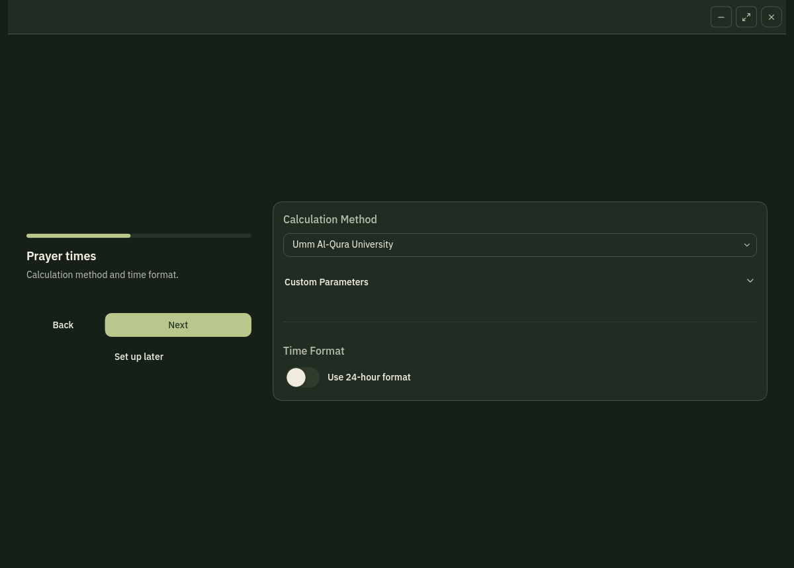

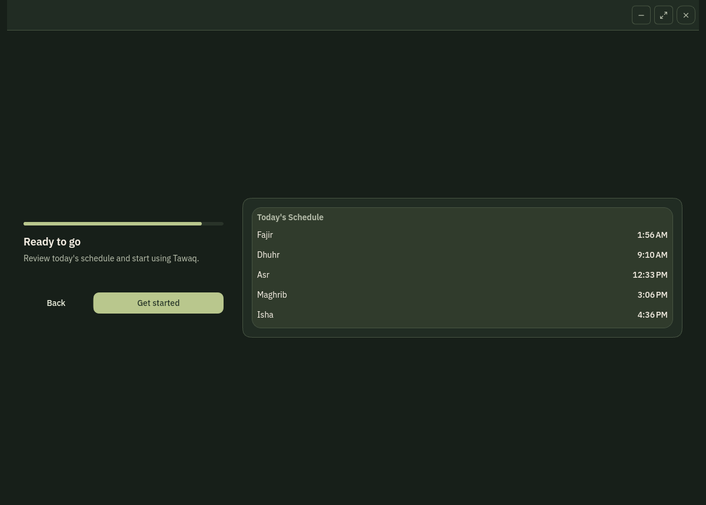

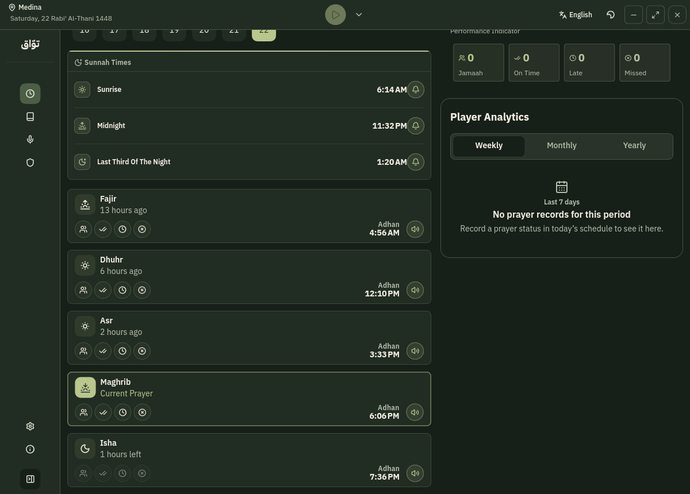

The [post-completion hero](evidence/madinah-prayer-after-finish.png) also shows Medina and Maghrib at 6:06 PM. The [owner's original wrong-preview screenshot](evidence/user-onboarding-wrong-times.png) is retained separately; its precise inputs were not recorded and must not be substituted for the fresh comparison above.

<a id="ui-31"></a>

### UI-31 — Onboarding's sparse two-column composition wastes its viewport

**Priority:** P2 · **Status:** design critique of reproduced layouts, reinforced by explicit owner feedback.

**Reproduction:** Open Welcome and compare it with calculation-method and final-preview steps at 1200×860. Inspect the visual balance above and below the content, then follow the primary action between steps.

**Actual:** Welcome spreads a small title/progress/action rail and an oversized sparse card across two columns near the vertical center. Large unused areas remain above and below. The right card contains a decorative sparkle and a “Take your time” alert with little else. The left side separates the explanation and Next action from the card being acted on. Calculation and finish reuse the same composition despite different amounts of content; the finish schedule adds another bordered card inside the surrounding card.

**Expected and impact:** A setup screen should feel intentional, cohesive, and easy to move through. Space should support reading and decisions rather than make a tiny task look stranded in an expansive window. The owner explicitly finds this onboarding unattractive and wasteful; that preference is recorded as owner feedback, not generalized into a user-study conclusion.

**Principle and direction:** Distill, group, and establish a clear focal area. Use a compact coherent setup surface with title, explanation, active choice, progress, and navigation related visually. Let content determine useful density; preserve breathing room without filling it with decorative panels, repetitive alerts, or invented product features. Reduce redundant nested card borders and give each step a deliberate content hierarchy.

**Owner and fan-out:** [OnboardingScaffold](../../../lib/app/onboarding/onboarding_scaffold.dart) defines the wide 340-pixel rail, separate step viewport, vertical centering, maximum widths, and card wrapper. [OnboardingScreen](../../../lib/app/onboarding/onboarding_screen.dart) supplies heterogeneous step content. Review all eight steps together, especially tall location settings versus very sparse Welcome, before selecting a shared composition. This is broader than adding a step counter (UI-10) or stretching the title bar (UI-29).

**Acceptance:** A design review of every step demonstrates cohesive grouping, clear primary action, and purposeful space at wide and minimum desktop sizes. Arabic/English and larger text remain usable. Fewer layers of framing improve hierarchy without removing needed instructions, validation, back/skip behavior, accurate preview, or durable completion.

Evidence: [Welcome in Sage](evidence/onboarding-inset-titlebar-sage.png), [Welcome in the owner's light-theme capture](evidence/user-onboarding-inset-titlebar.png), [calculation method](evidence/onboarding-madinah-method.png), and [the nested final schedule](evidence/onboarding-madinah-utc-preview.png).

## Source-supported follow-ups requiring additional evidence

These entries are useful investigation tickets, but should not be filed as fully reproduced runtime failures. Each distinguishes its source evidence from its contextual screenshot.

<a id="ui-25"></a>

### UI-25 — Follow-up: Hadith errors have technical copy and no local retry

**Priority:** P2 · **Status:** source-supported; no failed request or bookmark load was injected.

**Verification recipe:** Fail a Hadith search request and a bookmark load separately. Inspect English/Arabic feedback, attempt recovery from the results area, then repeat with a pagination failure after successful results.

**Source observation:** [HadithResultsColumn](../../../lib/feature/hadith/presentation/widgets/hadith_results_column.dart) exposes exception strings for search/bookmark errors. The hard-error region does not provide an in-place retry action. Manual form resubmission is possible, but it is not explained as the local recovery path. Existing controller tests distinguish hard search failures from pagination behavior.

**Expected and impact:** Localized guidance should explain the failure and provide scoped recovery without unnecessarily discarding valid context. Raw technical text is especially unclear in an Arabic interface.

**Principle and direction:** Clear errors and recovery. Map errors at the relevant owner and preserve the established controller state model; do not replace hard errors with fabricated results or invent offline data.

**Owner and fan-out:** Hadith result column, search controller/provider, bookmark loading, and localization inputs. Fortress already offers a repository retry pattern worth examining, without assuming its exact state model fits Hadith.

**Acceptance:** Fault-injection evidence confirms localized hard-error and pagination states, reachable retry, and preservation of valid query/context. Add screenshots of the actual failure before promoting this entry to reproduced.

Context only: [successful Hadith search](evidence/hadith-results-1366x768.png). It is not an error-state screenshot.

<a id="ui-26"></a>

### UI-26 — Follow-up: Recent-query removal depends on hover and announces “Clear all”

**Priority:** P2 · **Status:** source-supported; keyboard/assistive behavior not exercised live.

**Verification recipe:** Create at least two recent Hadith queries in a wide split layout. Use Tab without hovering to locate single-query removal. Inspect the live semantic name when the removal control is shown. Repeat in Arabic.

**Source observation:** [HadithSearchColumn](../../../lib/feature/hadith/presentation/widgets/hadith_search_column.dart) computes `showRemove = isHovered || !useSplitLayout`; in wide mode, a per-query control is absent until hover. Its callback removes one query, while [Hadith accessibility strings](../../../lib/feature/hadith/presentation/widgets/hadith_accessibility.dart) use the localized clear-all wording in that control's name. Individual filter-chip scope should also be checked.

**Expected and impact:** Removing one item should be reachable with keyboard/focus and announced as removing that item. The separate clear-all action must have a distinct scope.

**Principle and direction:** Input-mode parity and accurate action naming. Show removal on focus as well as hover, or use a persistent accessible action with a clear single-item label.

**Owner and fan-out:** Recent-query chip rendering, query persistence owner, filter chips, and shared Hadith semantics helpers. This is a presentation/semantic concern, not evidence of history data loss.

**Acceptance:** Live Tab and semantic inspection confirm independent per-query removal in both locales and layouts. Clear-all continues to remove all items intentionally.

Context only: [Hadith result/search layout](evidence/hadith-results-1366x768.png); it does not demonstrate a keyboard failure.

<a id="ui-27"></a>

### UI-27 — Follow-up: Reduced motion is not applied consistently

**Priority:** P2 · **Status:** source-supported; OS reduced motion was not toggled.

**Verification recipe:** Enable the platform's reduced/disabled animation preference and exercise onboarding transitions, Quran/Fortress reading, loading skeletons, settings transitions, and the player equalizer. Record normal and reduced modes with the same actions.

**Source observation:** `AnimationEntry` honors the Forui motion preference. [DirectionalContentSwitcher](../../../lib/core/widgets/directional_content_switcher.dart) creates a 260 ms slide/fade without consulting it; [FSkeletonizer](../../../lib/core/widgets/f_skeletonizer.dart) installs shimmer; [RecitationEqualizer](../../../lib/feature/quran/presentation/widgets/player/recitation_equalizer.dart) repeats its controller while animating. Resolved package and pinned SDK source were inspected: the repeating controller is not automatically stopped merely because it was constructed with a default behavior.

**Expected and impact:** One coherent policy should govern spatial transitions and repeating decorative effects. A preference that affects only some shared wrappers can leave distracting motion in the same journey.

**Principle and direction:** Purposeful, accessible motion. Apply preference handling at shared owners, retaining static feedback that still communicates loading and playback state.

**Owner and fan-out:** Shared transition, skeleton, and audio presentation primitives; onboarding, Quran study, Fortress focus reading, and settings consumers. No frame-time or performance improvement is claimed.

**Acceptance:** Runtime preference changes produce the intended motion policy across all consumers. Static states still explain loading/playback. Tests enforce policy at the shared owner and representative consumers.

Motion context only: [normal verse selection clip](evidence/quran-verse-selection.mp4). It is not reduced-motion compliance evidence.

<a id="ui-28"></a>

### UI-28 — Follow-up: Reflection saving has no visible status

**Priority:** P3 · **Status:** source-supported; save failure and kill-boundary behavior not exercised.

**Verification recipe:** Select an ayah, write a reflection, inspect feedback during and after the debounce, navigate away, then restart. Separately exercise a controlled persistence failure and the established flush boundary.

**Source observation:** [NotesSection](../../../lib/feature/quran/presentation/widgets/study/notes_section.dart) uses debounced persistence and an unmount flush but does not present a visible saving/saved/error status in this editor. This report contains no evidence of a lost note and does not assert a broken persistence contract.

**Expected and impact:** Users writing personal reflections should understand whether their work is durable, especially when autosave replaces an explicit Save action. Any feedback should remain calm and avoid adding noisy machinery for every keystroke.

**Principle and direction:** Visibility of state and durable-data trust. First verify actual persistence guarantees, then communicate the meaningful boundary and failure recovery from the existing owner.

**Owner and fan-out:** Reflection editor, its notifier/repository, and the established settings storage/flush conventions. Do not introduce a second save owner or change durable decoding as a UI shortcut.

**Acceptance:** Existing persistence and flush guarantees are retained; users receive accurate unobtrusive status and useful recovery on real failure. Promote this entry only after runtime evidence and the intended feedback policy are established.

Context only: [selected study panel](evidence/quran-selection-active.png). No save-failure state is shown.

## Cross-cutting assessment and proposed sequencing

The recurring problem is a mismatch between layout chrome and task space. Several screens adapt their width but retain fixed-height groups or divide a short viewport into regions that cannot fit useful content. Repeating the same breakpoint patch in each widget would not resolve the shared design constraint. The smallest complete changes should begin with the actual owner and use real available height, then preserve the sound feature state models.

1. **Restore trustworthy prayer display and core compact tasks:** UI-30, UI-01, UI-05, UI-06, and UI-16. Correct the preview's configured-zone formatting, then treat header/pane sizing and useful content access as one flow per feature. Check the real 800×600 shell, both locales, and larger text.
2. **Make reading and setup predictable:** UI-02, UI-03, UI-08, and UI-09. Preserve collapse intent and reading position; define alert eligibility and focused prerequisite recovery.
3. **Clarify destinations and hierarchy:** UI-04, UI-07, UI-10, UI-11, UI-12, UI-14, UI-18, UI-19, UI-24, UI-29, and UI-31. Couple related actions where it shortens the task; make onboarding a coherent composition; avoid adding generic dashboards or extra state machinery.
4. **Finish visible content and support:** UI-13, UI-15, UI-17, UI-20, UI-21, UI-22, and UI-23. Verify destinations and religious explanations, then update localization inputs and outputs together where needed.
5. **Verify the follow-up risks:** UI-25–UI-28. Gather actual failure/accessibility evidence before describing these as reproduced defects.

This order is a proposed backlog sequence, not an implementation commitment. Some issues share an owner and should be fixed together, while others have independent acceptance criteria: repairing About URLs does not repair their action, and repairing player labels does not establish short-window safety.

### Strengths to preserve

- Manuscript and Sage provide a coherent, calm visual language across light/dark and Arabic/English examples. The report does not recommend replacing the theme system.
- The reciter dialog demonstrates useful height bounding and scrollable content at the minimum window size; compact Hadith shows that a focused initial task can work well.
- Shared semantics helpers, localized shell names, focus styling, container-aware split gates, and the Quran one-page fallback are sound foundations. Findings about visible icon discovery must not be misreported as a total absence of accessibility names.
- Source-driven religious content, explicit location prerequisites, and separate Quran reader scaling should remain protected throughout any redesign.

### Scoped heuristic review

The independent design review scored the observed journey on a 0–4 expert scale (0 absent/problematic, 4 strong). This is a limited critique, not a whole-app certification, accessibility conformance score, or measured user outcome.

| Heuristic | Score | Reason in this observed journey |
| --- | --- | --- |
| Visibility of state | 2 | Empty player and study states need clearer next actions |
| Match to user concepts | 3 | Core domains are familiar; specialist copy and one wrong label weaken clarity |
| User control | 2 | Indirect location recovery and stacked collapse behavior reduce control |
| Consistency | 2 | Locale direction and mode-dependent control behavior disagree |
| Error prevention | 3 | Prerequisite gates are useful; live setup interruption needs policy |
| Recognition over recall | 2 | Collapsed icon navigation and unexplained filters add recall burden |
| Efficiency | 3 | Split views can be efficient once populated; initial/compact states need work |
| Minimalism | 2 | Empty panes, duplicate copy, and large About chrome consume space |
| Error recovery | 1 | Source review identifies technical Hadith errors and weak local recovery |
| Help and guidance | 1 | Technical setup/filter choices have limited task-oriented explanation |

## Evidence provenance and verification

The evidence folder contains **47 PNG screenshots and two MP4 clips**, plus capture mapping and a manifest. Two PNGs prefixed `user-` were supplied by the owner and are clearly attributed; their exact revision/state was not established. Of the audit's own captures, all except `onboarding-language-compositor.png` were obtained from the actual app's Flutter framebuffer through its VM service. The compositor screenshot includes desktop opacity/wallpaper; that appearance must not be attributed to the application's theme.

The Quran clips were recorded from the owned Linux app workspace using the monitor recorder and cropped to the observed app region. `quran-compact-study.mp4` is an eight-second settled compact state. `quran-verse-selection.mp4` contains repeated selection/clearing in a wide Arabic dark window. Both are silent. Their compositor opacity and surrounding edge pixels are desktop behavior, not evidence of app transparency. No speed changes, generated UI, fabricated error screen, or edited religious text were used. A player recording was excluded because its captured frames did not reliably demonstrate the intended behavior.

Native CUA exact-window capture was unavailable in this session because the shared service did not have the desktop environment variables. The audit used the purpose-built Flutter driver/VM screenshot path instead. Pointer events for custom-painted ayahs were grounded in fresh screenshots; provider state and religious data were not mutated to manufacture findings. Normal navigation, settings controls, and native window resizing produced the inspected states.

The app used isolated XDG roots and a task-owned documents directory. The audit interacted with real app controls, including language/theme/scaling changes, search, chapter selection, and dialogs. Original unrelated source changes were preserved. Temporary runtime tooling, logs, state, and raw recordings remain outside the repository; only the report and selected media are delivery artifacts.

### Checks completed

- Source owners, nearest tests, SDK pin, root dependencies/lockfile, and relevant resolved dependency behavior were inspected.
- Five targeted test files passed, **20 tests total**:

  ```bash
  fvm flutter test test/core/layout/responsive_test.dart test/feature/hadith/hadith_split_layout_test.dart test/prayer/presentation/prayer_hero_header_test.dart test/theme/manuscript_theme_contrast_test.dart test/feature/settings/settings_screen_material_test.dart
  ```

- These tests provide bounded regression context, not proof that the observed runtime layouts are correct. The native screenshots show gaps in the existing coverage.
- `impeccable detect --json lib` exited successfully with `[]`. The native audit playbook says this detector does not apply to native/Flutter, so its empty output is not a clean bill of health. There are no detector rule IDs to attach.
- Delivered screenshots and representative video frames were visually inspected. Both final MP4s were probed and fully decoded. Relative report links, evidence hashes/dimensions, and final documentation diff were checked.
- No UI source edits, package changes, code generation, full analysis, or full app test suite were performed for this documentation-only task. No performance improvement is claimed.

### Coverage limits and exclusions

This is a bounded native desktop audit, not an exhaustive matrix. It does not establish macOS/Windows behavior, screen-reader conformance, release/profile performance, every text scale, every prayer/day boundary, offline recitation/download recovery, every network failure, every reflection persistence boundary, or full keyboard journey parity. The follow-up section makes the most relevant remaining states explicit.

Animation flickering was requested as an investigation category, but a reproducible flicker was not confirmed. Captured selection reflow and settled layout clipping are documented accurately instead. Framebuffer captures cannot establish compositor flicker or frame-time performance; a profile trace and higher-frequency recording of an identified trigger would be needed for those claims.

The temporarily gray map subsequently loaded and is not filed as a permanent failure. The reciter picker fit its viewport; the overflow behind it belongs to the player drawer. An icon-only language control below the 768-pixel breakpoint was excluded because the native app enforces a minimum width of 800 pixels, making that candidate irrelevant to this supported desktop reproduction.

### Existing work preserved

At audit start, the working tree already contained edits to `AGENTS.md`, `lib/main.dart`, theme files, the theme selector, English/Arabic ARBs and generated localizations, theme/settings tests, plus untracked `.agents/`, `docs/design/sage/`, and `tool/sage_visual_harness.dart`. No findings should be interpreted as a clean-HEAD release comparison. The final source diff was compared with the saved initial diff to confirm this audit did not modify that work.

See [the evidence manifest](evidence/manifest.json) for delivered file sizes, dimensions/durations, hashes, and capture notes. Keep the report and evidence directory together when moving or sharing this audit.
