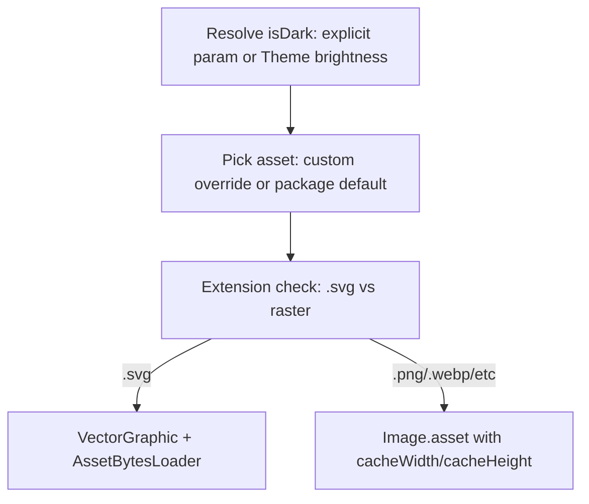

# Compiled surah header SVG migration

## Goals

- Render default banners from `[assets/images/surah-header.svg](assets/images/surah-header.svg)` (light) and `[assets/images/surah-header-dark.svg](assets/images/surah-header-dark.svg)` (dark).
- Use **compiled SVGs** (`vector_graphics` + `vector_graphics_compiler`) — not pinned article versions; add with `pub add` at implementation time.
- Let hosts override **both** light and dark banner assets via `MushafStyle`.
- Confirm header **text color is not tied to the banner asset** in this package (Tawaq’s fixed black is app-layer only).

## Dependency setup (latest via pub add)

In `[pubspec.yaml](pubspec.yaml)`, replace `flutter_svg` with:

```bash
dart pub add vector_graphics
dart pub add --dev vector_graphics_compiler
```

Do **not** copy `^1.1.11+1` from the article — let `pub add` resolve current compatible versions against `flutter: ">=3.38.0"`.

Configure asset transformers (replace blanket `- assets/images/` with explicit SVG entries):

```yaml
flutter:
  assets:
    - path: assets/images/surah-header.svg
      transformers:
        - package: vector_graphics_compiler
    - path: assets/images/surah-header-dark.svg
      transformers:
        - package: vector_graphics_compiler
    - assets/hive/
    - assets/otf_fonts/
```

**Note:** Consuming apps that override with their own `.svg` paths must declare the same transformer in **their** `pubspec.yaml` for those assets. Document this in README.

## Asset path constants

Add constants (e.g. in `[lib/src/core/mushaf_constants.dart](lib/src/core/mushaf_constants.dart)`):

- `kSurahHeaderLightAsset = 'assets/images/surah-header.svg'`
- `kSurahHeaderDarkAsset = 'assets/images/surah-header-dark.svg'`

Use these everywhere defaults are resolved — avoids stale string references.

## API changes — dual banner overrides

### `[MushafStyle](lib/src/data/models/mushaf_style.dart)`


| Field                  | Role                                                           |
| ---------------------- | -------------------------------------------------------------- |
| `surahHeaderImage`     | **Keep** — override for **light** banner (backward compatible) |
| `surahHeaderImageDark` | **New** — override for **dark** banner                         |


Update `[MushafStyle.modify](lib/src/data/models/mushaf_style.dart)` factory, `[MushafStyleCustomization.modify](lib/src/data/models/mushaf_style_extensions.dart)`, and `copyWith`-style constructor.

**Behavior change (document in CHANGELOG):** Previously `surahHeaderImage` replaced the banner regardless of `isDark`. After this change it applies to light only; dark uses `surahHeaderImageDark` or the package default.

### `[SurahHeaderWidget](lib/src/presentation/widgets/surah_header_widget.dart)`

Replace single `customHeaderImage` with:

- `customHeaderImageLight` (optional; falls back to package default)
- `customHeaderImageDark` (optional; falls back to package default)

Keep `customHeaderImage` as a **deprecated** alias → maps to `customHeaderImageLight` for one release cycle (or remove if you prefer a clean break — recommend deprecated alias).

## Widget rendering

Refactor `_buildBannerImage()` in `[surah_header_widget.dart](lib/src/presentation/widgets/surah_header_widget.dart)`:




- **Package defaults:** `VectorGraphic` with `AssetBytesLoader(path, packageName: 'mushaf_reader')`.
- **Custom raster overrides:** `Image.asset` + `cacheWidth`/`cacheHeight` from `width * devicePixelRatio` (DevTools oversized-image safety).
- **Custom SVG overrides:** `VectorGraphic` without `packageName` (host asset); document transformer requirement.
- Remove `flutter_svg` import and stale docs (`clearCache`, PNG/mainframe references).

### Theme / `isDark` wiring (gap you had not listed)

Today `[MushafPage](lib/src/presentation/screens/mushaf_page.dart)` never passes `isDark` to `[MushafPageSurahBlocks.build](lib/src/presentation/widgets/mushaf_page_surah_blocks.dart)` — **dark banner never shows in MushafReader**.

Fix:

- Change `isDark` to `bool?` on `SurahHeaderWidget`, `MushafPageSurahBlocks`, and `MushafPageRange`.
- When `null`, derive from `Theme.of(context).brightness == Brightness.dark` inside the widget/build path.
- `MushafPageRange.isDark` keeps working for explicit overrides (e.g. force light banner in dark app).

## Header text styling (not hardcoded to light banner)

**In `mushaf_reader`:** Banner ink is **not** coupled to the image asset.

- `[MushafPageSurahBlocks](lib/src/presentation/widgets/mushaf_page_surah_blocks.dart)` already passes:
  - `textStyle: mushafStyle.headerSurahNameStyle ?? mushafStyle.surahNameStyle`
  - `styleModifier: mushafStyle.headerSurahNameStyleModifier ?? mushafStyle.surahNameStyleModifier`
- `[SurahNameWidget](lib/src/presentation/widgets/surah_name_widget.dart)` applies those via `MushafTextStyleMerger` — only default when host sets nothing is black from `[MushafFonts.basmalahStyle](lib/src/core/fonts.dart)` (`0xFF000000`), same as other basmalah text defaults.

**No package change needed** for font flexibility beyond documenting that hosts should set `headerSurahName` (or `surahName`) to a theme-aware color when using the dark banner — e.g. `Theme.of(context).colorScheme.onSurface`.

**Example app follow-up** (optional, separate from package): `[example/lib/app_settings.dart](example/lib/app_settings.dart)` still hardcodes `kMushafBannerSurahNameColor` — update demo to use theme-aware `headerSurahName` so it showcases correct usage.

## Wiring through the tree

Update `[mushaf_page_surah_blocks.dart](lib/src/presentation/widgets/mushaf_page_surah_blocks.dart)`:

```dart
SurahHeaderWidget(
  ...
  customHeaderImageLight: mushafStyle.surahHeaderImage,
  customHeaderImageDark: mushafStyle.surahHeaderImageDark,
  isDark: isDark, // nullable, auto-resolves
)
```

No new params required on `MushafPage` / `MushafReader` if auto-theme works.

## Tests

- Extend `[test/data/mushaf_style_test.dart](test/data/mushaf_style_test.dart)`: `surahHeaderImageDark` passthrough + `modify()` support.
- Add widget test (new `test/widgets/surah_header_widget_test.dart`):
  - Light `ThemeData` → finds default light asset loader path.
  - Dark theme → dark asset path.
  - Custom light/dark overrides respected.
  - Pump with `MaterialApp`; use `find.byType(VectorGraphic)` or key on banner wrapper.

Existing `[test/widgets/mushaf_page_test.dart](test/widgets/mushaf_page_test.dart)` should still pass (page 1 has surah header).

## Docs and changelog

- `[CHANGELOG.md](CHANGELOG.md)`: new dark override field, compiled SVG banners, `isDark` auto-theme, `surahHeaderImage` now light-only.
- `[README.md](README.md)`: short `MushafStyle` snippet for dual banner overrides + note that custom SVGs need `vector_graphics_compiler` in host pubspec.
- Update widget doc comments in `surah_header_widget.dart`.

## Build verification

After implementation:

```bash
dart pub get          # from pub add
flutter test
flutter analyze
```

Full rebuild required for asset transformers: `flutter clean && flutter run` (hot reload insufficient).

## Downstream (Tawaq — out of scope here, but you should know)

When Tawaq upgrades `mushaf_reader`:

- Remove `kMushafBannerSurahNameColor` hack; use theme-aware `headerSurahName`.
- Optionally set `surahHeaderImage` / `surahHeaderImageDark` if using custom banners.
- No MushafPage `isDark` param needed if auto-theme is implemented.

## What you had not explicitly listed

1. `**MushafPage` / `MushafReader` never used dark banner** — fixed via nullable auto-`isDark`.
2. **Single `surahHeaderImage` could not distinguish light vs dark** — fixed via `surahHeaderImageDark`.
3. **Custom host SVGs need their own transformer** in the consuming app’s pubspec.
4. **Default black header text** when host sets no style — not banner-locked, but may look wrong on dark banner until host styles `headerSurahName`.
5. **Example app** still demonstrates hardcoded black banner text — worth updating as a reference.
6. **Removed old assets** (`mainframe.png`, `surah_banner*.svg`) — ensure no remaining references in code/tests/docs.

